# Worked examples — the same model in Enterprise Architect **and** in Mermaid

> A recipe gallery. Pick a diagram type, see a **correct** example of it built **both** ways — live
> in Sparx Enterprise Architect (via the `enterprise-architect` MCP) and in Mermaid — and copy the
> exact recipe. Use this when a skill needs to *produce* a diagram and you want it right the first time.
>
> The notation here was cross-checked against *UML @ Classroom: An Introduction to Object-Oriented
> Modeling* (Seidl, Scholz, Huemer, Kappel; Springer, 2015). The examples are an original **online-shop**
> domain (not the book's figures). EA images were built live and exported with
> `Project.SaveDiagramImageToFile`; Mermaid images are rendered from the source shown.
>
> **Which tool?** EA gives true UML notation, a persistent model, and every diagram type. Mermaid is
> text-in-Markdown and renders four of these well (class, state, sequence, activity-as-flowchart) but
> has **no** native use-case, object, component, deployment, or timing diagram — for those, use EA.
> Type strings and payload shapes referenced below live in
> `${CLAUDE_PLUGIN_ROOT}/shared/reference/ea-type-cheatsheet.md`; the build mechanics live in the
> `ea-modeling` spell.

## Contents
- [1. Class diagram](#1-class-diagram--shop-domain)
- [2. State machine diagram](#2-state-machine-diagram--order-lifecycle)
- [3. Sequence diagram](#3-sequence-diagram--place-an-order)
- [4. Activity diagram](#4-activity-diagram--handle-an-order)
- [EA-only diagram types](#ea-only-diagram-types)

---

## 1. Class diagram — shop domain

**Scenario.** A `Customer` (a kind of `Person`) **places** orders; an `Order` is **composed of** one
or more `OrderLine`s; each line references a `Product`; an order is optionally **paid by** a `Payment`.
Shows generalization, association with multiplicities, and composition.

### In Enterprise Architect

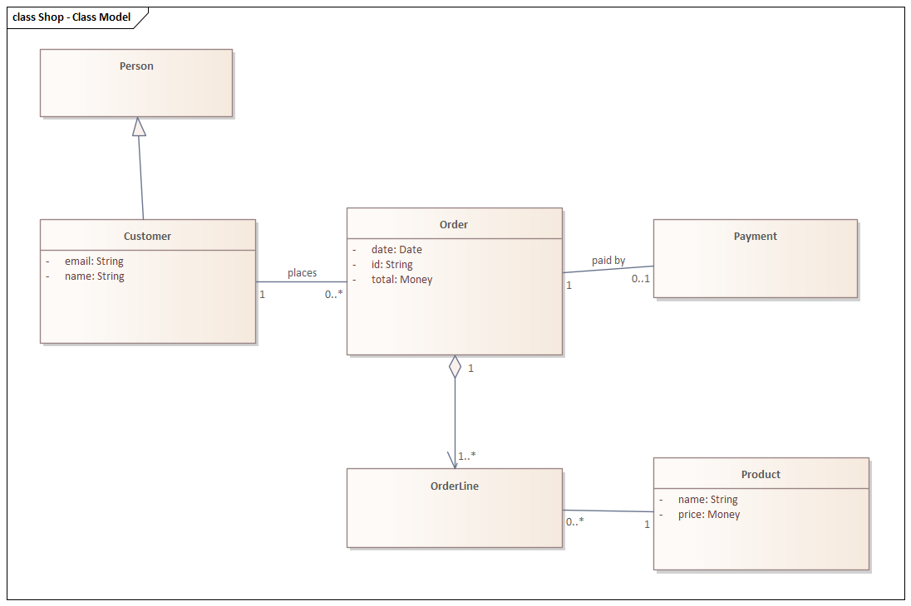
*Built live in Sparx EA via the MCP.*

**What was used** (build order — see `ea-modeling`):
1. `enterprise-architect:create_or_update_package` → a target package, capture its `packageID`.
2. `enterprise-architect:create_or_update_elements` with `type:"Class"` for `Person, Customer, Order, OrderLine, Product, Payment` (capture IDs).
3. `enterprise-architect:create_or_update_attributes` per class — envelope `{ elementID, attributeInfo:[ { attributeID:0, name, type, scope:"Private" } ] }`.
4. `enterprise-architect:create_or_update_connectors`:
   - `type:"Generalization"` Customer→Person.
   - `type:"Association"` Customer→Order (`name:"places"`), with `sourceEnd:{relatedElementID,multiplicity:"1"}` / `targetEnd:{relatedElementID,multiplicity:"0..*"}`.
   - `type:"Aggregation"` Order→OrderLine (`1` : `1..*`). **Note:** the **filled composite diamond is GUI-only** — the MCP can't set the aggregation kind, so it renders as a hollow (shared) diamond; set composite in the EA GUI if you need it.
   - `type:"Association"` OrderLine→Product (`0..*` : `1`) and Order→Payment (`1` : `0..1`, `name:"paid by"`).
5. `enterprise-architect:create_or_update_diagram` `type:"Class"`, then `place_elements_on_diagram` (x/y > 10), `layout_connectors`, `get_diagram_image` to verify.

### In Mermaid

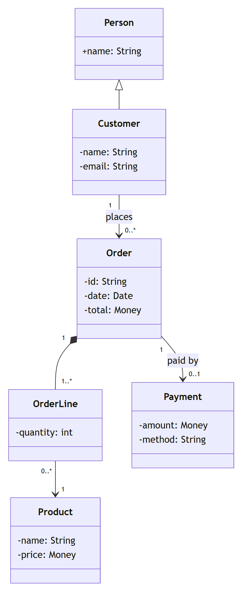

Mermaid source

<!-- render: images/we-class-mermaid.png -->

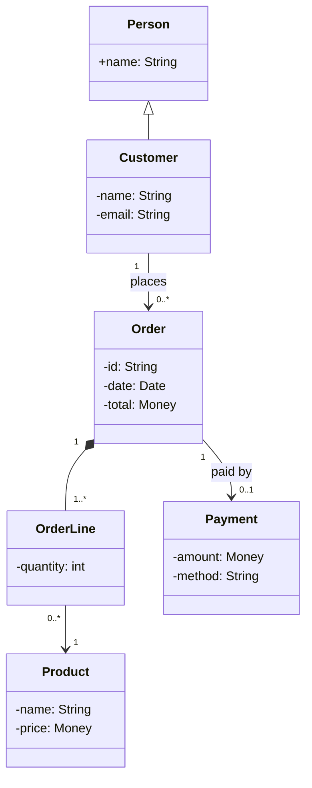

**What was used:** `classDiagram`; `<|--` generalization (child on the right of the arrow), `*--`
composition (filled diamond — Mermaid sets this directly, unlike the MCP), `-->` association;
multiplicities as quoted `"1"` / `"0..*"` strings on each end; `: label` for the association name.

**Differences.** Mermaid draws the composite diamond from `*--` directly; EA-via-MCP needs the GUI for
it. EA shows visibility markers, an attribute compartment, and the `«…»`/abstract styling natively;
Mermaid approximates them.

---

## 2. State machine diagram — order lifecycle

**Scenario.** One `Order`'s lifecycle: `New → Paid → Shipped → Delivered`, with `cancel` paths to
`Cancelled`. Shows states, an initial and final node, and triggered transitions.

### In Enterprise Architect

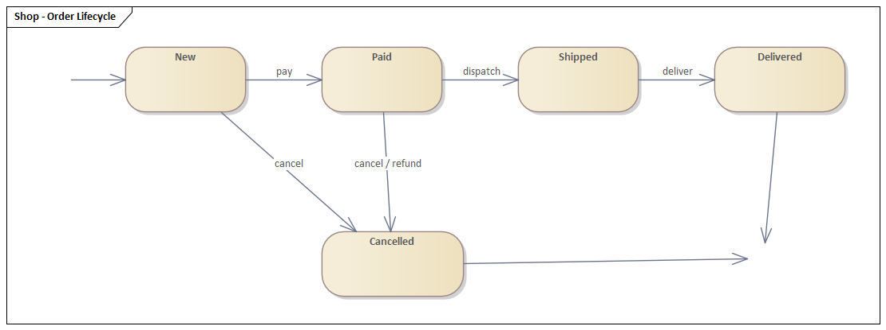
*Built live in Sparx EA via the MCP.*

**What was used:**
1. `create_or_update_elements`: `type:"State"` for `New, Paid, Shipped, Delivered, Cancelled`; **two**
   `type:"StateNode"` (initial + final — naming an initial/final node may auto-retype it to `Pseudostate`, which is fine).
2. `create_or_update_connectors` `type:"StateFlow"` for every transition; put the **trigger** in the
   connector `name` (e.g. `"pay"`, `"dispatch"`, `"cancel / refund"`); the initial→first and last→final flows are unnamed.
3. `create_or_update_diagram` `type:"StateMachine"` (no space), place, `layout_connectors`, verify.

### In Mermaid

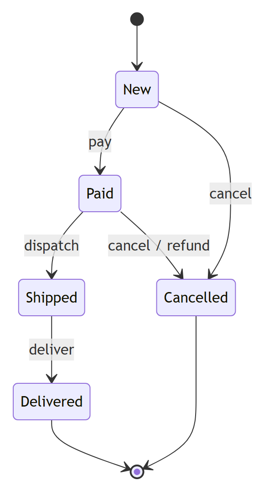

Mermaid source

<!-- render: images/we-state-mermaid.png -->

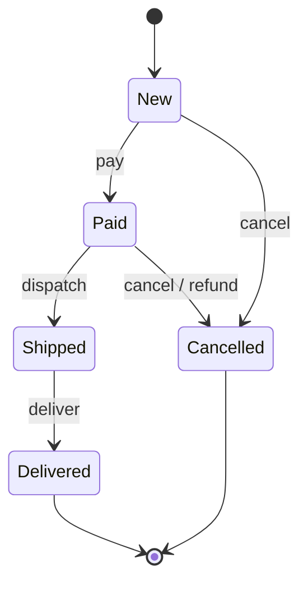

**What was used:** `stateDiagram-v2`; `[*]` is **both** the initial and the final pseudostate marker
(direction tells them apart); `-->` transition with `: trigger [guard] / effect` after the colon.

**Differences.** EA's initial/final are distinct `StateNode` elements; Mermaid overloads `[*]`. Both
read identically.

---

## 3. Sequence diagram — place an order

**Scenario.** A `Customer` adds an item and checks out; the `WebShop` authorizes with a
`PaymentService` and confirms. Shows synchronous calls, a return message, and activations.

### In Enterprise Architect

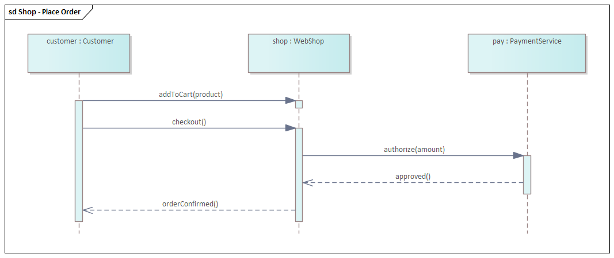
*Built live in Sparx EA via the MCP.*

**What was used** (this is the **highest-risk** EA build — read the duplicate-message trap in `ea-modeling`):
1. `create_or_update_elements` `type:"Sequence"` for the three lifelines (name them `instance : Classifier`, e.g. `shop : WebShop`).
2. `create_or_update_diagram` `type:"Sequence"`, then `place_elements_on_diagram` for the lifeline heads.
3. **`enterprise-architect:open_diagrams` the diagram FIRST** — messages on a hidden diagram error *but still create connectors* (a retry then duplicates).
4. `enterprise-architect:create_or_update_messages` — envelope `{ diagramID, messageInfo:[ { connectorID:0, name, sourceElementID, targetElementID, order } ] }`. **Messages use flat `sourceElementID`/`targetElementID`** (NOT the `sourceEnd.relatedElementID` connectors use). Set `isReturnMessage:true` for a dashed return (`approved`, `orderConfirmed`); `order` sequences them top-to-bottom.
5. Reload (`Repository.ReloadDiagram`) and `get_diagram_image` to verify before any retry.

### In Mermaid

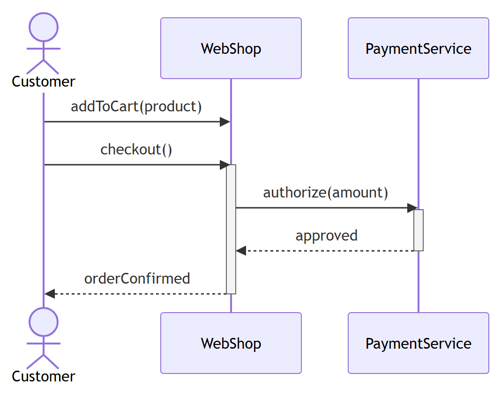

Mermaid source

<!-- render: images/we-sequence-mermaid.png -->

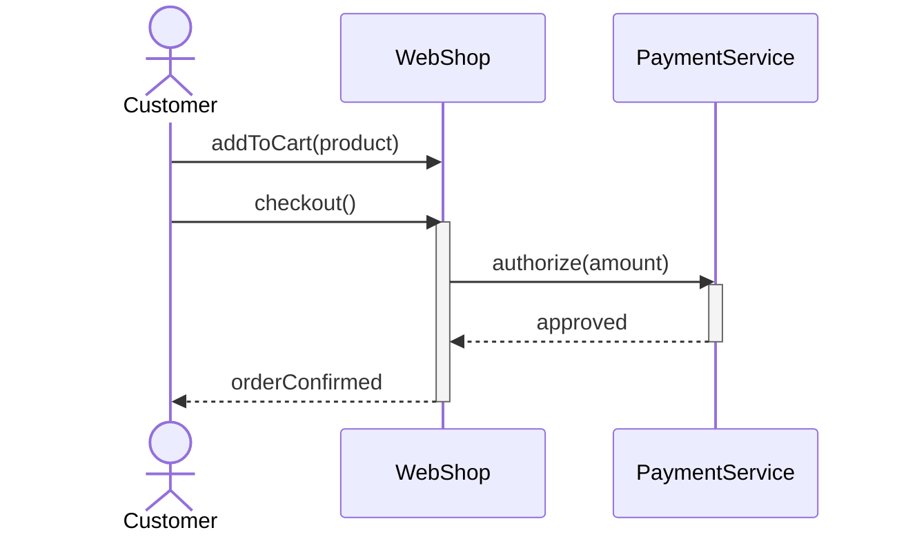

**What was used:** `sequenceDiagram`; `->>` solid-filled synchronous call, `-->>` dashed reply;
`activate`/`deactivate` for execution bars; `actor` vs `participant`, with `as` for a display alias.

**Differences.** EA stores messages as model connectors and needs the open-diagram-first dance;
Mermaid is declarative and ordered by line position. Both show the same five messages.

---

## 4. Activity diagram — handle an order

**Scenario.** Receive an order, check stock, then **branch**: pack & ship if in stock, otherwise create
a backorder; both paths notify the customer. Shows actions, a decision/merge, and guarded edges.

### In Enterprise Architect

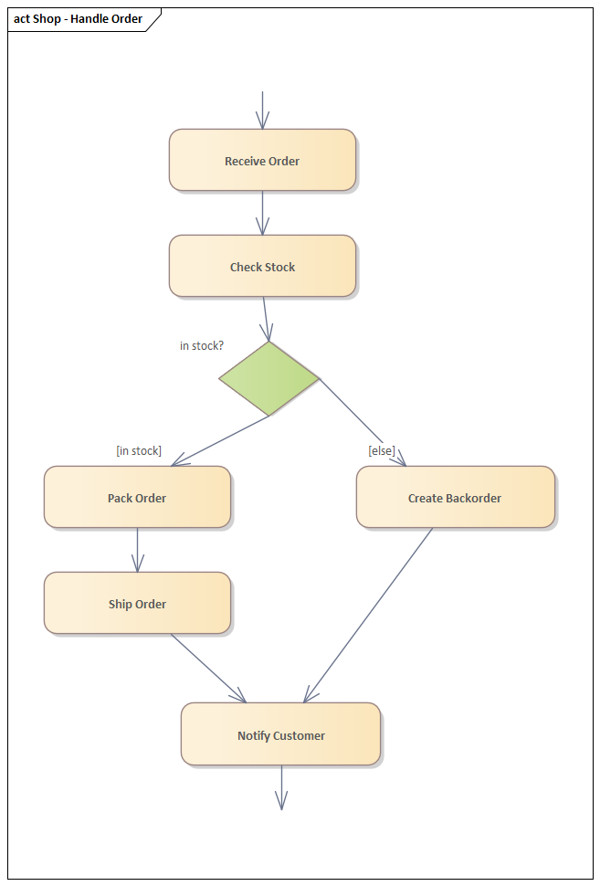
*Built live in Sparx EA via the MCP.*

**What was used:**
1. `create_or_update_elements`: `type:"Action"` for each step; `type:"Decision"` for `in stock?`
   (the diamond — also serves as the merge); two `type:"StateNode"` for the initial/final nodes.
2. `create_or_update_connectors` `type:"ControlFlow"` for every edge; put the **guard** in the
   connector `name` on the decision's outgoing edges (`"[in stock]"`, `"[else]"`).
3. `create_or_update_diagram` `type:"Activity"`, place, `layout_connectors`, verify.

### In Mermaid

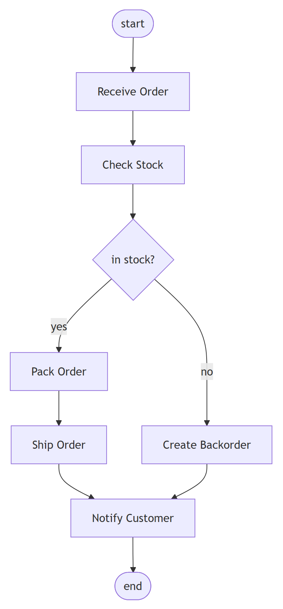

Mermaid source

<!-- render: images/we-activity-mermaid.png -->

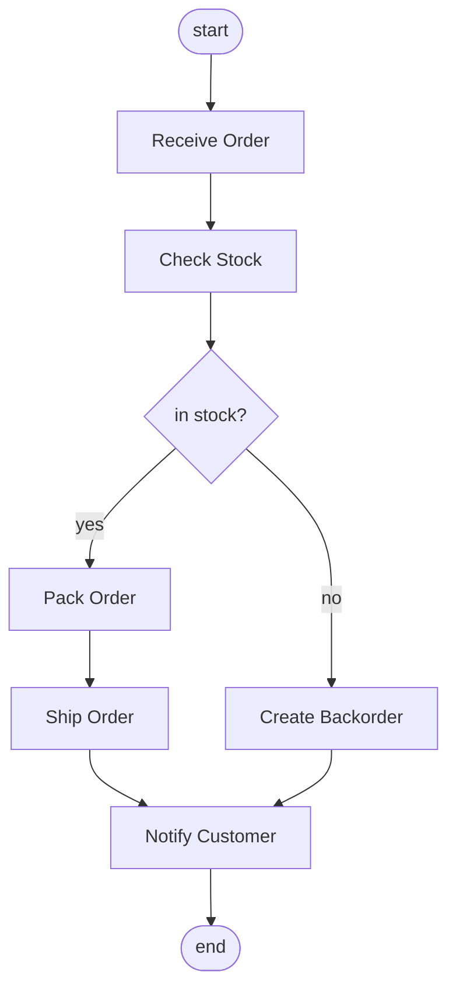

**What was used:** `flowchart TD`; `([text])` stadium nodes for the start/end (Mermaid has no UML
initial/final glyph), `[text]` for actions, `{text}` for the decision diamond, `-->|guard|` for a
guarded edge. This is an **approximation** — a flowchart, not a true UML activity diagram (no
fork/join bars, object flows, or partitions). For those, build it in EA.

**Differences.** EA has real initial ●/final ◉ nodes, fork/join bars, swimlanes, and object flows;
Mermaid's flowchart conveys the control flow but not those activity-specific symbols.

---

## EA-only diagram types

Mermaid has **no faithful equivalent** for these — build them in EA (recipes in the matching spell):

| Diagram | EA diagram `type` | Why not Mermaid |
| --- | --- | --- |
| **Use case** | `Use Case` | No native use-case notation (ellipses, actors, «include»/«extend», system boundary). |
| **Object** | `Object` | No native instance-specification/slot/link snapshot. |
| **Component / Deployment / Composite Structure / Timing** | `Component` / `Deployment` / `Composite Structure` / `Timing` | No native equivalents. |

See the `uml` spell's per-diagram reference files for the notation, and `ea-modeling` for the build.
