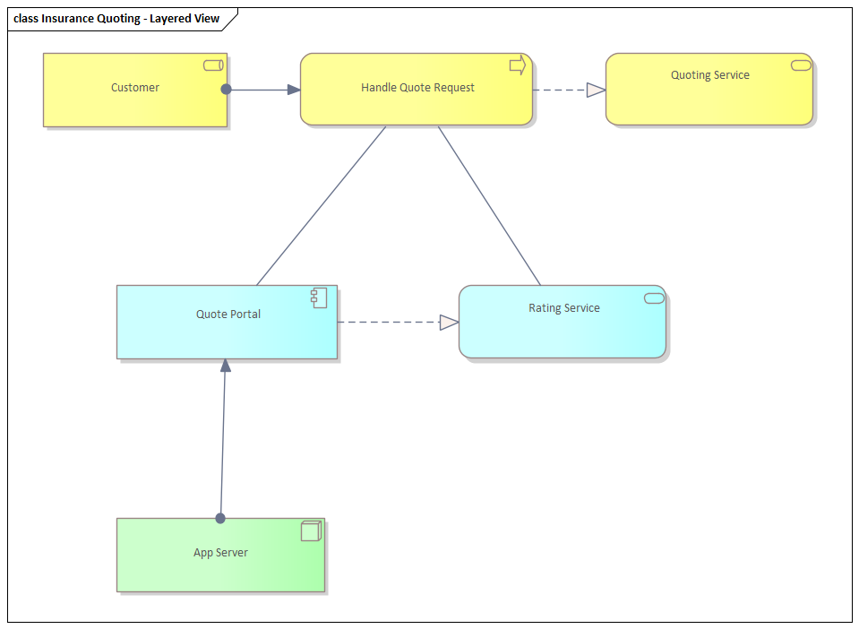

# ArchiMate 3.2 — worked example: online insurance quote service

A small, concrete enterprise modeled end-to-end to show how the layers connect. The scenario: **ACME Insurance** offers customers an **online car-insurance quote** they can request and accept on the web. We model a **layered view** (Business → Application → Technology) plus a short Motivation snippet. Every element names its ArchiMate type; every line names its relationship.

## Contents

- [The scenario](#the-scenario)
- [Business layer](#business-layer)
- [Application layer](#application-layer)
- [Technology layer](#technology-layer)
- [Stitching the layers (the serving chain)](#stitching-the-layers-the-serving-chain)
- [Motivation snippet](#motivation-snippet)
- [Text rendering of the layered view](#text-rendering-of-the-layered-view)
- [How to read it back](#how-to-read-it-back)

## The scenario



*Rendered in Sparx Enterprise Architect.*

A prospective customer visits ACME's website, enters car/driver details, receives a premium quote, and can accept it to create a policy. Behind the web UI a quoting application calls a rating engine and a policy system; everything runs on ACME's servers and a cloud database.

## Business layer

| Element | Type | Note |
|---------|------|------|
| Customer | **Business Role** | The party requesting a quote. |
| Insurance Broker | **Business Actor** assigned to the **Sales** Business Role | (Optional human channel.) |
| Provide Insurance Quote | **Business Service** | What the customer consumes. |
| Conclude Policy | **Business Service** | Accepting a quote creates a policy. |
| Quoting (the operation) | **Business Process**: *Request Quote → Calculate Premium → Present Quote → Accept Quote* | Realizes the two services. |
| Insurance Quote | **Business Object** | Information produced by the process. |
| Policy | **Business Object** (with a **Contract**) | Produced on acceptance. |
| Quote Request Portal | **Business Interface** | Where the service meets the customer. |

Relationships:
- *Quoting* Business Process **realizes** *Provide Insurance Quote* and *Conclude Policy* Business Services.
- *Customer* Business Role is **assigned to** / **serves** the interaction; the Business Service **serves** the *Customer*.
- *Calculate Premium* **accesses** (read/write) *Insurance Quote* Business Object.
- *Accept Quote* **triggers** creation of *Policy* (Triggering inside the process; **Access:write** to *Policy*).

## Application layer

| Element | Type | Note |
|---------|------|------|
| Quote Portal | **Application Component** | The customer-facing web app. |
| Rating Engine | **Application Component** | Computes premiums. |
| Policy Administration System (PAS) | **Application Component** | Stores/issues policies. |
| Calculate Quote | **Application Service** | Exposed by Rating Engine. |
| Manage Policy | **Application Service** | Exposed by PAS. |
| Premium Calculation | **Application Function** | Performed by Rating Engine. |
| Quote Data | **Data Object** | Realizes the *Insurance Quote* business object. |
| Policy Record | **Data Object** | Realizes the *Policy* business object. |
| Rating API | **Application Interface** | REST endpoint of the Rating Engine. |

Relationships:
- *Rating Engine* **assigned to** *Premium Calculation* (Application Function); the function **realizes** *Calculate Quote* (Application Service), exposed through *Rating API* (Application Interface).
- *Premium Calculation* **accesses** *Quote Data* (Data Object).
- *Quote Portal* **serves** the business (it supports the *Quoting* business process); *Quote Portal* **serving**→ *Request Quote/Present Quote* steps.
- *Calculate Quote* **serving**→ *Quote Portal*; *Manage Policy* **serving**→ *Quote Portal* (the portal uses both services).
- *Quote Data* **realizes** *Insurance Quote*; *Policy Record* **realizes** *Policy* (cross-layer Realization from Application passive structure to Business passive structure).

## Technology layer

| Element | Type | Note |
|---------|------|------|
| Web Server | **Node** | Hosts the Quote Portal. |
| App Server | **Node** | Hosts Rating Engine + PAS. |
| Linux + Tomcat | **System Software** | Execution environment on the nodes. |
| Policy Database | **System Software** (DBMS) on a **Device** / cloud **Node** | Stores policy/quote artifacts. |
| Hosting Service | **Technology Service** | Compute/runtime offered upward. |
| Database Service | **Technology Service** | Persistence offered upward. |
| LAN/Internet | **Communication Network** (realizing a **Path** between nodes) | Connectivity. |
| quote-portal.war / rating.jar / pas.ear | **Artifacts** | Deployable units of the application components. |

Relationships:
- *Web Server* / *App Server* (Nodes) **assigned to** their **Artifacts** (deployment); each Artifact **realizes** its Application Component (e.g. *rating.jar* **realizes** *Rating Engine*).
- *Linux + Tomcat* (System Software) **assigned to** the Nodes; Nodes **realize** *Hosting Service*; DBMS **realizes** *Database Service*.
- *Hosting Service* and *Database Service* (Technology Services) **serve** the Application layer (Components/Functions).
- *Communication Network* **realizes** the *Path* connecting *Web Server* and *App Server*.

## Stitching the layers (the serving chain)

This is the spine of the **Layered Viewpoint** and exactly where the **derivation rule** earns its keep:

```
Technology Service  --serves-->  Application Component/Function
                                          |
                              --realizes--> Application Service
                                          |
                                  --serves--> Business Process
                                          |
                              --realizes--> Business Service
                                          |
                                  --serves--> Customer (Business Role)
```

By derivation you can collapse, e.g., `Database Service —serves→ PAS —assigned→ ... —realizes→ Manage Policy —serves→ Quoting` into a single `Database Service —serves→ Quoting` line for an executive overview view, without drawing the intermediate hops.

## Motivation snippet

| Element | Type |
|---------|------|
| Chief Underwriter, Customer | **Stakeholder**s |
| Online self-service expectation; rising acquisition cost | **Driver**s |
| "Web channel underused" | **Assessment** |
| Increase online quote conversion | **Goal** |
| +20% online policies in 12 months | **Outcome** |
| "Quote returned in < 3 seconds" | **Requirement** |
| "Reuse existing rating engine" | **Constraint** |
| Self-service first | **Principle** |

Relationships: *Driver* → (Assessment) → **influences** *Goal*; *Goal* **realized by** *Outcome*; *Requirement* **realizes**/refines *Goal*; *Requirement* is **realized by** the *Quote Portal* + *Rating Engine* (cross to Application layer); *Constraint* **influences** the architecture choice to reuse *Rating Engine*.

## Text rendering of the layered view

Informal sketch (NOT real ArchiMate notation — see the Mermaid caveat in `viewpoints.md`). Types in «guillemets», relationship on the arrow:

```
BUSINESS    [Customer «Role»] --serves(consumes)-- [Provide Insurance Quote «Service»]
                                                          ^ realizes
                          [Quoting «Process»: Request->Calculate->Present->Accept]
                                  | serves (supported by)        | access:w
APPLICATION       [Quote Portal «AppComponent»]            [Policy «BusinessObject»]
                     | uses(serving)      | uses(serving)
              [Calculate Quote «AppService»]   [Manage Policy «AppService»]
                     ^ realizes                      ^ realizes
              [Rating Engine «AppComponent»]    [PAS «AppComponent»]
                     ^ realizes (artifact)            ^ realizes (artifact)
TECHNOLOGY    [rating.jar «Artifact»]@[App Server «Node»] -- network -- [Policy DB «SystemSoftware»]
                     | serving (Hosting/Database «TechService»)
```

## How to read it back

- **Vertical** lines are mostly **Serving** (up) and **Realization** (down) — the layered spine.
- **Horizontal** lines within a layer are **Triggering/Flow** (behavior order) and **Access** (behavior↔data).
- Each layer **realizes a Service** that the layer above **is served by** — if you can't trace that chain from Customer down to a Node, the model has a gap.
- To build this for real in Enterprise Architect, see `ea-bridge.md` (and `ea-modeling` for the build workflow).
