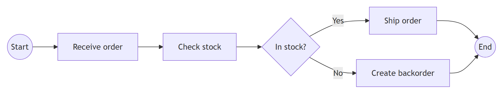
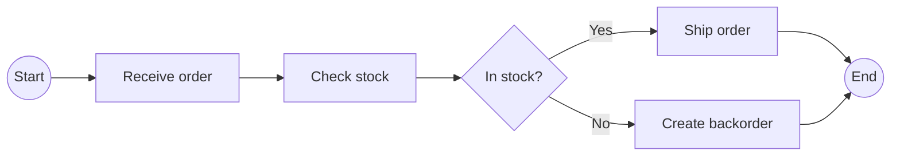

# BPMN 2.0.2 — Business Process Model and Notation

Authoring and reading **BPMN 2.0.2** process and collaboration diagrams: the
OMG standard (document **formal/13-12-09**, January 2014), published verbatim by
ISO as **ISO/IEC 19510:2013**. This skill covers the graphical notation, the
token-flow execution semantics, the full element set, and well-formedness rules,
plus a Mermaid bridge (for approximate flowcharts). Building real BPMN in
Enterprise Architect is a tool task — the **`ea-modeling`** skill owns it (and BPMN
is GUI-toolbox-only there; it is not MCP-creatable).

This skill is a **router**. The body below tells you which reference file to
open; the substance lives in `reference/*.md`. Do not paraphrase notation from
memory — open the relevant file and quote its rules.

The sketch below shows the *shape* of a BPMN process as a Mermaid flowchart.
BPMN has **no native Mermaid diagram type**, so this is an **approximation
only** — a circle stands in for a start/end event and a diamond for a gateway;
it omits the real BPMN markers, pools/lanes, and event triggers. For true BPMN
notation, see the faithful Enterprise Architect images in this skill.

Mermaid source

<!-- render: images/bpmn-process-sketch.png -->

## When to use

- Authoring or reviewing a business process / workflow as a BPMN diagram.
- Choosing the right element: which event trigger, which gateway, task vs.
  sub-process, pool vs. lane, sequence vs. message flow.
- Explaining BPMN execution semantics (tokens, splits/joins, exceptions).
- Checking a model for well-formedness / common modeling mistakes.

## When NOT to use (route elsewhere)

- **Building the BPMN model inside Enterprise Architect** — a tool task owned by
  the **`ea-modeling`** skill (its `reference/notation-to-ea-mapping.md` › "BPMN → EA"
  carries the MDG mapping and the key limitation: BPMN is GUI-toolbox-only, not
  MCP-creatable). `reference/pools-lanes-collaboration.md` §9 has the one-line
  consequence for an author.
- **Plain flowcharts** with no BPMN semantics — use the `mermaid` skill. BPMN
  has **no native Mermaid diagram type**; any Mermaid output is an *approximation*
  (see `reference/overview-and-rules.md` › "Mermaid note").
- UML, ArchiMate, ER, or other notations — different skills.

## Reference map (open what you need)

| File | Open it when you need… |
|------|------------------------|
| `reference/overview-and-rules.md` | The big picture: what BPMN is, diagram types, **conformance classes**, **token-flow semantics**, the element-category map, **well-formedness rules**, the version/standard note, and the Mermaid-approximation note. **Read this first** for any non-trivial question. |
| `reference/events.md` | Anything about **events**: Start / Intermediate (catch/throw, boundary interrupting/non-interrupting) / End, the full trigger taxonomy (None, Message, Timer, Error, Signal, Conditional, Link, Escalation, Compensation, Cancel, Terminate, Multiple, Parallel Multiple), the position×trigger matrix, and event sub-processes. |
| `reference/activities.md` | **Activities**: Task and its seven types (User, Service, Send, Receive, Manual, Script, Business Rule), Sub-Process (embedded / call / event / transaction / ad-hoc), and activity markers (loop, multi-instance, compensation). |
| `reference/gateways.md` | **Gateways**: Exclusive (XOR), Parallel (AND), Inclusive (OR), Event-Based, Complex — split vs. join semantics, default flows, the gateway-pairing rule, deadlock/livelock traps. |
| `reference/flows-and-data.md` | **Connecting objects** (Sequence Flow incl. conditional & default, Message Flow, Association) and **Data** (Data Object incl. collection & state, Data Store, Data Input/Output, Data Association), plus **Artifacts** (Group, Text Annotation). |
| `reference/pools-lanes-collaboration.md` | **Swimlanes & collaboration**: Pool (participant), Lane, black-box pools, message flow between pools, choreography note — and §9, the author-facing note that BPMN is GUI-toolbox-only in EA (the `ea-modeling` skill owns the MDG mapping). |

## Key facts to anchor on (details in the files)

- A **token** is the abstract marker that traverses sequence flows; element
  behaviour is defined by how it consumes and produces tokens. Sequence flow is
  intra-process only; **message flow** crosses pool boundaries. See
  `reference/overview-and-rules.md`.
- Every trigger is valid only at certain **event positions**, and is either
  **catching** or **throwing**. The authoritative matrix is in
  `reference/events.md` — do not guess (e.g. Error end-events *throw*; Cancel is
  only on transaction boundaries / transaction end).
- **Gateways do not create or evaluate data** beyond conditions on their
  outgoing flows; conditions live on the **sequence flows**, and a **default
  flow** is taken only when no other condition is true. See `reference/gateways.md`.

## Cross-references

- Flowcharts / general diagrams-as-code → `mermaid` skill.
- Building the model in EA → `ea-modeling` skill +
  `${CLAUDE_PLUGIN_ROOT}/shared/reference/ea-type-cheatsheet.md`.
