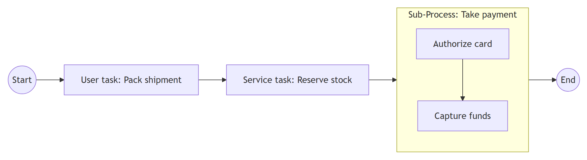
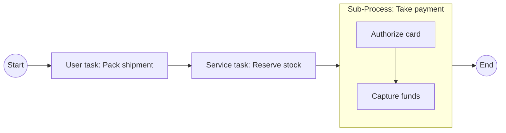

# BPMN 2.0.2 — Activities

Table of contents:
1. What an activity is
2. Task (atomic work)
3. Task types (the seven)
4. Sub-Process (compound work)
5. Sub-Process kinds: embedded / call / event / transaction / ad-hoc
6. Activity markers: loop, multi-instance, compensation
7. Worked example: order fulfilment activities
8. Common activity mistakes

---

## 1. What an activity is

An **activity** is a unit of *work* performed in a process. Notation: a
**rounded rectangle**. Two kinds:

- **Task** — atomic: not broken down further in this diagram.
- **Sub-Process** — compound: contains its own flow of activities/events/gateways.

A token entering an activity is consumed on the way in; the activity executes;
a token is produced on the outgoing flow when it completes. Small **marker
icons** at the bottom-centre of the shape (loop, multi-instance, compensation,
ad-hoc) modify *how* it runs; a **type icon** at the top-left (for tasks) says
*what kind* of work it is.

## 2. Task

A plain (rounded-rectangle) task with no type icon is an **abstract / undefined
task** — work whose nature isn't specified. Prefer a **typed** task when the kind
of work is known; it documents intent and is required for execution.

Naming rule: **verb + object** ("Approve invoice", "Ship order"), not a noun.

## 3. Task types (the seven)

Each is a rounded rectangle with a distinguishing top-left icon.

| Type | Icon | What it is | When to use | Mistake to avoid |
|------|------|-----------|-------------|------------------|
| **User** | person | A human performs the work *with* system support (a worklist item). | Anything a person does in a UI/form. | Confusing with Manual (Manual has *no* system involvement). |
| **Service** | gears | Automated work by a system/service (web service, automated app) with no human. | API calls, automated computations. | Using it for human steps. |
| **Send** | filled envelope | Sends a **message** to another participant; completes once sent. | Outbound message in a collaboration. | Using a throwing message *event* when a *task* (with its own lifecycle) is meant — both exist; task is the activity form. |
| **Receive** | open envelope | Waits for a **message**; completes on receipt. Can be the **instantiating** receive (starts the process). | Inbound message as a work step. | Using it where a message *start event* fits better. |
| **Manual** | hand | Work done by a person **without** any system/engine (e.g. install a part). | Purely physical/off-system steps. | Using it for system-assisted human work (that's User). |
| **Script** | scroll | The engine runs a **script** (in some language) inline. | Lightweight automated logic inside the engine. | Putting heavy integration here (use Service). |
| **Business Rule** | table | Sends data to a **business-rules / decision** engine (e.g. DMN) and gets a decision back. | Decisions driven by rule tables — feed the result into a following gateway. | Drawing the *decision* as a gateway label instead of computing it in a Business Rule task. |

(All seven are in the **Analytic** conformance class; the undefined task is in
Descriptive.)

## 4. Sub-Process (compound work)

A **sub-process** is an activity that contains its own BPMN flow. Two display
states:

- **Collapsed** — a rounded rectangle with a small **[+]** marker; the internals
  are hidden. Use for overview diagrams.
- **Expanded** — the rectangle is enlarged and the inner flow is drawn inside it
  (with its own start/end events). Use to show detail in place.

A sub-process creates a **token scope**: boundary events attach to it, and a
terminate inside it ends only that scope. It must begin with a **none start
event** and end with end event(s) (for embedded sub-processes).

## 5. Sub-Process kinds

| Kind | Border / marker | What it is | When to use |
|------|-----------------|-----------|-------------|
| **Embedded** (inline) | normal border, [+] when collapsed | Internal flow defined *in place*, sharing the parent's data context. | Decompose a step that is only used here. |
| **Call Activity** (global / reusable) | **thick border**, [+] | A *reference* to a globally defined process or global task, reused across models. | The same sub-process is invoked from several places. |
| **Event Sub-Process** | **dotted border**, no incoming flow | In-scope event/exception handler; starts on its event trigger. | Handle an event within a scope without boundary-event clutter. See `events.md` §7. |
| **Transaction** | **double-line border** | A sub-process with ACID-like, all-or-nothing semantics; on failure it is **cancelled** and compensation runs. | Long-running business transactions needing coordinated rollback (cancel/compensation events). |
| **Ad-Hoc Sub-Process** | **~ (tilde)** marker | Contains activities with *no predefined order*; performers choose which/when, possibly repeating, until a completion condition holds. | Unstructured knowledge work (e.g. "prepare proposal": research, draft, review in any order). |

Notes:
- A **Call Activity** can call a global **Process** (yielding a new scope) or a
  global **Task**.
- A **Transaction** sub-process pairs with a **cancel boundary** event (recovery)
  and a **cancel end** event (rollback) — see `events.md`.
- An **Ad-Hoc** sub-process's inner activities often have *no* sequence flow
  between them; ordering is left to the performer.

## 6. Activity markers

Markers sit at the bottom-centre and can combine (e.g. multi-instance + loop is
not combined, but a sub-process may be both ad-hoc and looped). Applicable to
tasks *and* sub-processes.

| Marker | Icon | Meaning |
|--------|------|---------|
| **Loop** | circular arrow | The activity repeats **sequentially** while/until a loop condition holds (test before or after each iteration). |
| **Multi-Instance — parallel** | three **vertical** bars | The activity runs as **N concurrent instances** (one per item in a collection). All instances run in parallel. |
| **Multi-Instance — sequential** | three **horizontal** bars | N instances run **one after another**. |
| **Compensation** | rewind (double-left triangle) | Marks the activity as a **compensation handler** — it runs only when compensation is triggered (not on the normal flow). |
| **Ad-Hoc** (sub-process only) | **~** tilde | Inner activities are unordered (see §5). |

Distinctions that matter:
- **Loop vs. Multi-Instance:** loop = "repeat this one activity an unknown number
  of times, sequentially, driven by a condition". Multi-instance = "run this once
  **per item** in a known collection", parallel or sequential. Use multi-instance
  when you have *a list*; use loop when you have *a condition*.
- **Compensation marker vs. compensation event:** the marker flags a handler
  activity; the *event* (`events.md`) triggers it.

## 7. Worked example: order fulfilment activities

For an order-to-cash process inside one pool:

- **Receive Task** "Receive order" (instantiating) — starts the process on an
  inbound order message.
- **Business Rule Task** "Check credit" — calls the rules engine; its result
  feeds an **Exclusive Gateway** "Credit OK?" (the decision is *computed in the
  task*, branched in the gateway — see `gateways.md`).
- **Service Task** "Reserve stock" — automated inventory call.
- **Multi-Instance (parallel) Task** "Pick line item" — one instance per order
  line (a collection); all picks run concurrently.
- **User Task** "Pack shipment" — a person packs, with system support.
- **Send Task** "Send dispatch notice" — outbound message to the customer.
- **Transaction Sub-Process** "Take payment" — capture funds; if it fails, a
  **cancel** rolls it back and a **compensation** "Refund authorization" handler
  (compensation-marked task) undoes any partial charge.

Token note: the multi-instance pick task holds several instance-tokens at once
that synchronize before "Pack shipment" — equivalent to a fan-out/fan-in over the
order lines without drawing explicit parallel gateways.

The diagram below is a Mermaid **approximation** of activity/task types and a
sub-process: Mermaid has no BPMN task icons, so each node is labelled by its task
type and the sub-process is shown as a `subgraph` — Enterprise Architect renders
true BPMN activities with type markers.

Mermaid source

<!-- render: images/bpmn-activities-approx.png -->

## 8. Common activity mistakes

- **Untyped tasks everywhere.** Once the nature is known, type the task — it
  documents intent and is needed for execution.
- **User vs. Manual vs. Service confusion.** Person + system = User; person, no
  system = Manual; system, no person = Service.
- **Decision in a gateway instead of a task.** Gateways only branch; compute the
  decision in a Business Rule / User task and branch on its output.
- **Loop where multi-instance is meant** (or vice-versa) — list ⇒ multi-instance,
  condition ⇒ loop.
- **Send/Receive task vs. message event.** Both are valid; a task has a full
  activity lifecycle (and can carry markers), an event is a lightweight point.
  Don't model a received message as a plain task with no message semantics.
- **Call Activity drawn as embedded.** If it's reused, give it the thick border
  (call activity); embedding duplicates the definition.
- **Transaction semantics on a normal sub-process.** Only a transaction
  sub-process (double border) gets cancel/compensation coordination.
