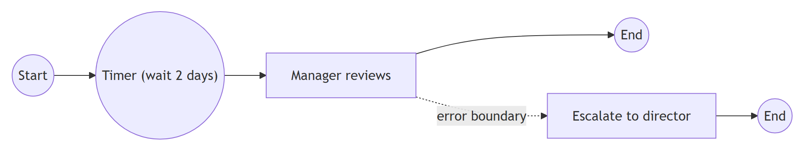
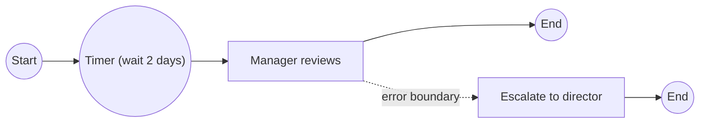

# BPMN 2.0.2 — Events

Table of contents:
1. What an event is
2. The three positions and catch/throw
3. Boundary events (interrupting / non-interrupting)
4. The trigger taxonomy
5. Position × trigger matrix (authoritative)
6. Trigger reference (each trigger: what / when / notation / mistakes)
7. Event sub-processes
8. Worked example: leave request with timer escalation
9. Common event mistakes

---

## 1. What an event is

An **event** is something that *happens* during a process and affects its flow.
Notation: a **circle**. Events are drawn small and are passive in the sense that
the process *reacts* to (catches) or *signals* (throws) them.

Three things define any event: its **position** (start / intermediate / end),
its **direction** (catching or throwing), and its **trigger** (the kind of thing
that happens — message, timer, error, …). The inner marker of the circle shows
the trigger; the border style shows the position; a filled (dark) marker shows
*throwing*, an unfilled (outline) marker shows *catching*.

## 2. The three positions and catch/throw

| Position | Border | Role | Direction |
|----------|--------|------|-----------|
| **Start** | single thin line | begins a process/sub-process; creates a token | always **catching** (it reacts to the trigger that starts the instance) |
| **Intermediate** | double thin line | occurs between start and end, on the flow or on a boundary | **catching or throwing** |
| **End** | single thick (bold) line | consumes a token; marks a path's completion | always **throwing** (it produces its trigger as a result) |

- **None** events have an empty circle: a *plain* start (just "begin here") or a
  plain end (just "stop here").
- A **throwing** intermediate event emits its trigger and immediately passes the
  token on (e.g. throw a signal, send a message, throw an escalation). A
  **catching** intermediate event on the normal flow *waits* until its trigger
  occurs, then releases the token.

## 3. Boundary events (interrupting / non-interrupting)

A **boundary event** is an intermediate **catching** event attached to the edge
of an activity. It listens while the activity runs.

- **Interrupting** (solid double circle): when it fires, the activity is
  **cancelled** (its token removed) and a token is emitted on the boundary
  event's outgoing flow — the *exception path*. Use for errors, timeouts that
  abort, cancellation.
- **Non-interrupting** (dashed double circle): when it fires, the activity
  **keeps running** and an *additional* token is spawned down the boundary's
  outgoing flow — a *parallel side-path*. Use for "meanwhile, also do X"
  (e.g. send a reminder while waiting), escalations that don't abort.

Only certain triggers are valid on a boundary (see matrix). **Error** and
**Cancel** boundary events are *always* interrupting.

## 4. The trigger taxonomy

| Trigger | Meaning |
|---------|---------|
| **None** | Unspecified / plain (start or end). |
| **Message** | A message arrives (catch) or is sent (throw) to/from another participant. |
| **Timer** | A point in time, a duration, or a cycle is reached (catch only). |
| **Error** | A named error is thrown by/within an activity; caught to handle it. |
| **Signal** | A broadcast (one-to-many) signal; not addressed to a specific receiver. |
| **Conditional** | Fires when a business condition (rule on data) becomes true (catch only). |
| **Link** | "Go-to" connector pairing a throw and a catch within the same process (off-page / spaghetti-avoidance). |
| **Escalation** | A non-fatal escalation passed up (e.g. notify a supervisor) — can be non-interrupting. |
| **Compensation** | Triggers compensation (undo) of already-completed activities. |
| **Cancel** | Cancels a **transaction** sub-process; only on a transaction boundary or as a transaction end. |
| **Terminate** | Immediately ends the process, consuming **all** remaining tokens (end only). |
| **Multiple** | Any one of several triggers (catch) / throws several (throw). |
| **Parallel Multiple** | **All** of several triggers must occur to fire (catch only). |

## 5. Position × trigger matrix (authoritative)

Verified against the OMG BPMN 2.0 specification and the Camunda BPMN reference.
"Catch"/"Throw" gives the direction; "—" means the trigger is **not valid** at
that position. Columns:
- **Start** = top-level start event
- **ESP-I / ESP-N** = event sub-process start, interrupting / non-interrupting
- **Int.catch** = intermediate catching, on the normal flow
- **Bnd-I / Bnd-N** = boundary, interrupting / non-interrupting
- **Int.throw** = intermediate throwing, on the normal flow
- **End** = end event

| Trigger | Start | ESP-I | ESP-N | Int.catch | Bnd-I | Bnd-N | Int.throw | End |
|---------|:-----:|:-----:|:-----:|:---------:|:-----:|:-----:|:---------:|:---:|
| None | Catch | — | — | — | — | — | — | Throw |
| Message | Catch | Catch | Catch | Catch | Catch | Catch | Throw | Throw |
| Timer | Catch | Catch | Catch | Catch | Catch | Catch | — | — |
| Conditional | Catch | Catch | Catch | Catch | Catch | Catch | — | — |
| Link | — | — | — | Catch | — | — | Throw | — |
| Signal | Catch | Catch | Catch | Catch | Catch | Catch | Throw | Throw |
| Error | — | Catch | — | — | Catch | — | — | Throw |
| Escalation | — | Catch | Catch | — | Catch | Catch | Throw | Throw |
| Compensation | — | Catch | — | — | Catch | — | Throw | Throw |
| Cancel | — | — | — | — | Catch¹ | — | — | Throw¹ |
| Terminate | — | — | — | — | — | — | — | Throw |
| Multiple | Catch | Catch | Catch | Catch | Catch | Catch | Throw | Throw |
| Parallel Multiple | Catch | Catch | Catch | Catch | Catch | Catch | — | — |

Notes:
- ¹ **Cancel** is valid only with **transaction** sub-processes: as an
  interrupting boundary event on a transaction, or as the end event *inside* a
  transaction. Not valid elsewhere.
- **Error** boundary and **Cancel** boundary are always **interrupting** (no
  non-interrupting column).
- **None** end is the plain "stop"; **None** start is the plain "begin".
- **Link** is a same-process connector: a throw-link and a matching catch-link
  (same name) behave like an off-page connector — no token leaves the process.

## 6. Trigger reference

For each: what it is · when to use · notation rule · common mistake.

### None
Plain start ("process begins") or plain end ("this path ends"). Empty circle.
*Mistake:* relying on an implicit end (activity with no outgoing flow) instead of
drawing a None end — draw the end.

### Message
A message is exchanged with another **pool**/participant. Catch = wait for a
message (envelope outline); throw = send a message (filled envelope). On the
normal flow a catching message intermediate event waits; as a start it begins the
process on receipt. *When:* inter-participant communication. *Mistake:* using a
message event for data passed *within* the same pool — that is just sequence flow.

### Timer
A clock condition: a fixed date/time, a relative duration, or a recurring cycle.
Clock-face marker; **catch only** (you never "throw" time). *When:* a deadline,
a delay, a periodic trigger; as a boundary event for timeouts/escalations; as a
non-interrupting boundary for reminders. *Mistake:* putting a timer at an end or
throwing position — invalid.

### Error
A named error raised by an activity (typically a sub-process throwing an **error
end event**), caught by an **interrupting error boundary event** or an error
**event sub-process** start. Lightning/jagged marker. *When:* technical or
business faults that abort the activity. *Mistake:* using error for a normal
business decision (use a gateway) or making the boundary non-interrupting (error
boundaries are always interrupting).

### Signal
A **broadcast**: one throw, any number of catchers, across processes/pools,
*not* addressed to a specific receiver. Triangle marker (outline = catch,
filled = throw). *When:* "publish" semantics — many parts react to one event.
*Mistake:* confusing it with message (message is 1-to-1 and directed; signal is
1-to-many and undirected).

### Conditional
Fires when a **business condition over data** becomes true (e.g. "temperature >
100"). Lined-paper marker; **catch only**. *When:* trigger work when state
changes, often as a (non-)interrupting boundary. *Mistake:* using it where a
gateway decision (evaluated once, in flow) is what you mean.

### Link
A paired **throw/catch connector within one process** used to avoid long crossing
lines or to continue on another page. Arrow marker; the two halves share a name.
*When:* large diagrams, off-page continuation. *Mistake:* expecting it to cross a
pool (it cannot — it is intra-process only).

### Escalation
Signals that something needs attention *up the chain* without necessarily
aborting. Upward-arrow marker. *When:* "notify the manager but keep going" — pairs
well with a **non-interrupting** boundary escalation event. *Mistake:* using
error (which aborts) when you only meant to escalate.

### Compensation
Triggers **compensation** — undoing the effects of activities that already
completed (e.g. "refund payment", "cancel reservation"). Rewind/double-triangle
marker. A throwing compensation event triggers compensation handlers; a
compensation **boundary** event attaches the *compensation handler* to an
activity. *When:* sagas / long-running transactions where rollback isn't
automatic. *Mistake:* compensating an activity that never completed.

### Cancel
Used **only with transaction sub-processes**: a **cancel end event** inside a
transaction rolls it back; a **cancel boundary event** (interrupting) on the
transaction catches that and routes to recovery. *Mistake:* using cancel on a
non-transaction activity.

### Terminate
An **end** event that immediately ends the *entire process instance*, consuming
**all** remaining tokens (even on parallel branches). Filled-circle marker.
*When:* "abort everything now". *Mistake:* using it casually where branches
should be allowed to finish — it kills concurrent work.

### Multiple / Parallel Multiple
**Multiple** (pentagon, outline=catch/filled=throw): catch = fires on *any one*
of several triggers; throw = emits *all* listed triggers. **Parallel Multiple**
(plus sign, catch only): fires only when *all* listed triggers have occurred.
*When:* an event with several possible causes. *Mistake:* using Multiple when you
mean "all of" (that is Parallel Multiple) — different join semantics.

## 7. Event sub-processes

An **event sub-process** is a sub-process placed *inside* a parent process/sub-
process, drawn with a **dotted border**, that has **no incoming sequence flow**.
It starts when its **event start trigger** fires while the parent scope is active.

- **Interrupting** start (solid circle): the parent scope is **cancelled** and the
  event sub-process runs — equivalent to an interrupting boundary event but kept
  tidily inside the scope.
- **Non-interrupting** start (dashed circle): runs **alongside** the parent (the
  parent keeps going), like a non-interrupting boundary event.

Valid start triggers for event sub-processes are the ESP-I / ESP-N columns of the
matrix above (Message, Timer, Conditional, Signal, Error[I-only], Escalation,
Compensation[I-only], Multiple, Parallel Multiple). *When:* in-scope exception/
event handling that would otherwise need a boundary event plus a tangle of flows.

## 8. Worked example: leave request with timer escalation

Extending the leave-request process from `overview-and-rules.md`:

The **User Task "Manager reviews request"** must finish within 3 days. Attach a
**non-interrupting timer boundary event** (duration = 3 days, dashed circle) to
that task. Its outgoing flow goes to a **Send Task "Send reminder to manager"**,
then loops nowhere (it just nudges). Because it is *non-interrupting*, the review
task keeps running and a second token does the reminder in parallel.

If instead the rule were "auto-escalate to the director and stop waiting after 5
days", use an **interrupting timer boundary event** (solid circle, 5 days): it
cancels the review task and routes to a **User Task "Director decides"**.

Token walk (non-interrupting case): one token sits in "Manager reviews"; at day 3
the boundary timer fires and *spawns* a second token that runs the reminder; the
original token is untouched and completes when the manager responds. Two tokens
existed briefly — correct, because the reminder is a parallel side-effect.

The sketch below is a Mermaid **approximation** of events on a process thread:
Mermaid has no event circles, so these are plain flowchart nodes labelled by
event type — Enterprise Architect renders the true catching/throwing event
circles with trigger markers.

Mermaid source

<!-- render: images/bpmn-events-approx.png -->

## 9. Common event mistakes

- **Wrong direction marker:** drawing a throwing event with an outline marker (or
  vice-versa). Throw = filled, catch = outline.
- **Invalid position/trigger:** e.g. timer at an end event, error at a start, or a
  non-interrupting error boundary — all invalid (see matrix).
- **Message vs. signal:** message is directed 1-to-1 (needs a target participant);
  signal is an undirected broadcast.
- **Cancel/compensation outside transactions/handlers:** cancel needs a
  transaction; compensation needs a completed activity and a handler.
- **Terminate killing wanted branches:** use a None end per branch if you want
  them to finish; reserve terminate for true aborts.
- **Boundary interrupting vs. non-interrupting:** solid cancels the activity;
  dashed spawns a parallel path. Picking the wrong one changes the semantics.
