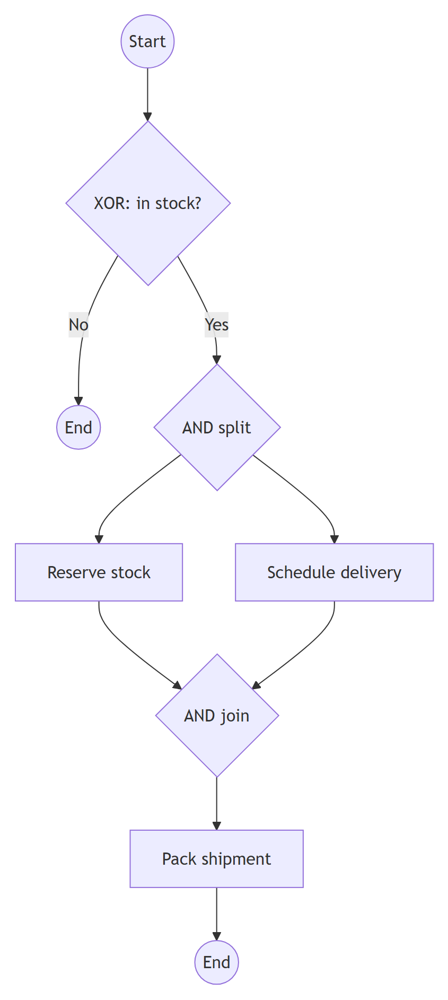
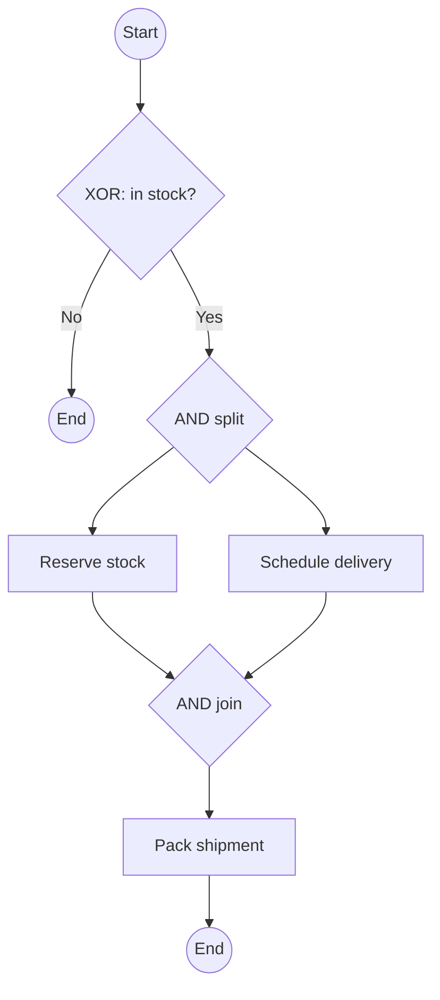

# BPMN 2.0.2 — Gateways

Table of contents:
1. What a gateway is (and what it is NOT)
2. Split vs. join
3. Exclusive (XOR)
4. Parallel (AND)
5. Inclusive (OR)
6. Event-Based
7. Complex
8. Conditions and default flows
9. The gateway-pairing rule (deadlock/livelock traps)
10. Worked example: order routing
11. Common gateway mistakes

---

## 1. What a gateway is (and what it is NOT)

A **gateway** controls how sequence-flow tokens **diverge** and **converge**.
Notation: a **diamond** with an inner marker showing the type.

A gateway **does no work and holds no data**. It only routes tokens. The
*decision data* is produced by a preceding **activity** (e.g. a Business Rule or
User task); the gateway merely tests **conditions on its outgoing sequence
flows**. Writing a question inside the diamond ("Approved?") is a labelling
convenience — the diamond still only branches.

## 2. Split vs. join

The same gateway symbol behaves differently by direction:

- **Split (diverging):** one incoming flow, **multiple outgoing** flows. Decides
  which/how many outgoing flows get a token.
- **Join (converging):** **multiple incoming** flows, one outgoing. Decides
  whether/when to merge incoming tokens.

Always know whether a given gateway is acting as a split or a join — the
semantics below differ between the two.

## 3. Exclusive (XOR)

Marker: empty diamond, or a diamond with an **"X"**.

- **Split:** routes the token down **exactly one** outgoing flow — the first whose
  **condition** evaluates true (evaluation order matters), else the **default**
  flow. Mutually exclusive choice.
- **Join:** **pass-through merge** — each arriving token is forwarded immediately
  to the outgoing flow; it does **not** wait for or synchronize other branches.

*When:* a yes/no or one-of-several decision. *Pairs with:* an exclusive (or
implicit) join. *Mistake:* using XOR-join to merge parallel branches — it fires
once per token, so a downstream activity runs multiple times.

## 4. Parallel (AND)

Marker: diamond with a **"+"**.

- **Split:** emits a token on **every** outgoing flow simultaneously — true
  concurrency, no conditions evaluated.
- **Join:** **synchronizing** — **waits** until a token has arrived on **all**
  incoming flows, then emits **one** token. This is the barrier that re-joins what
  an AND-split forked.

*When:* do several things at once. *Pairs with:* a matching AND-join. *Mistake:*
forgetting the AND-join (branches never re-synchronize) or joining an AND-split
with an XOR-join (downstream runs once per branch → duplicate work).

## 5. Inclusive (OR)

Marker: diamond with a **"O" (circle)**.

- **Split:** evaluates each outgoing flow's condition and emits a token on
  **every** flow whose condition is true (one *or more*). If none are true, the
  **default** flow is taken.
- **Join:** **synchronizes the branches that were actually activated** — it waits
  for all tokens that *could* arrive given the upstream split, then merges to one
  token. (Engines compute this from the active paths.)

*When:* "any combination of these may apply" (e.g. notify by email **and/or** SMS
**and/or** post). *Pairs with:* an inclusive join. *Mistake:* the OR-join is the
trickiest to implement; keep splits and joins paired and avoid mixing with raw
AND/XOR joins, which can deadlock or under-synchronize.

## 6. Event-Based

Marker: diamond with a **pentagon inside a double circle**.

A **deferred choice**: the branch is decided not by data but by **which event
happens first**. Each outgoing flow leads to a **catching intermediate event**
(message, timer, signal, conditional) or a **receive task**. The token waits;
when one of those events fires, that branch is taken and the others are
discarded.

- Two flavours, both available as **instantiating** gateways that *start* a
  process: the **exclusive** event-based gateway (the **first** event to occur
  wins and creates the instance), and the **parallel** event-based gateway
  (the instance is created only after **all** of its events have occurred).
  The everyday mid-process use is the exclusive one — "whichever happens first".

*When:* "wait for the customer's reply OR a 24-hour timeout, whichever first".
*Mistake:* putting tasks (other than receive) or gateways directly after it — its
targets must be catching events / receive tasks.

## 7. Complex

Marker: diamond with an **asterisk "*"**.

For routing that the standard gateways can't express — an arbitrary expression
governs the split (which combination of flows) and/or the join (e.g. "proceed
when **3 of 5** branches arrive"). The semantics are defined by an **activation
condition**.

*When:* genuinely irregular synchronization (n-of-m). *Mistake:* reaching for
Complex when an Inclusive or Parallel gateway would do — Complex is a last resort
because readers must decode its expression.

## 8. Conditions and default flows

- **Conditional sequence flow:** an outgoing flow carrying a boolean **condition
  expression**. Drawn from XOR/Inclusive splits. (On a flow leaving a *task*
  directly, a conditional flow gets a small **mini-diamond** at its source.)
- **Default flow:** drawn with a **tick/slash** mark near its source. Taken **only
  when no other outgoing condition is true**; its own condition (if any) is
  ignored. Provide a default on XOR and Inclusive splits so a token is never
  stuck.
- Conditions belong on the **flows**, not on the gateway shape; the gateway picks
  among them per its type.
- **Parallel** splits ignore conditions entirely (all flows fire), so a default is
  meaningless there.

## 9. The gateway-pairing rule (deadlock/livelock traps)

Match every split with a join of the **same type**:

| Split | Correct join | Wrong join → symptom |
|-------|--------------|----------------------|
| AND (parallel) | AND join | XOR join → downstream runs **once per branch** (duplicate completion). |
| XOR (exclusive) | XOR join (or implicit merge) | AND join → **deadlock**: waits for branches that never got a token. |
| OR (inclusive) | OR join | AND/XOR join → over- or under-synchronization (deadlock or duplicates). |

Other traps:
- **Implicit (uncontrolled) splits/joins** (multiple flows on a task with no
  gateway) act like AND-split / pass-through merge — easy to do by accident.
  Make concurrency/decisions explicit with gateways.
- A token that reaches an **AND-join** but one expected branch was never
  activated (e.g. it was behind an upstream XOR) **deadlocks**. This is the
  classic "AND-join after an XOR-split" bug — use matching types.

## 10. Worked example: order routing

Continuing the order-to-cash process:

1. After "Check credit" (Business Rule task), an **Exclusive (XOR) split**
   "Credit OK?": condition `score >= threshold` → continue; **default** →
   **End** "Order declined".
2. On the continue path, a **Parallel (AND) split** forks two concurrent
   branches: "Reserve stock" (Service task) and "Schedule delivery" (User task).
3. An **AND join** waits for both, then proceeds to "Pack shipment".
4. A **Inclusive (OR) split** "How to notify?": flows `wantsEmail` and `wantsSms`
   (either, both, or — via **default** — neither-special → postal). An **OR join**
   re-merges whichever notifications were sent.

Token walk: one token at the XOR (exactly one path). On "continue", the AND split
makes **two** tokens; the AND join consumes both and emits **one** — concurrency
correctly bracketed. The OR split may emit one or two tokens; the OR join waits
for exactly those and merges to one. No branch deadlocks because every split is
matched by a same-type join.

The diagram below is a Mermaid **approximation** of exclusive and parallel
gateways: Mermaid has no BPMN gateway markers, so diamonds labelled `XOR` / `AND`
stand in — Enterprise Architect renders true BPMN gateway diamonds with X / +
markers.

Mermaid source

<!-- render: images/bpmn-gateways-approx.png -->

## 11. Common gateway mistakes

- **Work in the diamond.** Gateways route only; compute decisions in a task.
- **Mismatched split/join types** (§9) — the top source of deadlocks and
  duplicate completions.
- **No default flow** on a XOR/OR split → token can get stuck when no condition
  holds.
- **XOR-join used to synchronize parallel work** — it doesn't wait; use AND/OR.
- **Conditions on the gateway** instead of on its outgoing flows.
- **Event-based gateway followed by tasks/gateways** instead of catching events /
  receive tasks.
- **Parallel split with conditions** — conditions are ignored; all flows fire.
- **Reaching for Complex** when Inclusive/Parallel suffices.
