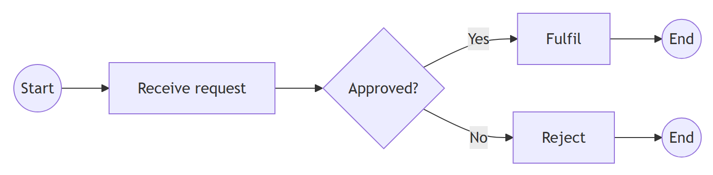
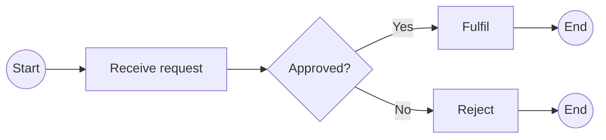
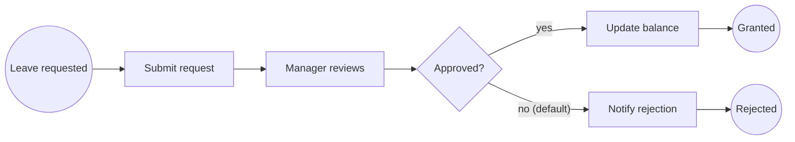

# BPMN 2.0.2 — Overview, Semantics & Rules

Table of contents:
1. What BPMN is and the standard
2. Diagram types
3. Conformance classes
4. Element-category map
5. Token-flow execution semantics
6. Well-formedness rules
7. Common process-level mistakes
8. Worked example: leave-request process
9. Mermaid note (no native BPMN)

---

## 1. What BPMN is and the standard

**BPMN** (Business Process Model and Notation) is a graphical notation for
business processes whose primary goal is to be *understandable by all business
stakeholders* — analysts who draft, developers who implement, and managers who
monitor — while remaining precise enough to be executable.

- **Version covered:** BPMN **2.0.2**, OMG document **formal/13-12-09**,
  published **January 2014**.
- **ISO equivalence:** OMG BPMN was adopted by ISO/IEC as
  **ISO/IEC 19510:2013** *Information technology — Object Management Group
  Business Process Model and Notation*, prepared from **BPMN 2.0.1** under the
  PAS procedure. 2.0.2 is a later errata-level revision that is technically
  near-identical, so the ISO text and BPMN 2.0.2 are equivalent for modeling
  purposes.
- 2.0.2 is a minor (errata) revision over 2.0 / 2.0.1; the notation and
  metamodel are those of BPMN 2.0. "BPMN 2.0" in everyday speech means this.

BPMN 2.0 added (over BPMN 1.x): a formal metamodel + XML interchange format
(serialization), execution semantics, choreography diagrams, and the full event
trigger set. When someone says "the BPMN file" they usually mean the **.bpmn**
XML interchange document.

## 2. Diagram types

BPMN defines three diagram types built from the same vocabulary:

| Diagram | Shows | Notes |
|---------|-------|-------|
| **Process** (orchestration) | The flow of work within a *single* participant — activities, gateways, events connected by sequence flow. | The workhorse. May sit inside one pool/lane set. |
| **Collaboration** | Two or more participants (**pools**) exchanging **messages**. | Sequence flow stays inside a pool; **message flow** crosses pools. See `pools-lanes-collaboration.md`. |
| **Choreography** | The ordered message exchanges *between* participants, with no single controlling process. | Niche; rarely tool-supported. Mentioned for completeness in `pools-lanes-collaboration.md`. |

(A "conversation" diagram is an informal overview of collaborations; not a core
modeling target.)

## 3. Conformance classes

BPMN 2.0 defines **conformance sub-classes** so tools/models can target a
manageable subset. From the specification:

- **Descriptive** — the elements visible to and used by analysts: pools/lanes,
  task, (collapsed) sub-process, call activity, start/end events, none /
  message / timer / terminate events, sequence/message flow, data object/store,
  exclusive & parallel gateways, association, group, text annotation. Good
  "first-level" modeling vocabulary.
- **Analytic** — Descriptive **plus** the full event set on intermediate and
  boundary positions, event sub-processes, inclusive & event-based gateways,
  send/receive/user/service/business-rule/script/manual task types, and markers.
  This is what most rigorous business analysis uses.
- **Common Executable** — the subset intended to be reliably executed by engines
  (process-execution semantics, expressions, data handling).

There are also process-level vs. choreography-level conformance and an overall
"Complete" conformance. **Guidance:** for most analyst work, stay within
**Analytic**; reach for the rest only when a real construct demands it.

## 4. Element-category map

Every BPMN shape falls into one of five categories. Knowing the category tells
you what it can connect to.

| Category | Members | Reference file |
|----------|---------|----------------|
| **Flow Objects** | **Events**, **Activities**, **Gateways** | `events.md`, `activities.md`, `gateways.md` |
| **Connecting Objects** | **Sequence Flow**, **Message Flow**, **Association** (incl. Data Association) | `flows-and-data.md` |
| **Swimlanes** | **Pool** (participant), **Lane** | `pools-lanes-collaboration.md` |
| **Data** | **Data Object**, **Data Store**, **Data Input**, **Data Output** | `flows-and-data.md` |
| **Artifacts** | **Group**, **Text Annotation** | `flows-and-data.md` |

Connection rules in one line: **Sequence Flow** connects Flow Objects *within
one pool*; **Message Flow** connects two pools (or their boundary nodes);
**Association** links Artifacts/Data to anything without implying token flow.

## 5. Token-flow execution semantics

BPMN's dynamic behaviour is defined with the metaphor of a **token**.

- A process instance starts by generating a **token at each start event** that
  fires. The token is an abstract marker (it has no value of its own) that
  traverses **sequence flows** and visits flow objects.
- An **activity** consumes the token on its incoming flow, executes, then emits a
  token on its outgoing flow.
- **Gateways** route tokens (see `gateways.md`): a split may *duplicate* tokens
  (parallel/inclusive) or *choose one* path (exclusive); a join may *wait and
  merge* tokens (synchronizing) or *pass through* each token (uncontrolled
  merge).
- A token is **consumed at an end event**. The process instance **completes when
  no tokens remain anywhere** in its scope (all reached an end event or were
  consumed by a terminate). A **terminate end event** consumes *all* remaining
  tokens in the process, ending it immediately.
- Multiple tokens can be alive at once (true concurrency) — that is what an
  AND-split models. Implicit splits/joins (a flow object with multiple outgoing
  or incoming sequence flows and no gateway) behave like an **uncontrolled**
  parallel split / merge: every outgoing flow gets a token; every incoming token
  passes straight through without synchronization.

Key consequences:
- **No global variables drive routing** — routing is decided by conditions on
  sequence flows and by gateway type, evaluated as the token arrives.
- **Message flow does not carry tokens.** Sending a message does not move a token
  to another pool; the other pool reacts via its own catching event.
- **Boundary events** intercept a token *inside* the activity: an interrupting
  boundary event removes the token from the activity (cancelling it) and emits a
  token on the boundary's outgoing flow; a non-interrupting one spawns an
  *additional* token while the activity keeps running. See `events.md`.

## 6. Well-formedness rules

A model can be drawn yet be *malformed*. Enforce these:

1. **Start/end coverage.** Every process should have at least one explicit
   **start event** and the path of every token should reach an **end event**
   (avoid implicit/dangling ends). Use explicit events; do not leave activities
   with no outgoing flow as silent ends.
2. **Sequence-flow endpoints.** A sequence flow has **exactly one source and one
   target**, both Flow Objects, and **both in the same pool**. It must not cross a
   pool boundary (that is a message flow).
3. **Event connectivity.** A **start event** has *no incoming* sequence flow and
   at least one outgoing. An **end event** has *no outgoing* sequence flow and at
   least one incoming. (Boundary events are attached, not on the main flow.)
4. **Gateways route only.** A gateway performs no work; do not hang data behaviour
   on it. Conditions live on the gateway's **outgoing sequence flows**, not on the
   gateway shape itself.
5. **Pair your gateways.** A split gateway should be matched by a join of the same
   type (AND-split ↔ AND-join, etc.) to avoid deadlock or stray tokens — see
   `gateways.md` for the exact failure modes.
6. **Message flow only between pools.** Message flow connects elements in
   *different* pools (or pool↔node); never within one pool.
7. **No sequence flow into/out of a black-box pool.** A collapsed/black-box pool
   exposes only message flow.
8. **Reachability & no dead ends.** Every flow object lies on some path from a
   start event to an end event; no element is unreachable, and no non-end element
   is a dead end (except intentional traps handled by boundary/terminate events).
9. **Label decisions.** Exclusive/inclusive gateways used as decisions should be
   posed as a question and their outgoing flows labelled with the answers/
   conditions; one of them should be the **default** flow.
10. **Data associations are directional** and use **(data) association**, not
    sequence flow — see `flows-and-data.md`.

## 7. Common process-level mistakes

- Using a **diamond (gateway) as an activity** ("approve?" written in the
  diamond). The gateway only *branches*; the work/decision happens in a
  preceding **task** (often a Business Rule or User task).
- **Crossing a pool with sequence flow.** Inter-pool communication is message
  flow only.
- **AND-split joined by XOR** (or vice versa) → deadlock or duplicate
  completion. Mismatched gateway pairs are the single most common semantic bug.
- **Multiple uncontrolled outgoing flows** from a task when a *decision* was
  intended (that is an implicit AND-split — all run). Insert an explicit gateway.
- Modelling a **message as a sequence flow step** inside one pool. A received
  message is a (catching) **message event** or a **receive task**.
- Forgetting the **default flow** on a decision, so a token can get stuck when no
  condition holds.

## 8. Worked example: leave-request process (single pool)

Plain process inside one pool ("Employee Leave"):

1. **Start (None)** "Leave requested".
2. **User Task** "Submit leave request".
3. **User Task** "Manager reviews request".
4. **Exclusive Gateway** "Approved?" — two outgoing flows:
   - condition `approved == true` → **User Task** "Update leave balance" →
     **End (None)** "Leave granted".
   - **default** flow → **Send Task** "Notify rejection" → **End (None)**
     "Leave rejected".

Token walk: one token from Start traverses tasks 2 and 3; at the XOR gateway the
single token takes exactly one outgoing flow (the default if the condition is
false); it is consumed at whichever end event it reaches. Exactly one token
exists throughout — correct for a decision. (Contrast: a **parallel** gateway
here would wrongly grant *and* reject simultaneously.)

This example is extended with a timer escalation in `events.md`, with task-type
choices in `activities.md`, and split into two pools (employee ↔ HR system) in
`pools-lanes-collaboration.md`.

The diagram below is a Mermaid **approximation** of a simple BPMN process —
Mermaid has no native BPMN, so circles stand in for events and a diamond for the
gateway; Enterprise Architect renders true BPMN notation.

Mermaid source

<!-- render: images/bpmn-process-approx.png -->

## 9. Mermaid note (no native BPMN)

**Mermaid has no native BPMN diagram type.** There is no BPMN renderer in
Mermaid; gateways, pools, message flow, and event triggers have no first-class
Mermaid syntax. You can sketch the *control flow* with a Mermaid `flowchart`
(diamonds for gateways, rectangles for tasks, circles for events) **but it is an
approximation** — it loses BPMN semantics (token rules, event triggers,
catch/throw, pools vs. lanes, message vs. sequence flow). Always **label such a
sketch as "approximate BPMN, not valid notation"** and, for genuine flowchart
needs, use the **`mermaid` skill**. For real BPMN, produce a `.bpmn` model or
build it in Enterprise Architect (`pools-lanes-collaboration.md` › EA bridge).

Approximate flowchart sketch of the leave-request process (NOT valid BPMN):

