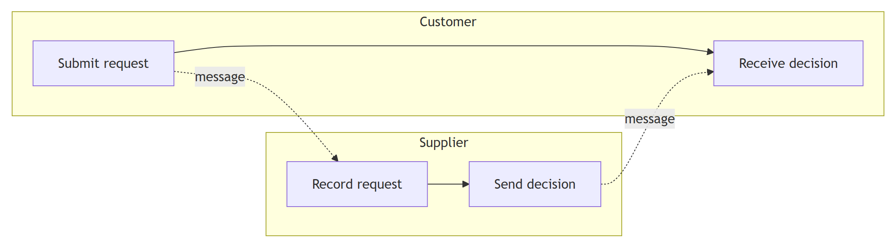
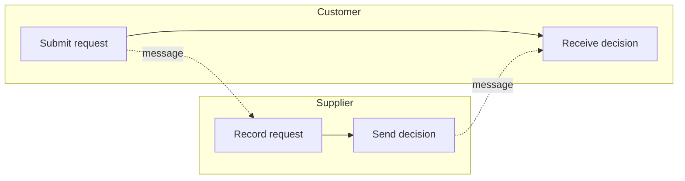

# BPMN 2.0.2 — Pools, Lanes & Collaboration

Table of contents:
1. Swimlanes overview
2. Pool (participant)
3. Lane
4. Black-box pools & message flow
5. Collaboration diagrams
6. Choreography (brief note)
7. Worked example: leave request across two pools
8. Common swimlane mistakes
9. Building BPMN in a tool

---

## 1. Swimlanes overview

**Swimlanes** organize a model by *who* does the work. BPMN has two:

- **Pool** — a **participant** in a collaboration (an organization, a system, a
  role acting as a black box). Each pool contains **one process** (or is empty /
  black-box).
- **Lane** — a **sub-division of a pool** (a role, department, or system within
  that participant).

Orientation can be horizontal (lanes stacked vertically) or vertical; horizontal
is most common.

## 2. Pool (participant)

A **Pool** is the container for a single participant's process. Notation: a large
**rectangle with a labelled header band** (the participant's name) on the left
(horizontal) or top (vertical) edge.

Rules:
- A pool holds **at most one process**. Two interacting parties = **two pools**.
- **Sequence flow stays inside a pool**; it must **not** cross the pool boundary.
- Interaction *between* pools is **message flow only** (dashed line) — see
  `flows-and-data.md`.
- A pool may be **expanded** (its process drawn inside) or **collapsed /
  black-box** (empty — only its message interface is shown).

## 3. Lane

A **Lane** partitions a pool into rows/columns, typically by **role or system**.
Notation: sub-bands within the pool, each labelled.

Rules:
- Lanes are **organizational only** — they have **no token semantics**. A token
  crosses lane boundaries freely along sequence flow (lanes are *not* pools).
- Use lanes to show *responsibility* ("Sales", "Warehouse", "Finance") within one
  participant.
- Sequence flow **may** cross lanes (same pool); it may **not** cross pools.

Lane vs. Pool decision: same legal/organizational entity, different roles ⇒
**lanes** in one pool. Separate parties that exchange messages ⇒ **separate
pools**.

## 4. Black-box pools & message flow

A **black-box pool** is a collapsed pool whose internals are hidden — you model
*your* process in detail and the counterpart (customer, external system) as an
empty pool you only exchange **messages** with.

- A black-box pool exposes **only message flow**; no sequence flow enters or
  leaves it, and no internal elements are shown.
- Message flow connects to the pool edge, or to specific message events /
  send-receive tasks if the pool is expanded.

## 5. Collaboration diagrams

A **collaboration** shows **two or more pools** and the **message flows** between
them. This is the standard way to model an interaction (e.g. Customer ↔ Seller,
or Process ↔ external Service).

Build pattern:
1. One pool per participant; detail the process(es) you control, black-box the
   rest.
2. Wire intra-pool control with **sequence flow**; wire inter-pool exchanges with
   **message flow**.
3. Use **message events / send & receive tasks** as the touch-points where
   messages are thrown/caught (`events.md`, `activities.md`).

## 6. Choreography (brief note)

A **choreography diagram** models the **ordered message exchanges between
participants** with no single controlling process — each choreography *activity*
is a message interaction band naming the two participants. It is a distinct,
niche diagram type with limited tool support; most work uses **process** and
**collaboration** diagrams. Mentioned here for completeness only.

## 7. Worked example: leave request across two pools

Splitting the leave-request process (`overview-and-rules.md`) into a
collaboration:

- **Pool "Employee / Manager"** (expanded): start → User Task "Submit request" →
  *(message flow out)* → … → XOR "Approved?" → end events, as before.
- **Pool "HR System"** (expanded or black-box): receives the request, records it,
  and **sends** an approval/rejection message back.
- **Message flows** (dashed) cross between the pools: "Leave request" out from a
  **Send task** in the Employee pool to a **Receive task / message start** in the
  HR pool; "Decision" back from HR to a **catching message event** in the Employee
  pool. The XOR "Approved?" branches on the *content* of that received decision.

Note: nothing connects the two pools except message flow; each pool's token flow
is independent. A message does **not** carry a token across — the receiving side
reacts with its own catching event (`overview-and-rules.md` §5).

The diagram below is a Mermaid **approximation** of a collaboration: Mermaid has
no BPMN pools or message flow, so `subgraph`s stand in for pools and a dashed
arrow for the message flow — Enterprise Architect renders true BPMN pools, lanes,
and message-flow connectors.

Mermaid source

<!-- render: images/bpmn-collaboration-approx.png -->

## 8. Common swimlane mistakes

- **Sequence flow crossing pools** — the cardinal error; use message flow.
- **Two parties in one pool with lanes** when they actually exchange *messages* —
  if they message each other, they are **separate pools**, not lanes.
- **Message flow between lanes of the same pool** — within a pool it's sequence
  flow; message flow is inter-pool.
- **Detailing a black-box pool** — if you don't control/model it, keep it
  collapsed and interact only by message.
- **Expecting lanes to synchronize tokens** — lanes have no semantics; only
  gateways/events do.

## 9. Building BPMN in a tool

**BPMN is not creatable via the EA MCP** — the `BPMN2.0::*` MDG type strings are rejected, the
`stereotypes` field strips the profile (you get plain UML), and the EA COM API reverts BPMN element
stereotypes too. So to author **real** BPMN, place the elements from EA's **BPMN toolbox by hand**;
when the goal is just a diagram in the repo, ship the **labelled Mermaid approximation** above.

The tool-side mechanism and the MDG concept/tagged-value table live in the **`ea-modeling`** skill
(`reference/notation-to-ea-mapping.md` › "BPMN → EA"); the COM-revert detail is in
`${CLAUDE_PLUGIN_ROOT}/shared/reference/ea-com-bridge.md`.
