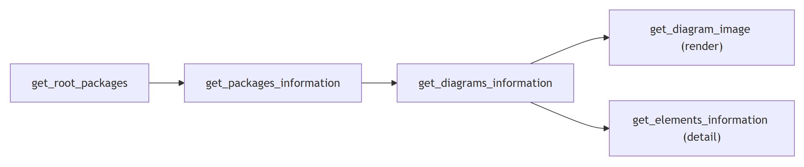
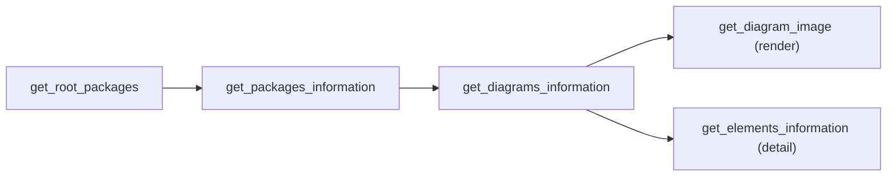

# EA MCP — read tool catalog

Read tools are always available (no `-enableEdit` needed). Use them to navigate, search, inspect,
and render. All names are fully qualified as `enterprise-architect:<tool>`.

## Contents
- [Navigate the tree](#navigate-the-tree)
- [Search](#search)
- [Inspect detail](#inspect-detail)
- [Diagrams & rendering](#diagrams--rendering)
- [Linked documents & selection](#linked-documents--selection)
- [A typical read flow](#a-typical-read-flow)



<details>
<summary>Mermaid source</summary>

<!-- render: images/ea-mcp-read-flow.png -->



</details>

## Navigate the tree

| Tool | Use |
| --- | --- |
| `get_root_packages` | List the root/model packages. The entry point and the liveness probe. |
| `get_packages_information` | Details for one or more packages (by ID), incl. child packages. |
| `get_current_package` | The package currently selected in the EA project browser. |

## Search

| Tool | Use |
| --- | --- |
| `find_packages_by_name` | Locate packages by (partial) name. |
| `find_elements_by_name` | Locate elements by (partial) name across the model. |
| `find_element_in_diagrams` | Find which diagrams an element appears on (usage/impact). |

## Inspect detail

| Tool | Use |
| --- | --- |
| `get_elements_information` | Full detail for elements by ID (attributes, operations, stereotypes, tagged values, notes). |
| `get_current_elements` | The element(s) currently selected in EA. |
| `get_connectors_information` | Detail for connectors by ID (type, ends, direction, stereotype). |
| `get_current_connector` | The connector currently selected in EA. |

> `get_connectors_information` over a guessed ID **range** fails the whole call if any single ID is
> invalid — narrow the range when probing.

## Diagrams & rendering

| Tool | Use |
| --- | --- |
| `get_diagrams_information` | Metadata for diagrams (by ID/package): name, type, contained elements. |
| `get_current_diagram` | The diagram currently active in EA. |
| `get_opened_diagrams` | Which diagrams are currently open in EA. |
| `open_diagrams` | Open one or more diagrams (REQUIRED before creating sequence messages). |
| `reload_diagrams` | Force EA to re-render after external changes. |
| `get_diagram_image` | **Render a diagram to PNG** — the verification workhorse. |

## Linked documents & selection

| Tool | Use |
| --- | --- |
| `export_element_linked_documents` | Pull an element's linked (rich-text) document out. |
| `select_element_in_browser` | Highlight an element in the EA project browser. |
| `select_element_in_diagram` | Select/centre an element on its diagram. |

## A typical read flow

```
get_root_packages                     # find the model roots
  → get_packages_information(id)       # drill into a package, list children + elements
  → get_diagrams_information(pkgId)    # list its diagrams
  → get_diagram_image(diagramId)       # render one to PNG to actually see it
  → get_elements_information([ids])    # pull detail on the interesting elements
```

For full reading recipes ("summarize a model", "find where X is used", "extract a diagram as an
image"), see the `ea-modeling` spell's `reading-recipes.md`.
