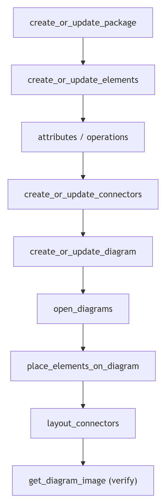
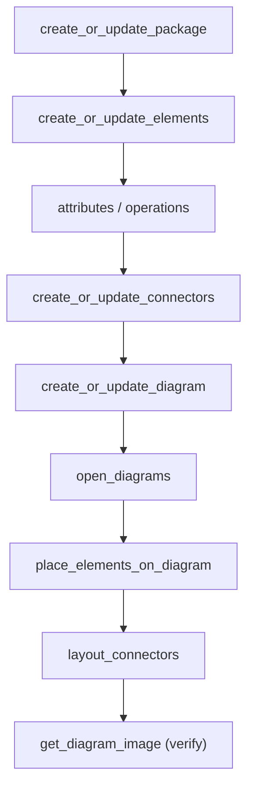

# EA MCP — write tool catalog

Write tools load **only** when `MCP3.exe` runs with `-enableEdit` and the client was restarted
(see `setup-and-connection.md`). The bare names in the tables and flow below are each the EA MCP
tool `enterprise-architect:<tool>` (documentation shorthand for the invokable
`mcp__enterprise-architect__<tool>`) — see the tool-name convention in
`${CLAUDE_PLUGIN_ROOT}/shared/reference/ea-type-cheatsheet.md`.

## Contents
- [The contract every create/update tool shares](#the-contract-every-createupdate-tool-shares)
- [Structure: packages, elements, members](#structure-packages-elements-members)
- [Relationships & messages](#relationships--messages)
- [Diagrams & layout](#diagrams--layout)
- [Delete, clone, baseline](#delete-clone-baseline)



<details>
<summary>Mermaid source</summary>

<!-- render: images/ea-mcp-build-order.png -->



</details>

## The contract every create/update tool shares

- They take an **array** of objects and **return the new IDs** in order. Capture those IDs — you
  need them to attach children, connectors, and diagram placements.
- They are **idempotent-ish "create or update"**: supply an existing ID/GUID to update, omit it to create.
- Each call **commits independently** — there is no transaction. A failure or timeout part-way
  leaves everything created so far.
- `taggedValues` is an **array of `{name,value}`** objects, never a map.

## Structure: packages, elements, members

| Tool | Use | Key fields |
| --- | --- | --- |
| `create_or_update_package` | Create/update a package. **Do this first** to get a parent `packageID`. | `name`, parent package ID |
| `create_or_update_elements` | Create/update elements (Class, UseCase, Actor, Action, State, …). | `type`, `name`, parent package ID, optional `stereotypes`, `taggedValues[]` |
| `create_or_update_attributes` | Add/update class attributes. | owning element ID, `name`, `type`, visibility |
| `create_or_update_operations` | Add/update class operations/methods. | owning element ID, `name`, return type, params |

See `${CLAUDE_PLUGIN_ROOT}/shared/reference/ea-type-cheatsheet.md` for the exact `type` strings.

## Relationships & messages

| Tool | Use | Notes |
| --- | --- | --- |
| `create_or_update_connectors` | Create/update relationships (Association, Generalization, Dependency, ControlFlow, StateFlow, …). | Set `direction: "Unspecified"` — `"Source -> Destination"` FAILS. Use `stereotypes:"include"/"extend"` for use-case «include»/«extend». |
| `create_or_update_messages` | Create sequence-diagram messages between lifelines. | **The diagram must be OPEN** (`open_diagrams`) first, or it errors **and still creates the connectors** → duplicates. |
| `change_connector_visibility` | Show/hide a connector on a diagram without deleting it. | |

## Diagrams & layout

| Tool | Use | Notes |
| --- | --- | --- |
| `create_or_update_diagram` | Create/update a diagram (the view). | Use the correct `type` string (`Class`, `Use Case`, `Sequence`, `Activity`, `StateMachine`, …). |
| `place_elements_on_diagram` | Place elements onto a diagram with geometry. | `x, y, width, height`; **x and y must be > 10**. |
| `layout_connectors` | Auto-route the connectors on a diagram. | Run after placing elements; then `get_diagram_image` to verify. |

## Delete, clone, baseline

| Tool | Use | Notes |
| --- | --- | --- |
| `delete_connectors_or_messages` | Delete connectors/messages. | **The only delete tool.** No delete for packages/elements — name throwaways `ZZ_*` and remove them in EA. |
| `clone_elements` | Duplicate elements. | |
| `clone_package` | Duplicate a package subtree. | |
| `create_baseline` | Snapshot a package as a baseline. | Take one **before** a large edit so you can compare/restore. |
| `apply_baseline` | Restore/merge from a baseline. | |
| `import_element_linked_documents` | Push a linked (rich-text) document into an element. | Counterpart of `export_element_linked_documents`. |

## The build order these tools are meant to follow

```
create_or_update_package → create_or_update_elements → (attributes/operations)
  → create_or_update_connectors → create_or_update_diagram → open_diagrams
  → place_elements_on_diagram → layout_connectors → get_diagram_image (verify)
```

Full mechanics and per-diagram playbooks are in the `ea-modeling` spell.
