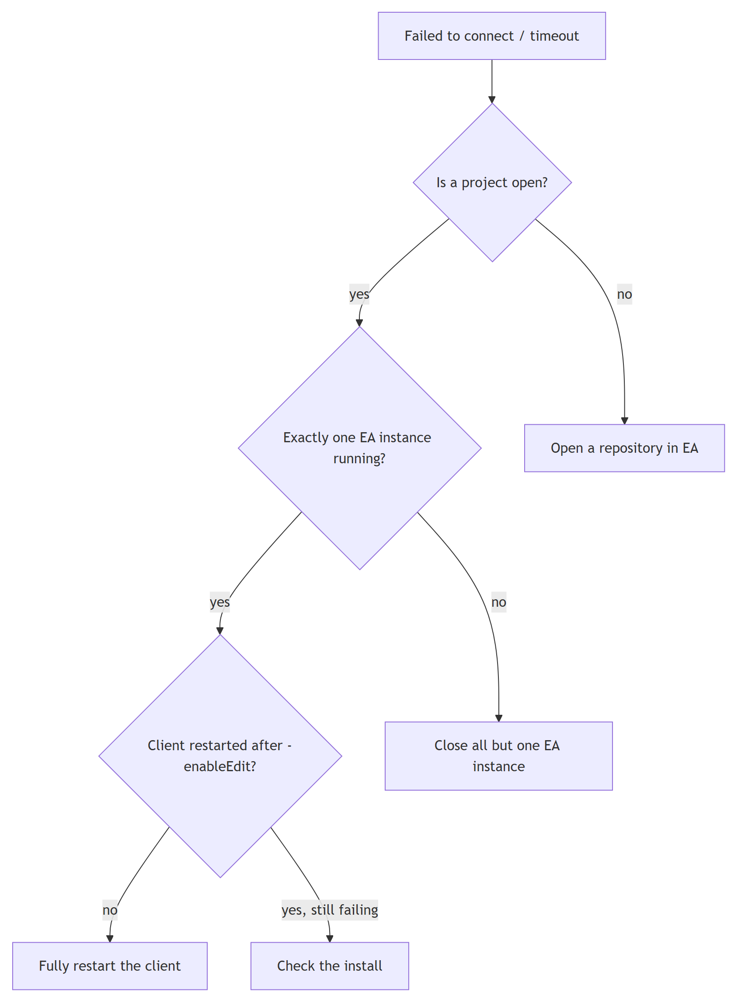
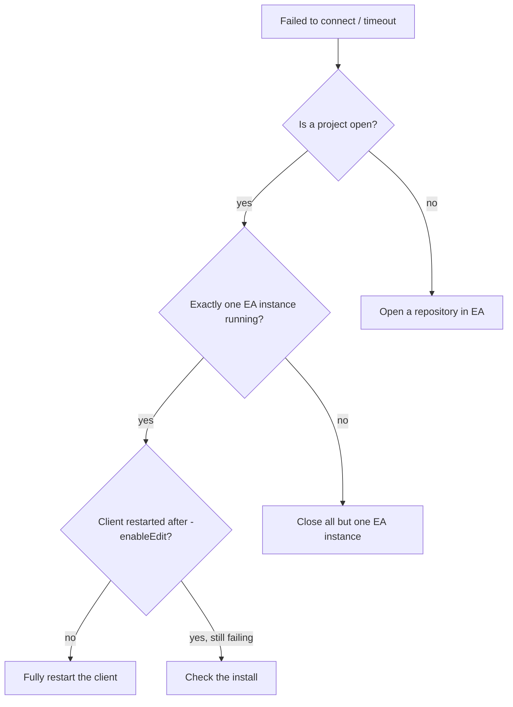

# EA MCP — troubleshooting

A cause→fix table for the failures you will actually hit. Start with `/archmage:ea-doctor`, which
walks these checks automatically.

## Contents
- [Connection failures](#connection-failures)
- [Missing write tools](#missing-write-tools)
- [Tool-call errors](#tool-call-errors)
- [Wrong things got created / wrong target](#wrong-things-got-created--wrong-target)

Mermaid source

<!-- render: images/ea-mcp-troubleshooting.png -->

## Connection failures

**Symptom:** "Failed to connect to Enterprise Architect", timeouts, or `get_root_packages` hangs/errors.

| Likely cause | Fix |
| --- | --- |
| **No project open in EA** (most common) | Open a repository in EA first — the add-in has nothing to serve without one. |
| EA not running | Launch EA. |
| **Two EA instances open** → COM ambiguity | Close all but one EA instance. |
| Server started before EA / stale server | Fully restart the client so `MCP3.exe` re-spawns. |
| EA mid-operation (modal dialog open, long import) | Dismiss the dialog / wait; EA can't service the pipe while blocked. |
| Genuinely slow (32-bit EA under ARM64 emulation) | Increase `-setTimeout` (e.g. 120) and restart the client. |

## Missing write tools

**Symptom:** `create_or_update_*` / `place_elements_on_diagram` are not in the tool list.

| Cause | Fix |
| --- | --- |
| `-enableEdit` not in the server args | Add it to `.mcp.json` / the `claude mcp add` command. |
| Args changed but server not restarted | A running server ignores new args — **fully restart the client**. |
| Wrong server entry being used | `claude mcp list` and confirm the `enterprise-architect` entry has `-enableEdit`. |

## Tool-call errors

| Error / symptom | Cause | Fix |
| --- | --- | --- |
| Payload rejected on `taggedValues` | Passed a map | Use an **array of `{name,value}`**. |
| Connector create fails | `direction: "Source -> Destination"` | Use `"Unspecified"`. |
| "Selection information is unavailable on hidden diagrams" | Sequence diagram not open | `open_diagrams` first; it **still created** the connectors — verify before retry to avoid dupes. |
| `get_connectors_information` over a range fails entirely | One invalid ID in the range | Narrow the ID range; query known-good IDs. |
| Placement ignored / element off-canvas | `x` or `y` ≤ 10 | Use coordinates > 10. |
| Element read back as a different `type` than written | Initial/final `StateNode` auto-retyped to `Pseudostate` | Expected — see schema-gotchas #9. |

## Wrong things got created / wrong target

| Symptom | Cause | Fix |
| --- | --- | --- |
| New content landed under the wrong "Model" root | **Two projects each have a root package named "Model" with packageID 1** — opening the wrong one silently retargets all IDs. | Verify the parent package (name + ID) with `get_packages_information` **before** writing. Keep one EA instance open. |
| Duplicate sequence messages | Retried after the hidden-diagram error | Delete dupes (higher connector IDs) with `delete_connectors_or_messages`. |
| Junk elements you can't remove | No delete tool for elements/packages | Name throwaways `ZZ_*`; delete them manually in EA. |
| Half-built model after a timeout | No transaction; each write commits independently | `create_baseline` before big builds; re-run idempotently (create_or_update will update, not duplicate, when given the same IDs). |

If none of this resolves it, the problem may be the install itself (registry-view/bitness on
ARM64) — see the install repo: https://github.com/klesajos/enterprise-architect-mcp-arm64 .
