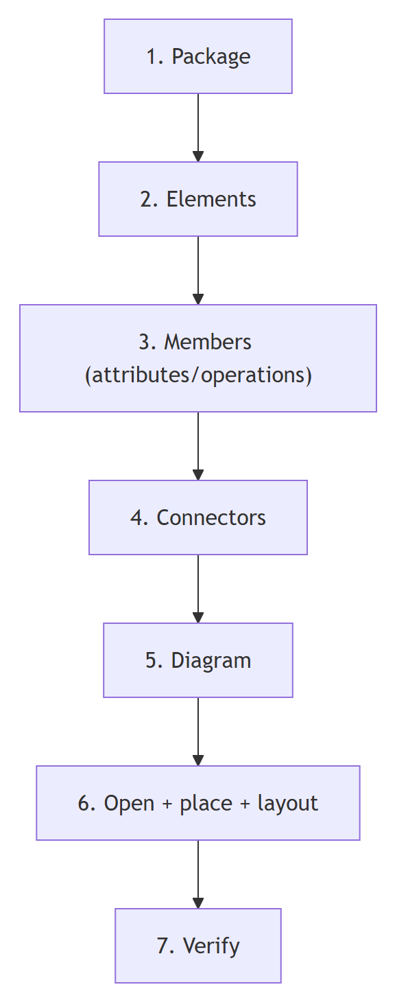
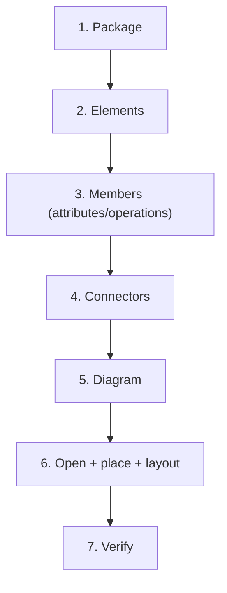

# EA build workflow — step by step

The repeatable recipe for turning a design into EA elements. Worked end-to-end on a tiny class
model; the same shape applies to every diagram kind (per-kind quirks are in
`diagram-type-playbooks.md`).

## Contents
- [Step 0 — confirm the target package](#step-0--confirm-the-target-package)
- [Step 1 — package](#step-1--package)
- [Step 2 — elements](#step-2--elements)
- [Step 3 — members (attributes/operations)](#step-3--members-attributesoperations)
- [Step 4 — connectors](#step-4--connectors)
- [Step 5 — diagram](#step-5--diagram)
- [Step 6 — open, place, layout](#step-6--open-place-layout)
- [Step 7 — verify](#step-7--verify)
- [The gotcha list (memorize)](#the-gotcha-list-memorize)



<details>
<summary>Mermaid source</summary>

<!-- render: images/ea-build-steps.png -->



</details>

## Step 0 — confirm the target package

```
enterprise-architect:get_root_packages
enterprise-architect:get_packages_information   # confirm name + ID of the intended parent
```
Two projects can both have a "Model" root at packageID 1. **Verify before writing.**

## Step 1 — package

Create the container first; capture the returned `packageID`.

```
enterprise-architect:create_or_update_package
  { "packageInfo": { "packageID": 0, "name": "Ordering", "owningPackageID": <modelRootId> } }
→ returns packageID, e.g. 7      # packageID:0 = create; parent is owningPackageID
```

## Step 2 — elements

Elements take an **array** and return IDs in order. Use the exact `type` strings from the
cheatsheet.

```
enterprise-architect:create_or_update_elements
  { "elementInfo": [
    { "elementID": 0, "type": "Class", "name": "Order",    "owningPackageID": 7 },
    { "elementID": 0, "type": "Class", "name": "Customer", "owningPackageID": 7 }
  ] }
→ returns [ {id: 101}, {id: 102} ]    # container is owningPackageID; owningElementID nests in an element
```

Optional per element: `stereotypes`, `notes`, and `taggedValues` as an **array**:
```json
"taggedValues": [ { "name": "owner", "value": "Sales" } ]
```

## Step 3 — members (attributes/operations)

Attach class members by owning element ID.

```
enterprise-architect:create_or_update_attributes
  { "elementID": 101, "attributeInfo": [
    { "attributeID": 0, "name": "total", "type": "Money", "scope": "Private" } ] }

enterprise-architect:create_or_update_operations
  { "elementID": 101, "operationInfo": [
    { "operationID": 0, "name": "submit", "returnType": "void" } ] }
```
`elementID` is the **top-level** target; members go in the `attributeInfo`/`operationInfo` array.
New members use `attributeID:0`/`operationID:0`. The visibility field is **`scope`** (not
`visibility`) — values `Private`/`Protected`/`Package`/`Public`.

## Step 4 — connectors

Reference the element IDs from step 2. **`direction: "Unspecified"`.**

```
enterprise-architect:create_or_update_connectors
  { "connectorInfo": [ {
      "connectorID": 0, "type": "Association", "direction": "Unspecified",
      "sourceEnd": { "relatedElementID": 102, "multiplicity": "1" },
      "targetEnd": { "relatedElementID": 101, "multiplicity": "0..*" } } ] }
  # ends are sourceEnd/targetEnd.relatedElementID — NOT sourceElementID/targetElementID
```

For use-case «include»/«extend»: `type:"Dependency"`, `stereotypes:"include"` (or `"extend"`).
For activity edges: `type:"ControlFlow"`. For state transitions: `type:"StateFlow"`.

## Step 5 — diagram

```
enterprise-architect:create_or_update_diagram
  { "diagramInfo": { "diagramID": 0, "name": "Domain", "type": "Class", "owningPackageID": 7, "owningElementID": 0 } }
→ returns diagramID, e.g. 20
```

## Step 6 — open, place, layout

Open the diagram (mandatory before creating sequence messages; harmless otherwise and lets layout
behave). Place each element with geometry — **x and y must be > 10** — then auto-route.

```
enterprise-architect:open_diagrams [20]

enterprise-architect:place_elements_on_diagram
  { "diagramID": 20, "placements": [
    { "elementID": 101, "x": 60,  "y": 40, "width": 160, "height": 90 },
    { "elementID": 102, "x": 320, "y": 40, "width": 160, "height": 90 } ] }

enterprise-architect:layout_connectors { "diagramID": 20 }
```

## Step 7 — verify

```
enterprise-architect:get_diagram_image [20]   # render PNG, then LOOK at it
```
If something is wrong, fix and re-render. Because creates are idempotent on ID, re-running a
corrected create updates rather than duplicates — **except** sequence messages (see playbooks).

## The gotcha list

The load-bearing payload hard rules (taggedValues array, direction `"Unspecified"`, arrays-in/IDs-out,
x/y > 10, the sequence-message duplicate trap, no element delete → `ZZ_*`, exact case-sensitive type
strings) are listed **once** in `${CLAUDE_PLUGIN_ROOT}/shared/reference/ea-type-cheatsheet.md` ›
"Schema shapes & hard rules". The two silent/irreversible ones are reinforced at point-of-use above
(Step 4 connectors, Step 6 messages) and in the per-diagram playbooks; recovery from a half-built
model is in the `ea-mcp` spell's `reference/schema-gotchas.md`.
