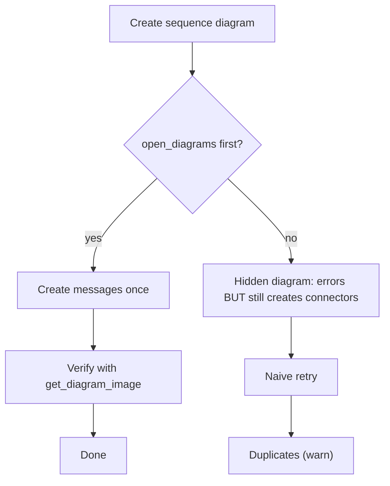

# Per-diagram playbooks

The build workflow is the same shape for every diagram, but each kind has quirks. These are the
ones that cause rework. General workflow: `build-workflow.md`. Type strings:
`${CLAUDE_PLUGIN_ROOT}/shared/reference/ea-type-cheatsheet.md`.

## Contents
- [Class diagram](#class-diagram)
- [Use case diagram](#use-case-diagram)
- [Sequence diagram (the duplicate trap)](#sequence-diagram-the-duplicate-trap)
- [Activity diagram](#activity-diagram)
- [State machine diagram](#state-machine-diagram)
- [Requirements diagram](#requirements-diagram)

Mermaid source

<!-- render: images/ea-sequence-trap.png -->

## Class diagram

- Diagram `type: "Class"`. Elements `Class`/`Interface`.
- Add **attributes** (`create_or_update_attributes`) and **operations** (`create_or_update_operations`) by owning element ID, after the class exists.
- Connectors: `Association` (with `sourceCardinality`/`targetCardinality` for multiplicity),
  `Aggregation` (set composite kind for composition — verify the flag), `Generalization` (child→parent),
  `Realization` (class→interface), `Dependency`.
- Place classes in a grid (x/y > 10), `layout_connectors`, render.

## Use case diagram

- Diagram `type: "Use Case"` (note the space). Elements `Actor`, `UseCase`.
- Actor↔use case is `Association`. Use-case relationships:
  - «include» → `Dependency` + `stereotypes:"include"`.
  - «extend» → `Dependency` + `stereotypes:"extend"`.
  - actor generalisation → `Generalization`.
- Typical layout: actors down the left, use cases in a system boundary to the right.

## Sequence diagram (the duplicate trap)

This is the highest-risk build. Read this before doing it.

1. Lifelines are **elements of `type: "Sequence"`** (stored as Objects). Create them first.
2. Create the diagram `type: "Sequence"`, then **`enterprise-architect:open_diagrams`** it.
3. **Only now** create messages with `create_or_update_messages`.
4. If you skip the open, the tool errors *"Selection information is unavailable on hidden
   diagrams"* **but still creates the message connectors**. So a naive retry **duplicates** them
   (dupes get the higher connector IDs).
5. **Verify with `get_diagram_image` BEFORE retrying anything.**
6. If duplicates exist, find them via `get_connectors_information` over a *narrow* ID range and
   remove with `delete_connectors_or_messages` (the only delete tool).

Order messages top-to-bottom by their sequence position. Synchronous calls vs returns vs async are
set on the message; render to confirm arrowheads.

## Activity diagram

- Diagram `type: "Activity"`. Nodes: `Action`, `Decision` (diamond, for branch **and** merge),
  initial/final as `StateNode` (naming may auto-retype to `Pseudostate`).
- Edges are `ControlFlow`. Put the **guard** on the control flow leaving a `Decision`.
- For object/data flow, use object nodes (verify type) with `ObjectFlow` (verify).
- Forks/joins: use the synchronization bar (verify EA type) — or model parallelism with multiple
  outgoing/incoming control flows on a fork node.

## State machine diagram

- Diagram `type: "StateMachine"` (no space). Nodes: `State`, initial/final `StateNode`.
- Transitions are `StateFlow`. Put `trigger [guard] / effect` on the transition.
- Composite/nested states: create child states inside the composite (verify nesting via the parent
  element ID).

## Requirements diagram

- Diagram `type: "Requirements"`. Elements `Requirement` (verify the element string in live EA).
- Link requirements to design elements with `Realization` (element realises requirement) or
  `Dependency`/«trace». Hierarchy via `Aggregation`/nesting.
