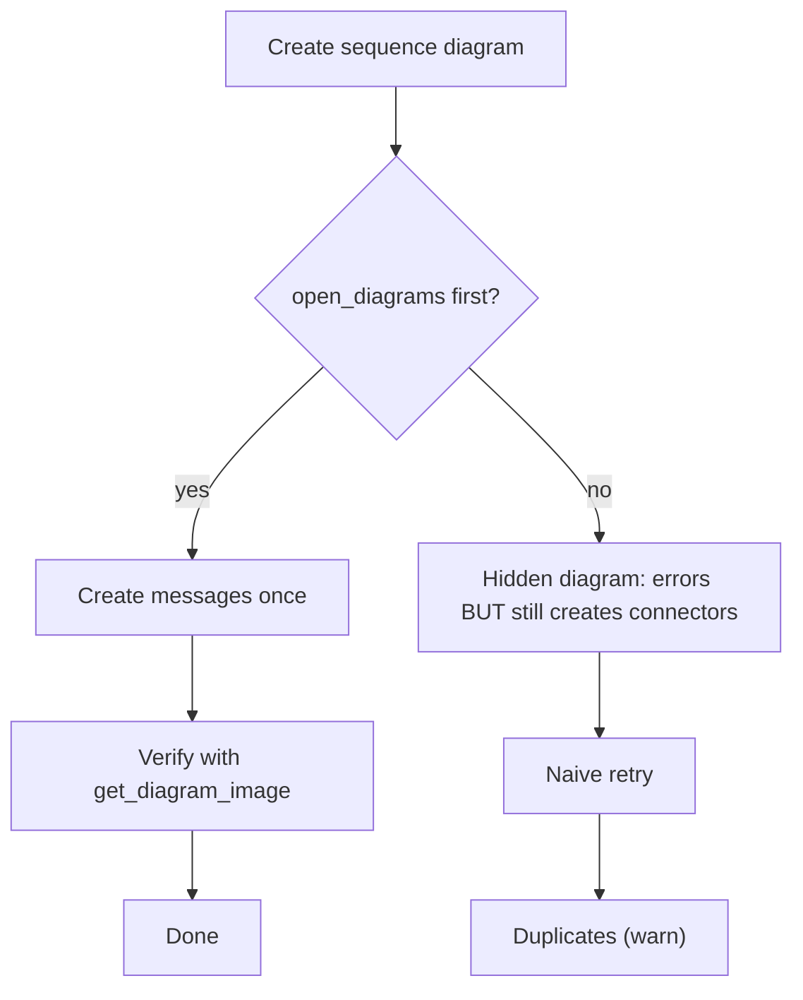

# Per-diagram playbooks

The build workflow is the same shape for every diagram, but each kind has quirks. These are the
ones that cause rework. General workflow: `build-workflow.md`. Type strings:
`${CLAUDE_PLUGIN_ROOT}/shared/reference/ea-type-cheatsheet.md`.

## Contents
- [Class diagram](#class-diagram)
- [Use case diagram](#use-case-diagram)
- [Sequence diagram (the duplicate trap)](#sequence-diagram-the-duplicate-trap)
- [Activity diagram](#activity-diagram)
- [State machine diagram](#state-machine-diagram)
- [Requirements diagram](#requirements-diagram)
- [Object diagram](#object-diagram)
- [Package diagram](#package-diagram)
- [Component diagram](#component-diagram)
- [Deployment diagram](#deployment-diagram)
- [Composite structure diagram](#composite-structure-diagram)
- [Profile diagram](#profile-diagram)
- [Communication / Timing / Interaction Overview](#communication--timing--interaction-overview)
- [ArchiMate view](#archimate-view)


<details>
<summary>Mermaid source</summary>

<!-- render: images/ea-sequence-trap.png -->



</details>

## Class diagram

- Diagram `type: "Class"`. Elements `Class`/`Interface`.
- Add **attributes** (`create_or_update_attributes`) and **operations** (`create_or_update_operations`) by owning element ID, after the class exists.
- Connectors: `Association` (set multiplicity via `sourceEnd.multiplicity` / `targetEnd.multiplicity`;
  the MCP leaves the line plain with no navigability arrow — set `Direction` on the connector via the
  EA COM bridge to draw it),
  `Aggregation` (for composition, set the aggregate end's `Aggregation=2` via the EA COM bridge to get the
  filled diamond — the MCP exposes no aggregation-kind field; the EA GUI also works), `Generalization` (child→parent),
  `Realization` (class→interface), `Dependency`.
  COM-bridge recipes: `${CLAUDE_PLUGIN_ROOT}/shared/reference/ea-com-bridge.md`.
- Place classes in a grid (x/y > 10), `layout_connectors`, render.

## Use case diagram

- Diagram `type: "Use Case"` (note the space). Elements `Actor`, `UseCase`.
- Actor↔use case is `Association`. Use-case relationships:
  - «include» → `Dependency` + `stereotypes:"include"`.
  - «extend» → `Dependency` + `stereotypes:"extend"`.
  - actor generalisation → `Generalization`.
- Typical layout: actors down the left, use cases in a system boundary to the right.

## Sequence diagram (the duplicate trap)

This is the highest-risk build. Read this before doing it.

1. Lifelines are **elements of `type: "Sequence"`** (stored as Objects). Create them first.
2. Create the diagram `type: "Sequence"`, then **`enterprise-architect:open_diagrams`** it.
3. **Only now** create messages with `create_or_update_messages`.
4. If you skip the open, the tool errors *"Selection information is unavailable on hidden
   diagrams"* **but still creates the message connectors**. So a naive retry **duplicates** them
   (dupes get the higher connector IDs).
5. **Verify with `get_diagram_image` BEFORE retrying anything.**
6. If duplicates exist, find them via `get_connectors_information` over a *narrow* ID range and
   remove with `delete_connectors_or_messages` (the only delete tool).

Order messages top-to-bottom by their sequence position. Synchronous calls vs returns vs async are
set on the message; render to confirm arrowheads.

**Watch the field names — messages are the one exception.** `create_or_update_messages` uses flat
`sourceElementID` / `targetElementID`, **NOT** the `sourceEnd.relatedElementID` /
`targetEnd.relatedElementID` you use for connectors. Carrying the connector rule over here is the
classic mistake. The payload:

```
create_or_update_messages {
  "diagramID": 20,
  "messageInfo": [
    { "connectorID": 0, "name": "submit()", "sourceElementID": 101, "targetElementID": 102, "order": 1 },
    { "connectorID": 0, "name": "ack",       "sourceElementID": 102, "targetElementID": 101, "order": 2,
      "isReturnMessage": true },
    { "connectorID": 0, "name": "notify()",  "sourceElementID": 102, "targetElementID": 103, "order": 3,
      "isAsynchronousMessage": true }
  ]
}
```

`connectorID: 0` creates; `order` sequences the arrows; `isReturnMessage: true` draws a dashed
return arrow and `isAsynchronousMessage: true` an open-arrowhead async call (a plain synchronous
call needs neither).

## Activity diagram

- Diagram `type: "Activity"`. Nodes: `Action`, `Decision` (diamond, for branch **and** merge),
  initial/final as `StateNode`. The MCP creates `StateNode` with `Subtype=0`, so initial/final render
  **invisibly** (control flows point at empty space) — set `Subtype=100` (initial) / `101` (final) via
  the EA COM bridge (`${CLAUDE_PLUGIN_ROOT}/shared/reference/ea-com-bridge.md`) to make them visible.
- Edges are `ControlFlow`. Put the **guard** on the control flow leaving a `Decision`.
- For object/data flow, use object nodes (verify type) with `ObjectFlow` (verify).
- Forks/joins: element `type: "Synchronization"` (the synchronization bar) — or model parallelism with
  multiple outgoing/incoming control flows on a fork node.

## State machine diagram

- Diagram `type: "StateMachine"` (no space). Nodes: `State`, initial/final `StateNode`. As on activity
  diagrams, the MCP creates `StateNode` with `Subtype=0` so initial/final render **invisibly** — set
  `Subtype=100` (initial) / `101` (final) via the EA COM bridge
  (`${CLAUDE_PLUGIN_ROOT}/shared/reference/ea-com-bridge.md`) to make them visible.
- Transitions are `StateFlow`. Put `trigger [guard] / effect` on the transition.
- Composite/nested states: create child states inside the composite (verify nesting via the parent
  element ID).

## Requirements diagram

- Diagram `type: "Requirements"` (confirmed). Elements `Requirement` (confirmed). This UML
  `Requirement` is **not** the confirmed ArchiMate `ArchiMate3::ArchiMate_Requirement` — a
  different MDG type; see the `archimate` spell.
- Link requirements to design elements with `Realization` (element realises requirement) or
  `Dependency`/«trace». Hierarchy via `Aggregation`/nesting.

## Object diagram

- Diagram `type: "Object"`. Elements `type: "Object"`, named `instance : Classifier` (the underline
  is intrinsic). Links are `Association` — no multiplicity, no navigability arrow (instance links).
- **Slots** (`attr = value` in the second compartment) are **not** an MCP field — set them via the
  element's `RunState` over COM: one `@VAR;Variable=<name>;Value=<val>;Op==;@ENDVAR;` block per slot
  (quote string values). Recipe in `${CLAUDE_PLUGIN_ROOT}/shared/reference/ea-com-bridge.md`.

## Package diagram

- Diagram `type: "Package"`. Create the packages with `create_or_update_package` (not as elements).
- Dependencies: `Dependency` + `stereotypes:"import"` / `"access"` / `"merge"` for the «import»/
  «access»/«merge» variants; a plain `Dependency` for an ordinary package dependency. (A dedicated
  `PackageImport` connector exists in EA but is unconfirmed via the MCP — verify before relying on it.)

## Component diagram

- Diagram `type: "Component"`. Elements `Component`, `Interface`, `Artifact`, `Port` (Port needs
  `owningElementID` = the component, not a package).
- Two ways to show provided/required interfaces:
  - **Expanded** (renders reliably): separate `Interface` boxes; `Realization` component→interface
    (provided), `Dependency` component→interface (required). Both render **headless** — set `Direction`
    via COM to draw the hollow triangle / open arrow.
  - **Assembly** (ball-and-socket): an `Assembly` connector between two components, named with the
    interface. EA does **not** draw lollipop/socket glyphs through automation — the expanded form is
    the clearer automatable choice.
- `Manifest` (artifact → component) + `stereotypes:"manifest"`, `Direction` via COM for the arrow.

## Deployment diagram

- Diagram `type: "Deployment"`. Elements `Node`, `Device` (renders «device»), `Artifact`, and an
  execution environment = `Node` + `stereotypes:"executionEnvironment"`.
- **Deploy by containment** (the conventional look): position the artifact's rectangle **inside** the
  node's, and give the child a **lower** `DiagramObject.Sequence` than the parent via COM (lower =
  front; equal sequence ⇒ the node fill hides the artifact). Deep nesting device→execEnv→artifact
  needs three sequence tiers. Alternatively a `Dependency` + `stereotypes:"deploy"` arrow.
- Communication paths: `CommunicationPath` node↔node. EA auto-names it "TCP/IP" — clear `Name` via
  COM; keep `direction:"Unspecified"` so it draws headless.

## Composite structure diagram

- Diagram `type: "Composite Structure"`. The enclosing classifier is a `Class`; **parts** are `Part`
  with `owningElementID` = that class (so they nest inside it). **Ports** are `Port` with
  `owningElementID` = the class — created via COM `EmbeddedElements.AddNew(name,"Port")`; they do
  **not** auto-place, so add them to the diagram and position them on the boundary.
- Delegation = a `Connector` from the boundary port to an internal part. Provided/required interfaces
  render **expanded** (`Realization` port→interface = provided lollipop; `Dependency` port→interface =
  required socket) — EA draws no true lollipop/socket via automation.

## Profile diagram

- Diagram `type: "Profile"`. A stereotype is `Class` + `stereotypes:"stereotype"`; the extended
  metaclass is `Class` + `stereotypes:"metaclass"`. There is **no** `Stereotype` element type (it
  errors).
- `Extension` (stereotype-class → metaclass-class) is the filled-triangle relationship — set
  `Direction` via COM to draw the head. A specialised stereotype → its parent stereotype is a
  `Generalization` (hollow triangle, intrinsic head). EA shows the applied stereotype as a `<>` icon,
  not «stereotype» text — that toggle ("Use Stereotype Icons") is a global EA option, not per-diagram.

## Communication / Timing / Interaction Overview

These three interaction diagrams are mostly GUI work; the MCP coverage is thin (mark anything below
"verify in live EA"):

- **Communication** (`type: "Communication"`): reuse the object/class lifelines; `Association` links
  carry the **numbered** messages (sequence numbers are set on the message properties).
- **Timing** (`type: "Timing"`): a state/value lifeline with a state timeline along a time axis — set
  up in the EA GUI; MCP authoring is unconfirmed.
- **Interaction Overview** (`type: "Interaction Overview"`): `ref`/`sd` frames are
  `InteractionOccurrence`/`InteractionFragment`; the control nodes reuse `Decision`/`StateNode`/
  `Synchronization`; edges are `ControlFlow`.

## ArchiMate view

- Host on a `Class` diagram (`type: "Class"`) — the ArchiMate view diagram-type FQN is unresolved;
  `Class` still renders full ArchiMate notation. Elements/relationships are the
  `ArchiMate3::ArchiMate_*` fully-qualified strings — full catalog in `notation-to-ea-mapping.md`.
- Set `direction:"Unspecified"`, then draw the **Serving** (and other open-arrow) heads via COM
  `Direction` (Assignment/Realization heads are intrinsic). Apply orthogonal routing through the MCP
  (`connectorStyle:"OrthogonalSquare"`), not COM. Lay layers top-to-bottom (Business high, Technology
  low) so the serving spine reads vertically.
