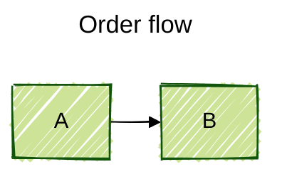
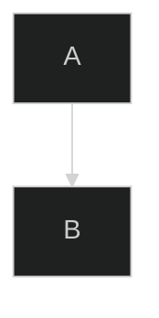
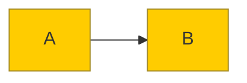

# Mermaid Diagram-as-Code

Authoritative reference for writing **Mermaid** diagrams — text that renders to diagrams inside Markdown, GitHub, GitLab, Notion, docs sites, and the [Mermaid Live Editor](https://mermaid.live). Each diagram is a fenced ```` ```mermaid ```` block whose first non-blank line is a type keyword (`flowchart`, `sequenceDiagram`, etc.).

Mermaid is a **rolling release** with no spec version — there is no "Mermaid 1.0". Syntax drifts between minor releases. Everything here is verified against **mermaid.js.org, snapshot as of 2026** (engine ~v11.x). When a type is **stable** the agent may emit it freely; when a type is flagged **⚠️ beta/experimental** the keyword and syntax can change between releases — keep usage minimal and tell the user it may not render in older engines or in renderers that pin an old Mermaid version (notably GitHub, which often lags the latest release).

## When to use this skill / when NOT to

- **Use this** for quick diagram-as-code embedded in Markdown, READMEs, PR descriptions, issues, MkDocs/Docusaurus pages, ADRs — anything where a lightweight text diagram beats a drawing tool.
- **NOT for modeling in Enterprise Architect** — for building/querying a real EA repository, use the `ea-modeling` skill instead.
- **NOT the place for formal notation rules** — Mermaid's class/state/ER/C4 syntax is a loose approximation of UML/BPMN/C4. For correct UML semantics use the `uml` skill; for correct BPMN use the `bpmn` skill. Mermaid here is about *rendering*, not notational correctness.
- **Tie-break for an unqualified diagram request** — if the user just says "draw a class/sequence/state diagram" without naming Mermaid/Markdown or asking for "diagram as text/code", default to the **`uml`** skill (notation-correct); route here only when they want a lightweight text sketch, name Mermaid, or target Markdown/GitHub/an issue/PR.

## Diagram type status (as of 2026 snapshot)

**Stable** — safe to emit: `flowchart`, `sequenceDiagram`, `classDiagram`, `stateDiagram-v2`, `erDiagram`, `gantt`, `pie`, `journey` (user journey), `quadrantChart`, `requirementDiagram`, `gitGraph`, `zenuml`.

**Stable syntax but officially "experimental" label** (core syntax is settled; only icon integration is experimental) — safe in practice: `timeline`, `mindmap`.

**⚠️ Beta / experimental** — keyword and syntax may change, may not render everywhere; use sparingly and warn the user: `c4` (the `C4Context`/`C4Container`/… family), `sankey`, `xychart-beta`, `block-beta`, `packet`, `kanban`, `architecture-beta`, `radar-beta`, `treemap-beta`. (Also experimental and only minimally covered: `venn`, `wardley`, event modeling, ishikawa, treeview.)

Note: several beta types keep the `-beta` suffix **in the keyword itself** (`xychart-beta`, `block-beta`, `architecture-beta`, `radar-beta`, `treemap-beta`), while `sankey`, `packet`, and `kanban` dropped the suffix. Get the keyword exactly right — see `reference/other-diagrams.md`.

## Reference files — table of contents

Open the file matching the diagram the user asked for. Do not preload all of them.

| File | Covers | Open when |
| --- | --- | --- |
| `reference/flowchart.md` | `flowchart`/`graph`: directions, node shapes (incl. v11 `@{ shape: }`), edges, subgraphs, styling, `classDef`, `click` | Flowcharts, process/decision diagrams, "boxes and arrows" |
| `reference/sequence.md` | `sequenceDiagram`: participants/actors, arrows, activations, notes, loop/alt/opt/par/critical/break, autonumber, boxes | Sequence / interaction / message-flow diagrams |
| `reference/class.md` | `classDiagram`: members, visibility, relationships, cardinality, generics, annotations, namespaces | UML-style class diagrams, OO models |
| `reference/state.md` | `stateDiagram-v2`: states, transitions, composite/choice/fork/join, concurrency, notes | State machines, lifecycles, status flows |
| `reference/er.md` | `erDiagram`: entities, attributes with PK/FK/UK, crow's-foot cardinality, identifying vs non-identifying | Entity-relationship / data-model diagrams |
| `reference/gantt-and-timeline.md` | `gantt` (schedules, dependencies, milestones) and `timeline` (chronologies) | Project schedules, roadmaps, chronological timelines |
| `reference/c4.md` | ⚠️ beta `C4Context`/`Container`/`Component`/`Dynamic`/`Deployment` | C4 architecture diagrams (warn it's experimental; prefer the `uml`/`ea-modeling` skills for rigor) |
| `reference/other-diagrams.md` | Stable: `pie`, `journey`, `quadrantChart`, `requirementDiagram`, `gitGraph`, `mindmap`. ⚠️ Beta: `sankey`, `xychart-beta`, `block-beta`, `packet`, `kanban`, `architecture-beta`, `radar-beta`, `treemap-beta` | Any of those types |

## Config, theming, and embedding (read before customizing any diagram)

Three things every diagram can use, regardless of type:

**1. YAML front-matter config** (preferred, engine v10.5+). A `---`-delimited block at the very top of the diagram (before the type keyword) sets a `title` and any config:

````markdown

````

**2. The `%%{init: {...}}%%` directive** (older, still works, now largely superseded by front-matter). Inline JSON on its own line:



Prefer front-matter for diagram-level config; reach for `%%{init}%%` only when a tool strips front-matter.

**3. Theming.** Built-in themes: `default`, `neutral` (good for B/W print), `dark`, `forest`, `base`. Set via `config.theme` (front-matter) or `theme` (init). Only the **`base`** theme is customizable — to recolor, set `theme: base` and supply `themeVariables` (hex colors only, not color names; Mermaid derives related shades, e.g. `primaryBorderColor` from `primaryColor`):



**Embedding in Markdown / GitHub.** Put the diagram in a ```` ```mermaid ```` fenced block. GitHub, GitLab, and many static-site generators render it automatically; no script needed. GitHub pins a specific Mermaid version that often trails the latest release, so **beta types and the newest `@{ shape: }` flowchart shapes may not render on GitHub even when valid on mermaid.live** — verify there and warn the user. Comments inside a diagram use `%%` at line start.

**General syntax rules that bite everyone:** `end` is a reserved word in flowcharts (capitalize it — `End`/`END` — or wrap in quotes when used as node text); wrap any label containing special characters, parentheses, or punctuation in `"double quotes"`; use `<br>` for hard line breaks; HTML entities like `&#35;` (#) or `&amp;` escape characters Mermaid would otherwise parse. Per-type pitfalls are listed in each reference file.
