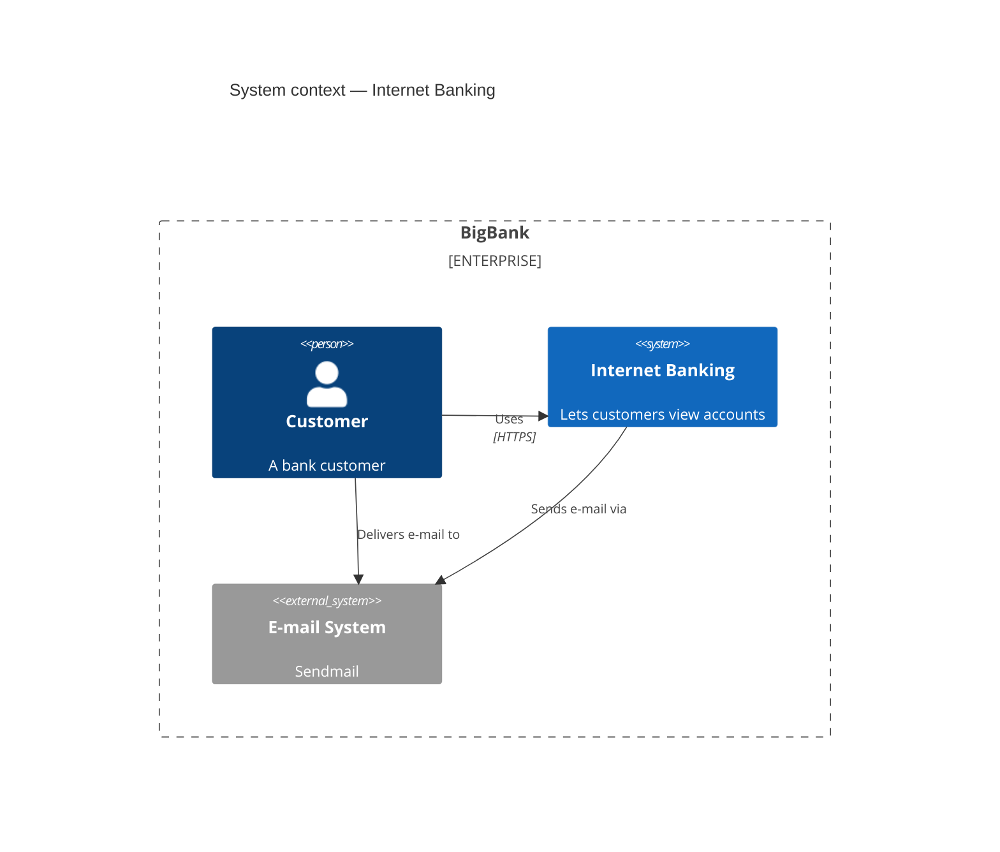

# C4 Diagrams (⚠️ experimental)

**What it's for:** C4-model architecture views (Context / Container / Component / Dynamic / Deployment), based on Simon Brown's PlantUML C4 macros.

> ⚠️ **Experimental.** mermaid.js.org states plainly: *"This is an experimental diagram for now. The syntax and properties can change in future releases."* Layout is also weaker than other Mermaid types (limited control over positioning). For anything beyond a quick sketch, prefer the `uml`/`ea-modeling` skills or a dedicated C4 tool (Structurizr). Warn the user before emitting C4. Verified against mermaid.js.org, 2026 snapshot.

- [Diagram keywords](#diagram-keywords)
- [Elements](#elements)
- [Boundaries](#boundaries)
- [Relationships](#relationships)
- [Layout & styling](#layout--styling)
- [Worked example](#worked-example)
- [Pitfalls](#pitfalls)

## Diagram keywords

Pick one as the first line: `C4Context`, `C4Container`, `C4Component`, `C4Dynamic`, `C4Deployment`.

## Elements

Arguments are positional; `?` marks optional, `$` marks a named optional like `$link`:

- `Person(alias, label, ?descr)` and `Person_Ext(...)` (external)
- `System(alias, label, ?descr)`, `System_Ext`, `SystemDb`, `SystemQueue`
- `Container(alias, label, ?techn, ?descr)`, `ContainerDb`, `ContainerQueue`, `Container_Ext`
- `Component(alias, label, ?techn, ?descr)`, `ComponentDb`, `ComponentQueue`, `Component_Ext`

Full optional tail on most: `(alias, label, ?techn, ?descr, ?sprite, ?tags, $link)`.

## Boundaries

Wrap elements in a boundary block `{ … }`:

- `System_Boundary(alias, label) { … }`
- `Container_Boundary(alias, label) { … }`
- `Enterprise_Boundary(alias, label) { … }`
- `Deployment_Node`/`Node`/`Node_L`/`Node_R` (deployment diagrams)

## Relationships

- `Rel(from, to, label, ?techn)` — directed relationship
- `BiRel(a, b, label)` — bidirectional
- Direction-hinted variants: `Rel_U`/`Rel_Up`, `Rel_D`/`Rel_Down`, `Rel_L`/`Rel_Left`, `Rel_R`/`Rel_Right`, `Rel_Back`

## Layout & styling

- `UpdateLayoutConfig($c4ShapeInRow="2", $c4BoundaryInRow="1")` — rough layout control (how many shapes/boundaries per row).
- `UpdateElementStyle(alias, $bgColor, $fontColor, $borderColor)`
- `UpdateRelStyle(from, to, $textColor, $lineColor, $offsetX, $offsetY)`

## Worked example

## Pitfalls

- Keyword is **`C4Context`** (camelCase, no space) etc. — not `c4` or `C4 Context`.
- Arguments are **positional and comma-separated**, strings usually quoted; getting the order wrong silently mislabels shapes.
- Layout is fragile — `UpdateLayoutConfig` only nudges row counts; don't expect precise placement. If layout matters, this is the wrong tool.
- Because it's experimental, GitHub and pinned-version renderers may fail to render it at all. Verify on mermaid.live and tell the user.
