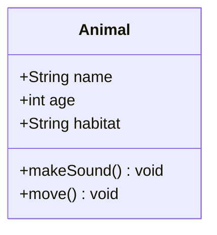
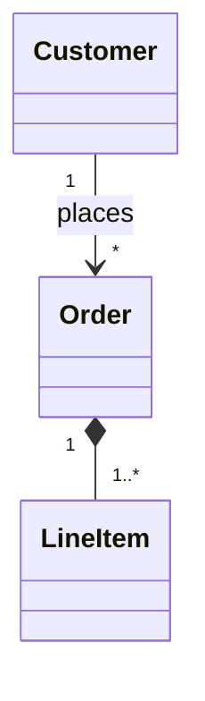
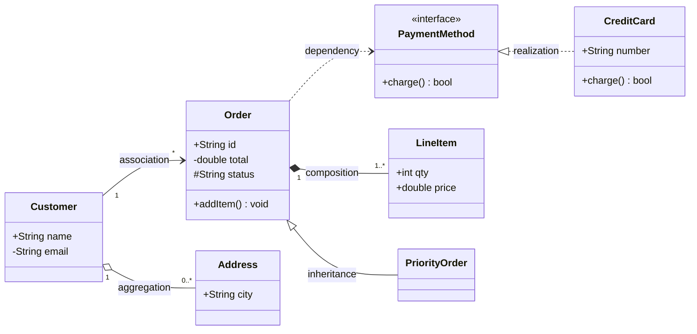

# Class Diagram (`classDiagram`)

**What it's for:** UML-style class structure — classes, members, and the relationships between them. Verified against mermaid.js.org, 2026 snapshot (stable). For *correct* UML semantics use the `uml` skill; Mermaid is a loose approximation.

- [Defining classes & members](#defining-classes--members)
- [Visibility & classifiers](#visibility--classifiers)
- [Relationships](#relationships)
- [Cardinality / multiplicity](#cardinality--multiplicity)
- [Generics, annotations, namespaces](#generics-annotations-namespaces)
- [Notes, direction, styling, interaction](#notes-direction-styling-interaction)
- [Worked example](#worked-example)
- [Pitfalls](#pitfalls)

## Defining classes & members

Define a class explicitly, or let a relationship create it implicitly. Members are **attributes** (no parentheses) or **methods** (parentheses). Two styles:

A method can declare a return type after the parentheses: `+getName() String`.

## Visibility & classifiers

Prefix a member with a visibility marker:

| Marker | Visibility |
| --- | --- |
| `+` | Public |
| `-` | Private |
| `#` | Protected |
| `~` | Package / internal |

Append a **classifier** to the member: `*` = abstract (`makeSound()*`), `$` = static (`count$` or `now()$`).

## Relationships

| Syntax | Meaning |
| --- | --- |
| `A <|-- B` | Inheritance (B extends A) |
| `A *-- B` | Composition |
| `A o-- B` | Aggregation |
| `A --> B` | Association (directed) |
| `A -- B` | Association (solid link) |
| `A ..> B` | Dependency |
| `A ..|> B` | Realization (B implements A) |
| `A .. B` | Link (dashed) |

Add a label after a colon: `A <|-- B : extends`. Two-headed forms combine markers, e.g. `A <|--|> B`, `A *--o B`.

## Cardinality / multiplicity

Put quoted multiplicities just outside each end of a relation:

Valid values: `1`, `0..1`, `1..*`, `*`, `n`, `0..n`, `1..n`.

## Generics, annotations, namespaces

- **Generics:** tildes — `class Box~T~`, `List~int~`, `Map~String, int~`.
- **Annotations** (stereotypes): `<<interface>>`, `<<abstract>>`, `<<enumeration>>`, `<<service>>` — on their own line inside the class or as `class Shape { <<interface>> }`.
- **Namespaces:** group classes — `namespace Payments { class Invoice class Receipt }`.

## Notes, direction, styling, interaction

- **Notes:** `note "free-floating note"` or `note for Animal "attached note"`.
- **Direction:** `direction LR` (also `TB`, `BT`, `RL`).
- **Styling:** `style Animal fill:#f9f,stroke:#333`; or `classDef warn fill:#fdd` then `cssClass "Animal" warn` or `Animal:::warn`.
- **Interaction:** `click Animal href "url"` / `click Animal call fn()`.

## Worked example

Mermaid class diagram — members and the main relationship types (rendered by GitHub from the source below)

<!-- render: images/mermaid-class.png -->

## Pitfalls

- Members are split by **parentheses**, not by intent: `total` is an attribute, `total()` is a method.
- Generics use **tildes `~`**, not angle brackets `<>` (angle brackets are parsed as annotation/markup).
- Multiplicities must be **quoted** and sit on the relationship line, outside the arrow.
- Annotation stereotypes use **double angle brackets** `<<…>>`.
- It's `classDiagram` — no `-v2` variant exists.
