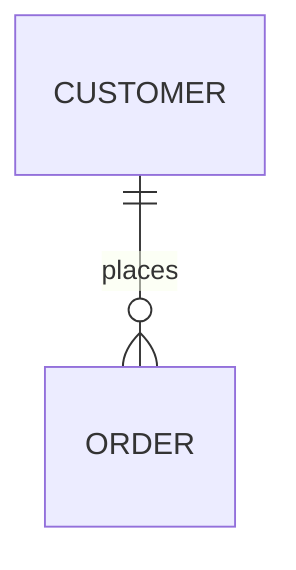
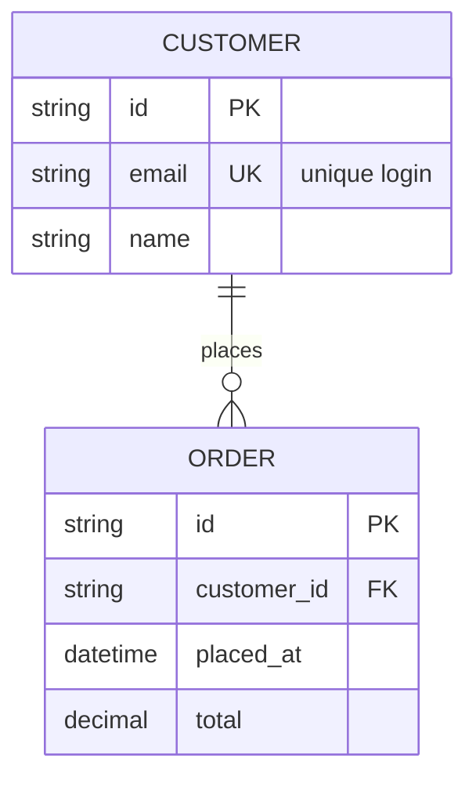
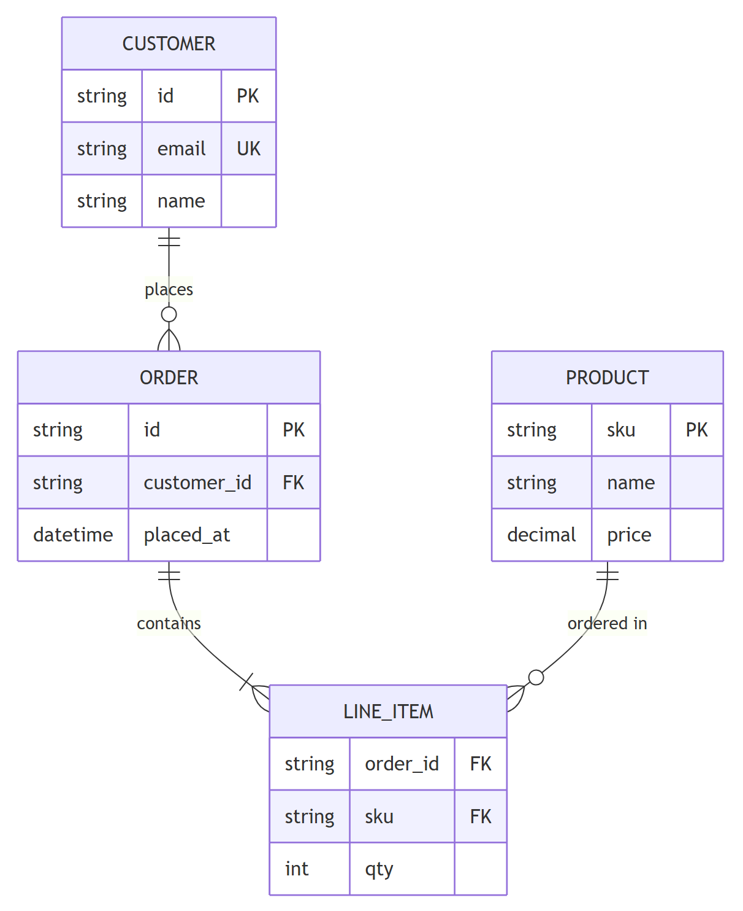
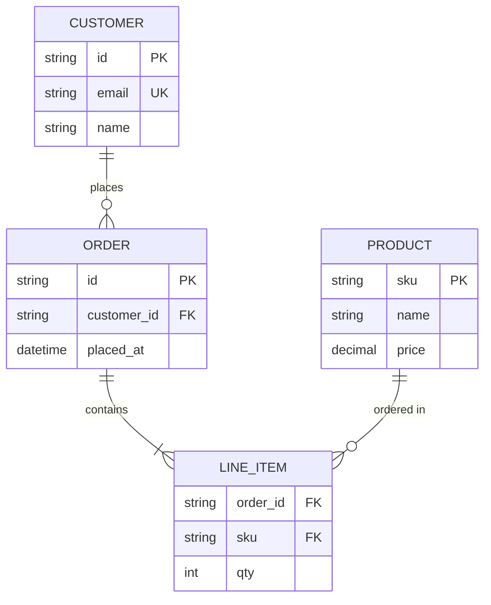

# Entity-Relationship Diagram (`erDiagram`)

**What it's for:** data models — entities, their attributes, and the cardinality of relationships between them (crow's-foot notation). Verified against mermaid.js.org, 2026 snapshot (stable).

- [Relationship statement](#relationship-statement)
- [Cardinality (crow's foot)](#cardinality-crows-foot)
- [Identifying vs non-identifying](#identifying-vs-non-identifying)
- [Attributes with keys & comments](#attributes-with-keys--comments)
- [Aliases, direction, styling](#aliases-direction-styling)
- [Worked example](#worked-example)
- [Pitfalls](#pitfalls)

## Relationship statement

Shape: `<entity1> <left-card><line><right-card> <entity2> : <label>`.

`places` is the relationship label. It is optional in the current spec (only the first entity is mandatory), but supply a short word or `"quoted phrase"` anyway — pinned/older renderers can choke on a bare relationship, and a labelled edge reads better.

## Cardinality (crow's foot)

Each relationship has a cardinality marker at **each end**. Left-side and right-side glyphs differ (they mirror):

| Cardinality | Left marker | Right marker |
| --- | --- | --- |
| Zero or one | `|o` | `o|` |
| Exactly one | `||` | `||` |
| Zero or more | `}o` | `o{` |
| One or more | `}|` | `|{` |

So `CUSTOMER ||--o{ ORDER` reads "exactly one CUSTOMER to zero-or-more ORDER". Word aliases also work in place of glyphs (`one or many`, `zero or many`, `only one`, `one or zero`, etc.) but the glyph form is the norm.

## Identifying vs non-identifying

The middle connector sets line style:

- `--` solid line = **identifying** relationship (child depends on parent's key). Word alias: `to`.
- `..` dashed line = **non-identifying** relationship. Word alias: `optionally to`.

Example: `ORDER ||--|{ LINE_ITEM : contains` (identifying) vs `USER }o..o{ ROLE : "may have"` (non-identifying).

## Attributes with keys & comments

Add a `{ … }` block after an entity. Each line is `type name [keys] ["comment"]`. Keys are comma-separated among `PK`, `FK`, `UK`:

## Aliases, direction, styling

- **Alias:** `CUSTOMER["Customer account"]` shows the bracketed label instead of the raw entity name.
- **Direction:** `direction LR` (also `TB`, `BT`, `RL`) right after `erDiagram`.
- **Styling:** `style CUSTOMER fill:#eef` or `classDef … ` + `class …`.

## Worked example

Mermaid source

<!-- render: images/mermaid-er.png -->

## Pitfalls

- The relationship label after the colon is **optional** in the current spec, but omitting it can fail on pinned/older renderers — keep a short word or `"quoted phrase"` for safety and readability.
- The two cardinality markers are **direction-sensitive** — `|o` is a *left* marker, `o|` is its *right* mirror. Don't write `o|--|o` expecting "zero-or-one to zero-or-one"; that's `o|`…`|o` (correct), whereas swapping them looks wrong.
- Connector glyphs run **together** with no spaces: `||--o{`, not `|| -- o{`.
- Attribute lines are `type name`, not `name: type` — type comes first.
- Phrases with spaces (labels, comments) must be in `"double quotes"`.
