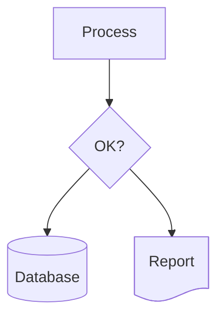
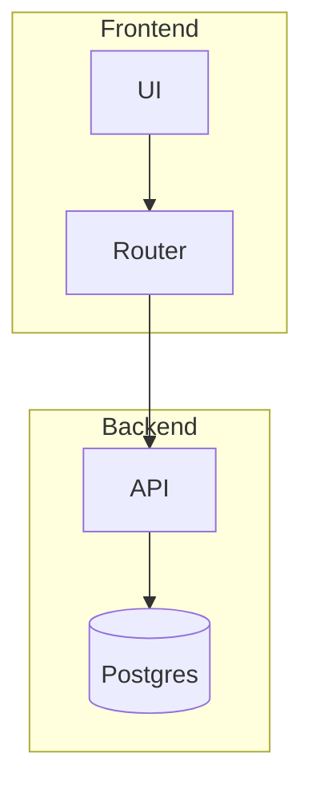
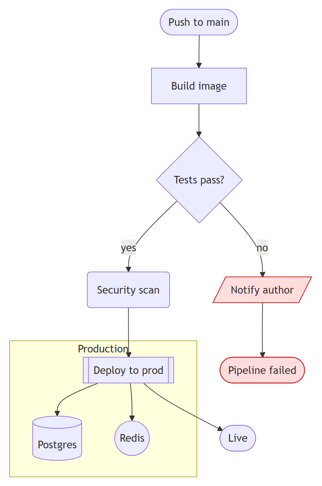
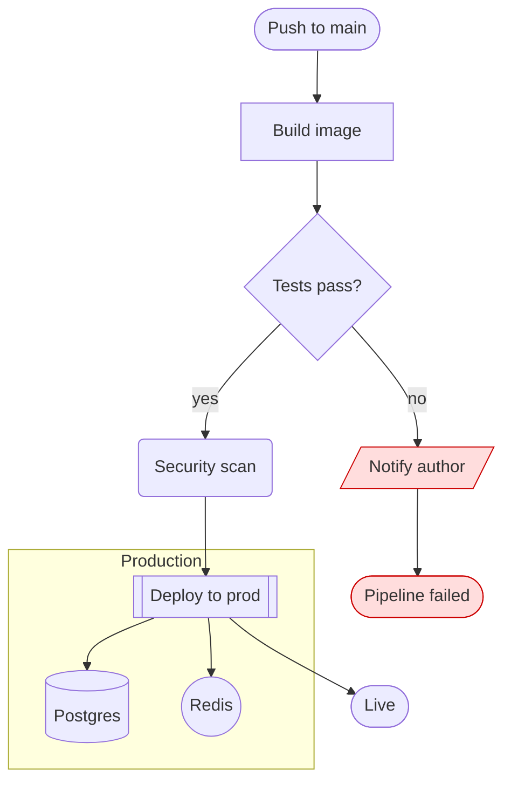

# Flowchart (`flowchart` / `graph`)

**What it's for:** boxes-and-arrows diagrams — processes, decision trees, pipelines, dependency graphs. Mermaid's most-used type. Verified against mermaid.js.org, 2026 snapshot (stable).

- [Keyword & direction](#keyword--direction)
- [Node shapes](#node-shapes)
- [v11.3+ typed shapes `@{ shape: }`](#v113-typed-shapes--shape-)
- [Edges / links](#edges--links)
- [Subgraphs](#subgraphs)
- [Styling: style, classDef, linkStyle](#styling)
- [Interaction: click](#interaction-click)
- [Worked example](#worked-example)
- [Pitfalls](#pitfalls)

## Keyword & direction

Start with `flowchart` (current) or `graph` (legacy alias, identical) followed by a direction:

| Keyword | Direction |
| --- | --- |
| `TB` or `TD` | Top to bottom |
| `BT` | Bottom to top |
| `LR` | Left to right |
| `RL` | Right to left |


## Node shapes

A node is an ID plus an optional shape wrapper holding its label. Same ID anywhere = same node. The classic shape set:

| Syntax | Shape |
| --- | --- |
| `A[Text]` | Rectangle (default) |
| `A(Text)` | Rounded rectangle |
| `A([Text])` | Stadium / pill |
| `A[[Text]]` | Subroutine (double-sided) |
| `A[(Text)]` | Cylinder (database) |
| `A((Text))` | Circle |
| `A(((Text)))` | Double circle |
| `A>Text]` | Asymmetric / flag |
| `A{Text}` | Rhombus / decision |
| `A{{Text}}` | Hexagon |
| `A[/Text/]` | Parallelogram |
| `A[\Text\]` | Parallelogram (alt) |
| `A[/Text\]` | Trapezoid |
| `A[\Text/]` | Trapezoid (alt) |

If a label contains spaces, punctuation, parentheses, or reserved words, wrap it in quotes: `A["Pay & ship (now)"]`. Markdown labels (bold/italic, auto-wrap) use a backtick form: `` A["`**Bold** title`"] ``.

## v11.3+ typed shapes `@{ shape: }`

Engine v11.3.0+ adds an explicit shape syntax giving access to ~30 flowchart shapes (many BPMN/flowchart-standard) by name. ⚠️ Newest GitHub may not render these yet — verify on mermaid.live.



Common `shape:` values: `rect` (process), `rounded` (event), `stadium` (terminal), `subproc`/`fr-rect` (subprocess), `cyl` (database), `circle` (start), `diam` (decision), `hex` (prepare), `doc`/`lin-doc`/`docs` (document/s), `delay`, `trap-b`/`trap-t` (priority/manual), `fork`, `cloud`, `bolt`, `tag-rect`, `notch-rect`, `text` (label-only). Also `A@{ icon: "fa:fa-cloud", form: "square", label: "Cloud" }` for icons and `A@{ img: "https://…", label: "Logo" }` for images.

## Edges / links

| Syntax | Meaning |
| --- | --- |
| `A --> B` | Arrow |
| `A --- B` | Open line (no arrowhead) |
| `A -.-> B` | Dotted arrow |
| `A ==> B` | Thick arrow |
| `A ~~~ B` | Invisible link (layout spacer) |
| `A -->|text| B` | Arrow with label (preferred form) |
| `A -- text --> B` | Arrow with label (alt form) |
| `A <--> B` | Bidirectional |
| `A --o B` | Circle endpoint |
| `A --x B` | Cross endpoint |

Make a link longer (more layout rank distance) by adding dashes/equals/dots: `A ----> B`, `A ====> B`, `A -...-> B`.

Edge IDs and animation (v11.3+): give an edge an ID to style or animate it — `A e1@--> B`, then `e1@{ animate: true }` or `class e1 someClass`.

## Subgraphs



`direction` inside a subgraph sets its internal flow. You can draw edges to/from the subgraph ID itself (`one --> two`).

## Styling

- **Inline:** `style A fill:#f9f,stroke:#333,stroke-width:2px`
- **Class def + apply:** `classDef hot fill:#f96,stroke:#900;` then `class A,B hot` or shorthand `A:::hot`
- **Default class:** `classDef default fill:#eee` styles every node
- **Link styling by index (0-based):** `linkStyle 0,2 stroke:#f00,stroke-width:3px`

## Interaction: click

```
click A "https://example.com" "Tooltip" _blank
click A callbackFn "Tooltip"
```

`href` opens a URL (target `_blank|_self|_parent|_top`); `call`/callback runs a JS function (needs `securityLevel: 'loose'`, so it won't work on GitHub).

## Worked example



<details>
<summary>Mermaid source</summary>

<!-- render: images/mermaid-flowchart.png -->



</details>

## Pitfalls

- **`end`** is reserved. A lowercase node/edge text of `end` breaks the parser — capitalize (`End`) or quote (`["end"]`). Same caution for `o`/`x` immediately after a link with no space: `A---oB` is parsed as a circle-edge; write `A --- oB` or `A---OB`.
- **Special characters** (`()`, `#`, `;`, `:`, `&`, quotes) in a label require wrapping the label in `"…"`, and `#` may need `&#35;`.
- **`graph` vs `flowchart`:** both parse, but `flowchart` enables the newer renderer/shapes — prefer it.
- **`@{ shape: }` and icons** are v11.3+; on engines older than that (and possibly GitHub) they silently fail or error. Fall back to classic shapes for max portability.
