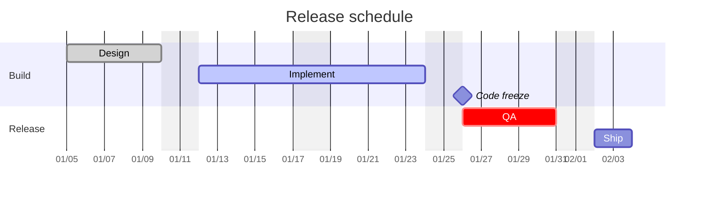
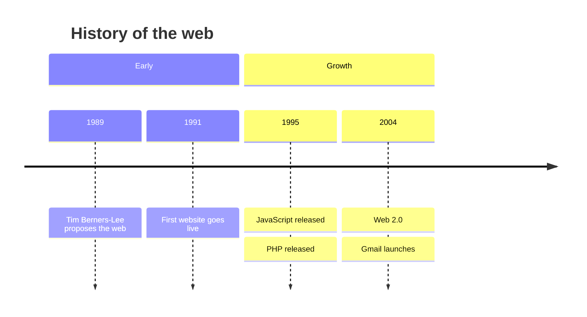

# Gantt & Timeline

Two chronological diagram types. **`gantt`** is stable; **`timeline`** is officially labelled "experimental" but its core syntax is stable (only icon integration is experimental) — safe to use. Verified against mermaid.js.org, 2026 snapshot.

- [Gantt](#gantt)
  - [Header keywords](#header-keywords)
  - [Sections & tasks](#sections--tasks)
  - [Task tags, dependencies, milestones](#task-tags-dependencies-milestones)
  - [Gantt worked example](#gantt-worked-example)
  - [Gantt pitfalls](#gantt-pitfalls)
- [Timeline](#timeline)
  - [Timeline worked example](#timeline-worked-example)
  - [Timeline pitfalls](#timeline-pitfalls)

---

## Gantt

**What it's for:** project schedules — tasks over time with dependencies, durations, and milestones.

### Header keywords

```
gantt
  title Project plan
  dateFormat YYYY-MM-DD      %% how INPUT dates are parsed
  axisFormat %m/%d           %% how the axis is DISPLAYED (d3 format)
  tickInterval 1week         %% optional axis tick spacing
  excludes weekends, 2026-12-25   %% skip non-working days
  todayMarker stroke:#f00,stroke-width:2px   %% or: todayMarker off
```

### Sections & tasks

`section <name>` groups the tasks below it. A task line is:

```
<Task name> : [tags,] [id,] <start>, <end-or-duration>
```

The start may be a date, `after <taskId>`, or omitted (continues from the previous task's end). The end may be an explicit date, a duration (`5d`), or `until <taskId>`.

### Task tags, dependencies, milestones

Optional tags come first, comma-separated: `done`, `active`, `crit`, `milestone`. Duration units: `ms s m h d w M y`.

| Pattern | Meaning |
| --- | --- |
| `a1, 2026-01-01, 5d` | starts on date, lasts 5 days |
| `a2, after a1, 3d` | starts when `a1` ends |
| `a3, 2026-01-01, until a5` | runs until task `a5` starts |
| `crit, active, a4, after a2, 2d` | critical + in-progress |
| `milestone, m1, 2026-02-01, 0d` | a milestone (zero duration) |

### Gantt worked example



### Gantt pitfalls

- **`dateFormat` parses input; `axisFormat` styles the axis** — mixing them up is the classic error. `axisFormat` uses d3 time-format tokens (`%Y %m %d %H`).
- A task with no start date inherits the **previous task's end** — fine within a section, surprising across sections; use `after <id>` to be explicit.
- Tags must come **before** the id and dates.
- `excludes weekends` only matters when tasks span those days; `weekend friday` redefines which days count as weekend.
- Milestones are zero-duration: `milestone, id, date, 0d`.

---

## Timeline

**What it's for:** a simple chronology — time periods each carrying one or more events. Not a Gantt (no durations/dependencies); just ordered text.

Structure: `timeline`, optional `title`, then `<time period> : <event>` lines. Multiple events for one period either chain with more colons or sit on indented continuation lines. `section <name>` groups periods. `<br>` forces a line break. Direction (v11.14+): `timeline LR` or `timeline TD`.

### Timeline worked example



### Timeline pitfalls

- Each event is introduced by a **colon**; the time period is the bare text before the first colon (it can be any string, not just a year).
- To attach several events to one period, repeat `: event` (chained) or put each on its own indented line starting with `:`.
- It's officially "experimental," so very old engines may not support it; the syntax itself is stable. Icon integration is the only genuinely unstable part — avoid icons if portability matters.
