# Other Diagrams — stable extras + beta types

Covers the remaining stable diagram types and every beta/experimental type. Verified against mermaid.js.org, 2026 snapshot. **Each ⚠️ beta type may change keyword/syntax between releases and often does not render on GitHub or other pinned-version renderers — verify on mermaid.live and warn the user.**

- **Stable:** [pie](#pie--stable) · [journey](#journey-user-journey--stable) · [quadrantChart](#quadrantchart--stable) · [requirementDiagram](#requirementdiagram--stable) · [gitGraph](#gitgraph--stable) · [mindmap](#mindmap--stable-syntax)
- **⚠️ Beta:** [sankey](#-sankey-beta) · [xychart-beta](#-xychart-beta) · [block-beta](#-block-beta) · [packet](#-packet-beta) · [kanban](#-kanban-beta) · [architecture-beta](#-architecture-beta) · [radar-beta](#-radar-beta) · [treemap-beta](#-treemap-beta)

---

## pie — stable

Proportional pie chart. Keyword `pie`, optional `showData` (prints values), optional `title`. Each slice is `"label" : value` (positive numbers only).

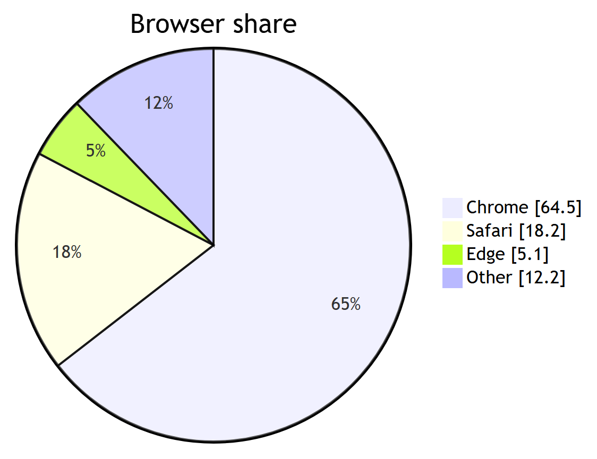

<details>
<summary>Mermaid source</summary>

<!-- render: images/mermaid-pie.png -->

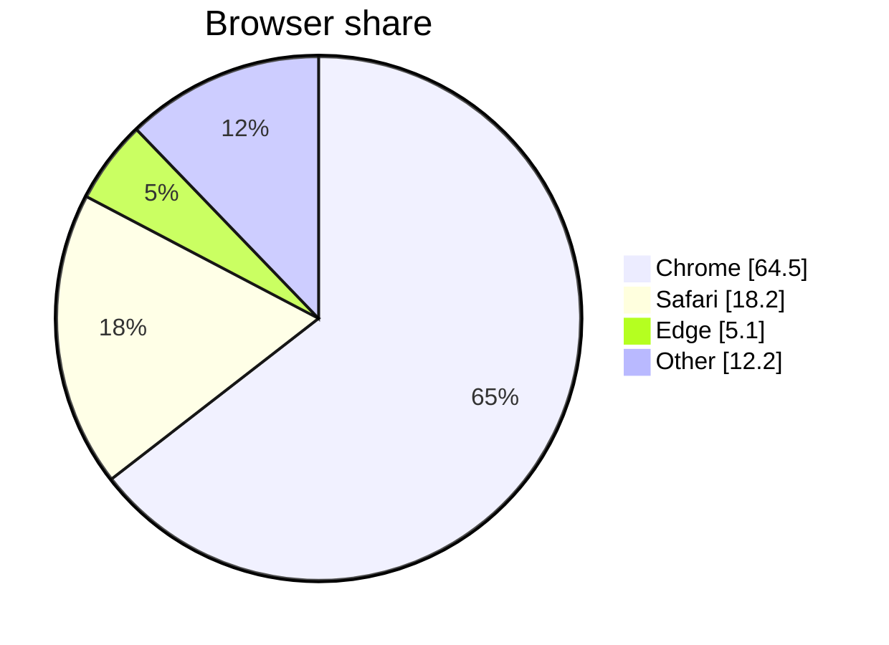

</details>

Pitfalls: values must be **> 0** (negatives error); slices render clockwise in source order; labels need quotes.

---

## journey (user journey) — stable

Maps a workflow as steps scored 1–5 by actor(s). Keyword `journey`, then `title`, `section`s, and task lines `Task name: <score>: <Actor1>, <Actor2>`.

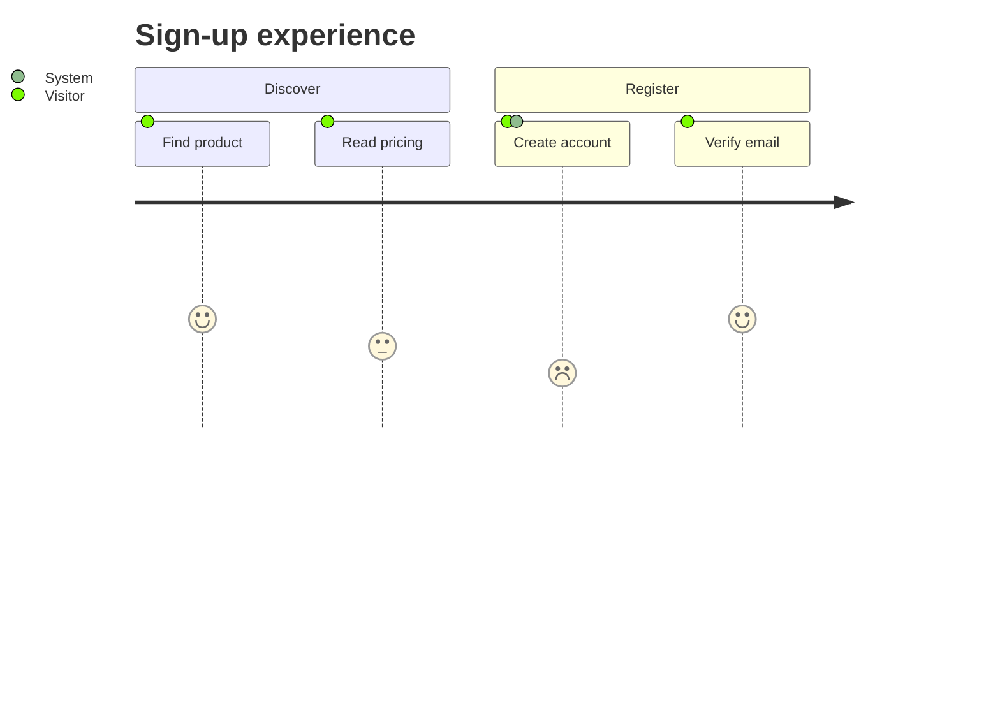

Pitfalls: score is a single integer **1–5**; the format is `task: score: actors` (two colons); actors are comma-separated.

---

## quadrantChart — stable

Plots points on a 2×2 matrix. Keyword `quadrantChart`, `title`, `x-axis L --> R`, `y-axis Bottom --> Top`, `quadrant-1..4` labels (1 = top-right, 2 = top-left, 3 = bottom-left, 4 = bottom-right), then points `Name: [x, y]` with x,y in **0..1**.

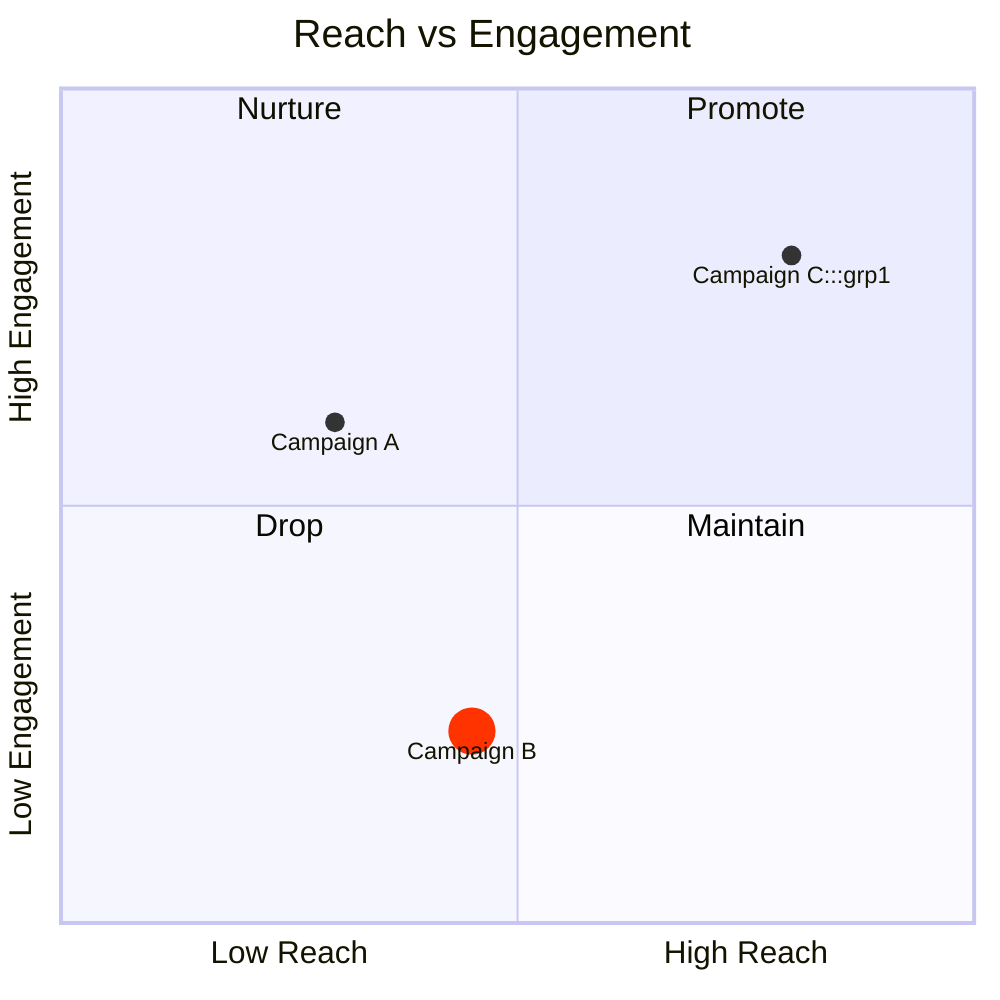

Per-point styling: `radius`, `color`, `stroke-color`, `stroke-width`, or a `:::class` with `classDef`. Pitfalls: coordinates are **0–1**, not pixels; quadrant numbering is fixed (1=TR … 4=BR).

---

## requirementDiagram — stable

SysML-style requirements and their traceability. Types: `requirement`, `functionalRequirement`, `performanceRequirement`, `interfaceRequirement`, `physicalRequirement`, `designConstraint`. Each has `id`, `text`, `risk` (`Low|Medium|High`), `verifymethod` (`Analysis|Inspection|Test|Demonstration`). `element` blocks have `type` and `docref`. Relationships: `contains`, `copies`, `derives`, `satisfies`, `verifies`, `refines`, `traces`.

```mermaid
requirementDiagram
  requirement user_login {
    id: 1
    text: Users must authenticate
    risk: high
    verifymethod: test
  }
  functionalRequirement oauth {
    id: 1.1
    text: Support OAuth2
    risk: medium
    verifymethod: test
  }
  element login_service {
    type: service
    docref: SRS-4.2
  }
  oauth - derives -> user_login
  login_service - satisfies -> oauth
```

Relationship syntax: `{src} - <type> -> {dst}` (or `<-` to reverse). Enum values are case-insensitive in practice but stick to the documented casing.

---

## gitGraph — stable

Renders commit history across branches. Keyword `gitGraph` (optionally `gitGraph LR:` / `TB:` / `BT:`). Commands: `commit` (`id:`, `tag:`, `type: NORMAL|REVERSE|HIGHLIGHT`), `branch <name>`, `checkout <name>` (alias `switch`), `merge <name>`, `cherry-pick id: "<commit>"`.

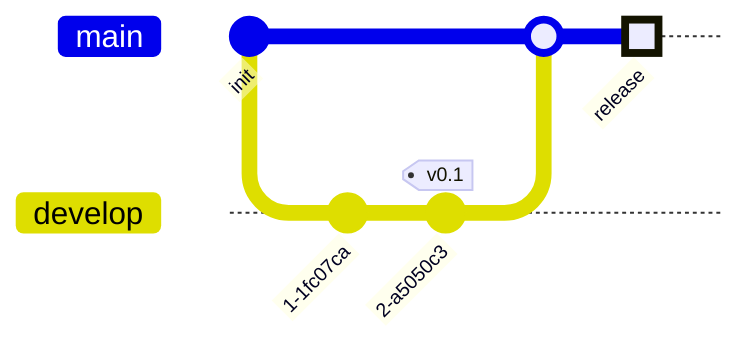

Config keys: `showBranches`, `showCommitLabel`, `mainBranchName`, `parallelCommits`, `mainBranchOrder`. Pitfalls: branch names with special chars need quoting (`branch "feature/x"`); orientation goes on the keyword line (`gitGraph TB:`), with the trailing colon.

---

## mindmap — stable syntax

Indentation-based hierarchy from a single root. Officially "experimental" but core syntax is settled (only icons are experimental). Keyword `mindmap`, then nodes nested by indentation. Shapes wrap the node text:

| Shape | Syntax |
| --- | --- |
| Square | `[text]` |
| Rounded | `(text)` |
| Circle | `((text))` |
| Bang | `))text((` |
| Cloud | `)text(` |
| Hexagon | `{{text}}` |

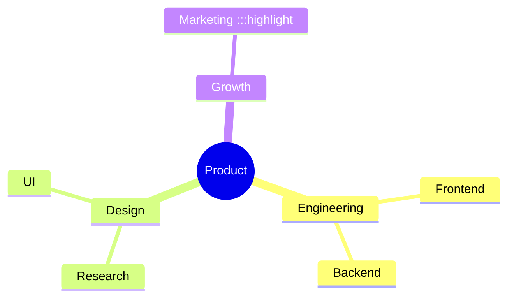

Icons: `::icon(fa fa-…)` on its own indented line. Classes: `:::className`. Pitfalls: hierarchy is purely **relative indentation**; a single root is expected; icons require Font Awesome/Material to be loaded by the renderer, so they often won't show on GitHub.

---

# ⚠️ Beta / experimental types

Keep these minimal. Confirm the **exact keyword** — some keep `-beta` in the keyword, some don't.

## ⚠️ sankey (beta)

Flow magnitudes between nodes. Keyword `sankey` (v10.3+; CSV body of `source,target,value`).

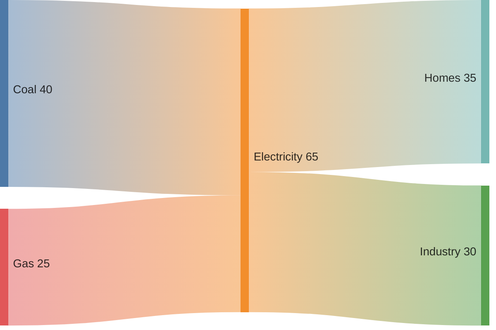

Notes: exactly 3 columns; blank lines allowed for spacing; commas inside a value need `"quotes"`, embedded quotes doubled (`""`). Config: `linkColor` (`source|target|gradient|#hex`), `nodeAlignment` (`justify|center|left|right`).

## ⚠️ xychart-beta

Bar/line chart on x/y axes. Keyword **`xychart-beta`**.

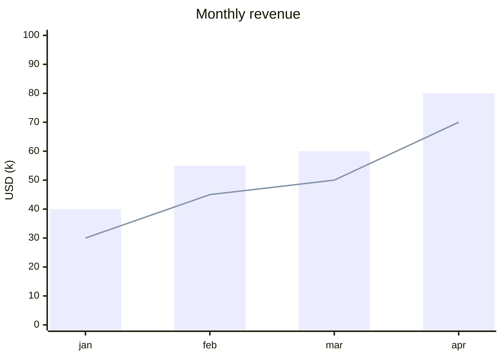

Notes: x-axis can be categorical `[a, b, c]` or numeric `"label" min --> max`; add `horizontal` after the keyword for bar landscape; only `bar` and `line` series exist.

## ⚠️ block-beta

Fixed-grid block layout. Keyword **`block-beta`**. `columns N` sets the grid; `id:N` spans N columns; `space`/`space:N` inserts gaps; arrows `-->`/`---`; nest with `block:id … end`.

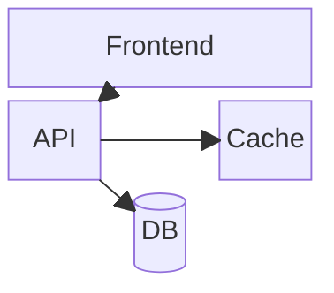

## ⚠️ packet (beta)

Network-packet byte/bit layout. Keyword **`packet`** (v11.0+). Body lines are `start-end: "Field"` (absolute bit range) or `+N: "Field"` (relative count, v11.7+).

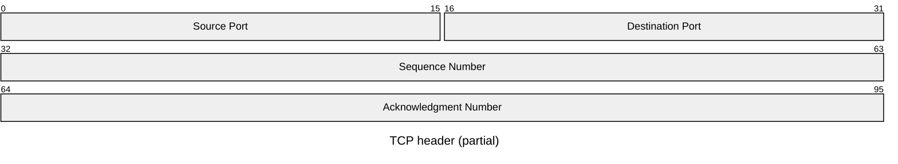

## ⚠️ kanban (beta)

Kanban board. Keyword **`kanban`**. A column is `colId[Title]`; tasks indent beneath; metadata via `@{ key: value }` (`assigned`, `ticket`, `priority` ∈ `Very High|High|Low|Very Low`).

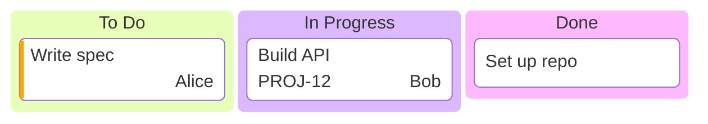

Global config `ticketBaseUrl` turns `#TICKET#` into a link.

## ⚠️ architecture-beta

Cloud/infra topology of grouped services. Keyword **`architecture-beta`** (v11.1+). `group id(icon)[Title]`; `service id(icon)[Title] in groupId`; `junction id`; edges name a side (`L|R|T|B`) at each end, with `<`/`>` for direction.

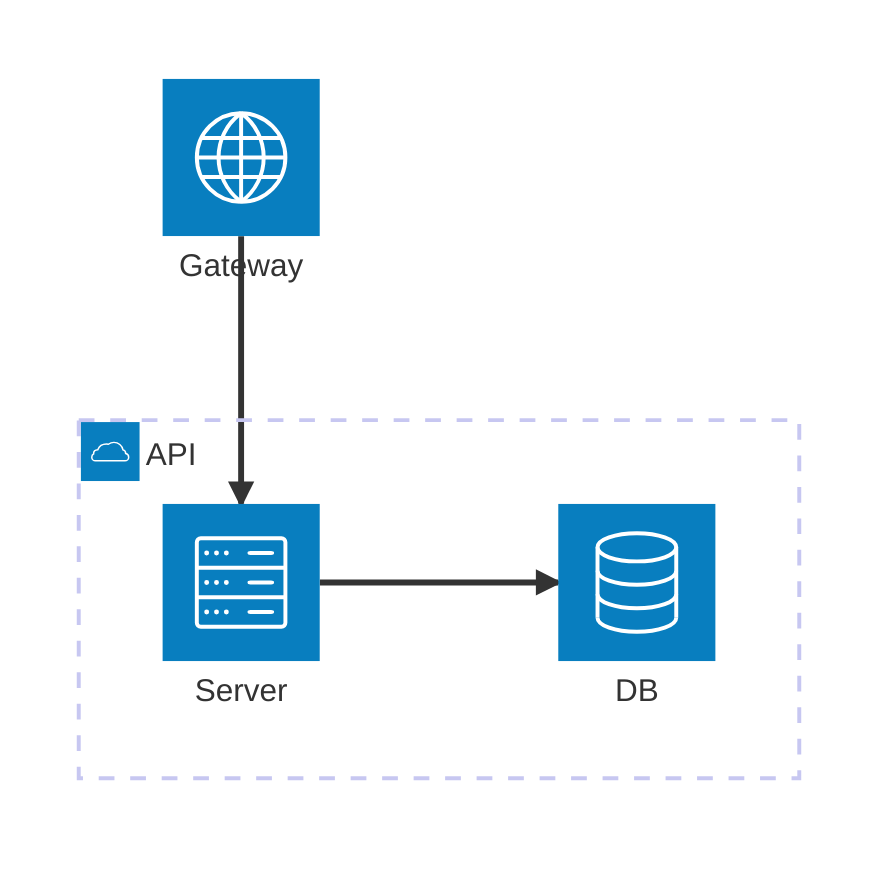

Note: icon names depend on registered icon packs; only a few built-ins exist, so icons may render as placeholders.

## ⚠️ radar-beta

Spider/radar chart for low-dimensional data. Keyword **`radar-beta`** (v11.6+). Declare `axis …`; plot `curve id{v1,v2,…}` (positional) or `curve id{axisName: value, …}` (named). Options: `max`, `min`, `ticks`, `graticule` (`circle|polygon`), `showLegend`.

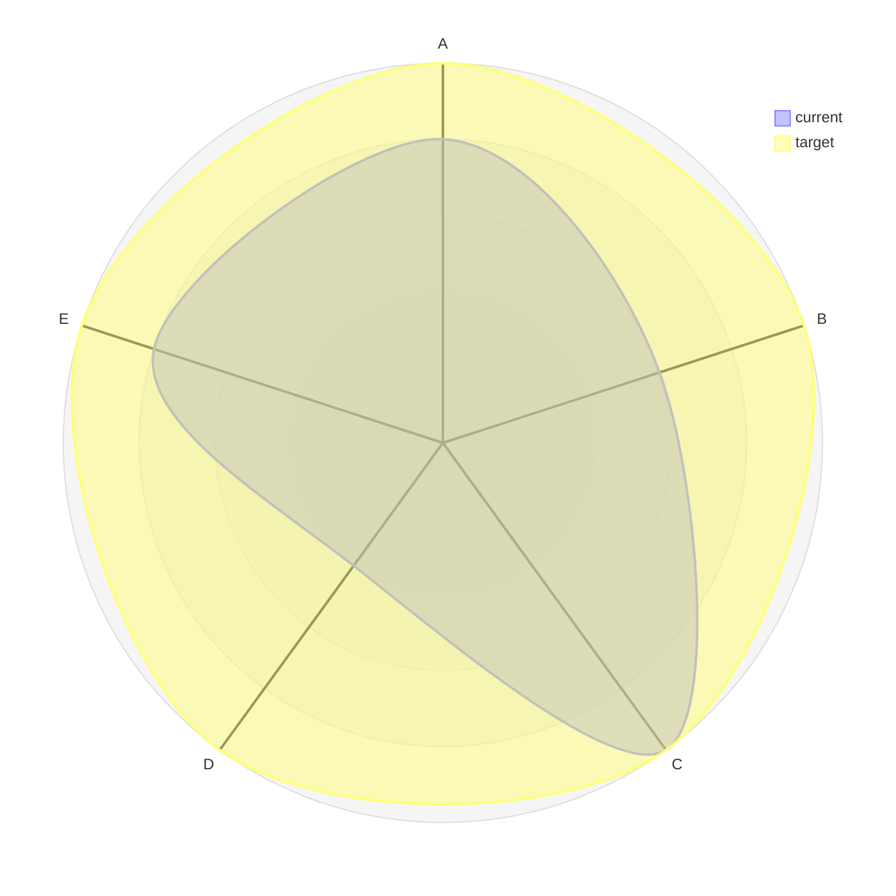

## ⚠️ treemap-beta

Hierarchical proportions as nested rectangles. Keyword **`treemap-beta`**. Indentation builds the tree; a leaf is `"Name": value`, a branch is a quoted `"Name"` with no value.

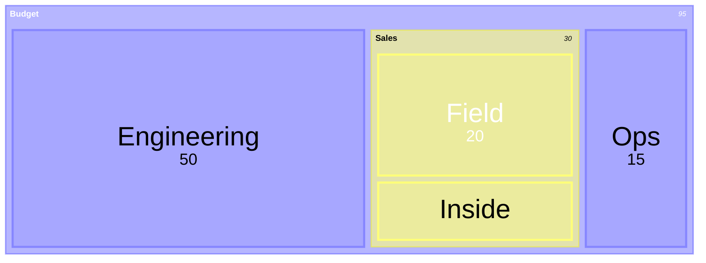
