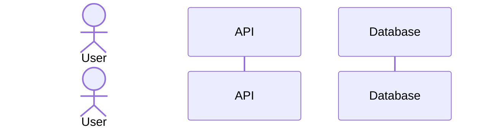
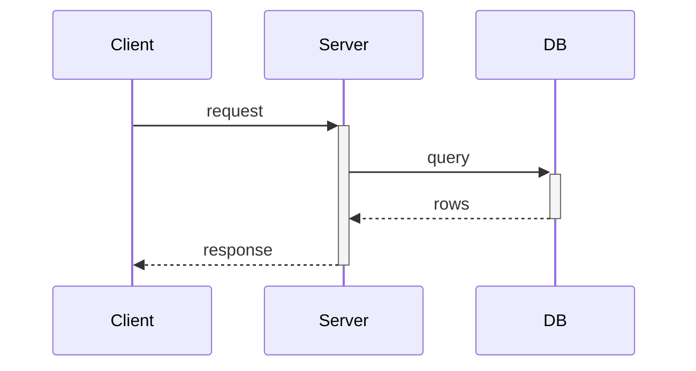
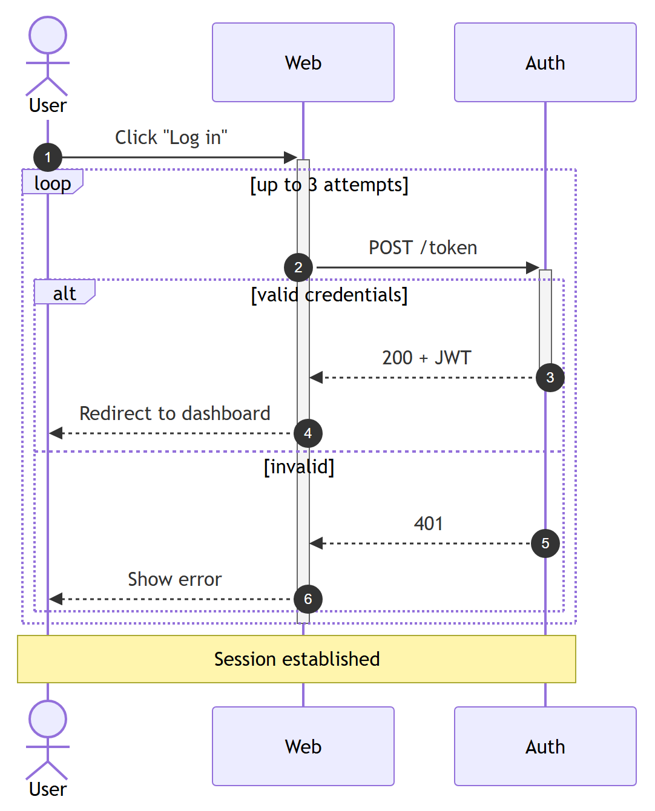
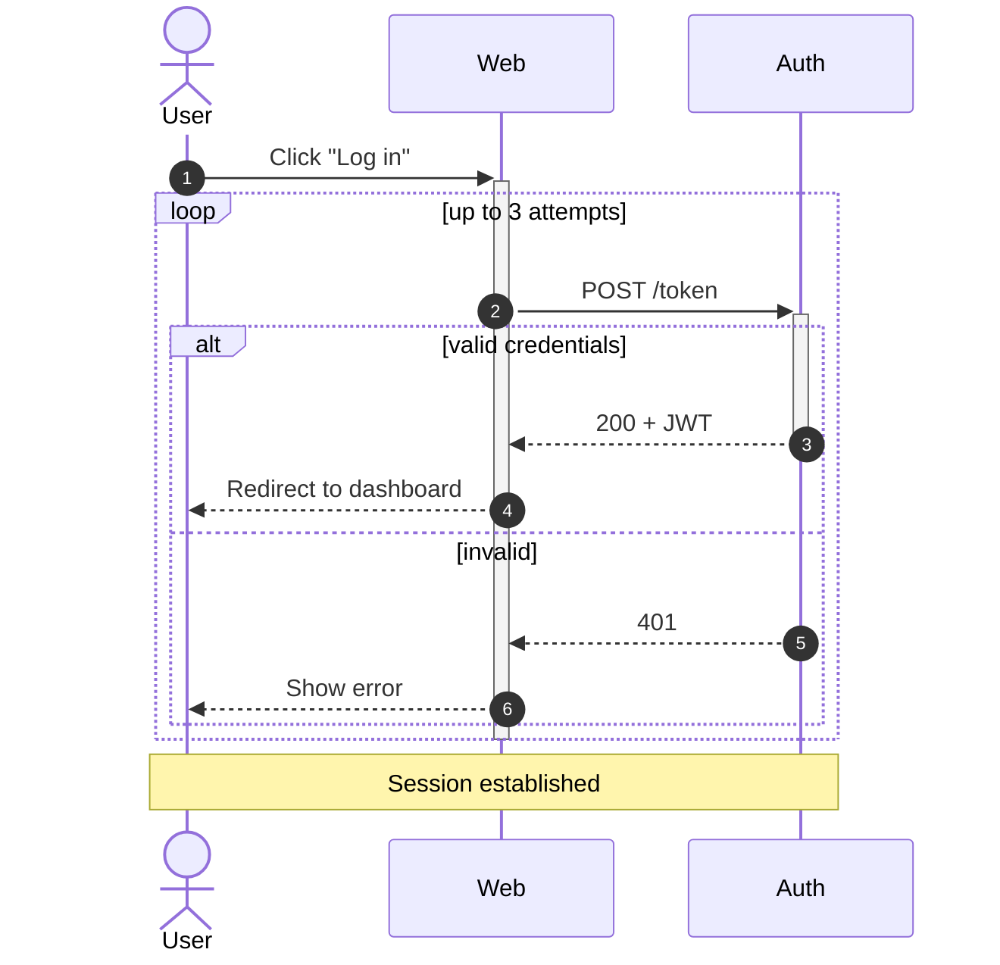

# Sequence Diagram (`sequenceDiagram`)

**What it's for:** time-ordered interactions between participants — API calls, message flows, protocols. Verified against mermaid.js.org, 2026 snapshot (stable).

- [Participants & actors](#participants--actors)
- [Messages / arrows](#messages--arrows)
- [Activations](#activations)
- [Notes](#notes)
- [Control blocks: loop/alt/opt/par/critical/break](#control-blocks)
- [Boxes, autonumber, background](#boxes-autonumber-background)
- [Worked example](#worked-example)
- [Pitfalls](#pitfalls)

## Participants & actors

Participants appear left-to-right in declaration order. Declare explicitly to fix order or set an alias; otherwise they spring up on first use.



`participant` = rectangle; `actor` = stick figure. `as` gives a display alias while you reference the short ID. `create participant X` / `destroy X` (v10+) show a participant appearing/being torn down mid-diagram.

## Messages / arrows

| Syntax | Line | Arrowhead |
| --- | --- | --- |
| `A->B` | solid | none |
| `A-->B` | dashed | none |
| `A->>B` | solid | filled arrow |
| `A-->>B` | dashed | filled arrow |
| `A-xB` | solid | cross (×, lost/async-fail) |
| `A--xB` | dashed | cross |
| `A-)B` | solid | open arrow (async) |
| `A--)B` | dashed | open arrow (async) |
| `A<<->>B` | solid | bidirectional |

Convention: `->>` for a call, `-->>` for the return.

## Activations

Show a participant being "busy" with an activation bar. Either explicit or shorthand `+`/`-` appended to the arrow:



`activate Server` / `deactivate Server` are the long form. Stacked activations on one participant nest.

## Notes

```
Note left of A: text
Note right of A: text
Note over A: text
Note over A,B: spans two participants
```

## Control blocks

All close with `end`:

- `loop <label> … end`
- `alt <cond> … else <cond> … end`
- `opt <cond> … end`
- `par <label> … and <label> … end` (parallel)
- `critical <action> … option <case> … end`
- `break <cond> … end` (stop the flow)

## Boxes, autonumber, background

- **Group participants:** `box <Color> <Name>` … `end` draws a labeled box around the participants declared inside.
- **Number messages:** `autonumber` (optionally `autonumber 10 10` for start/step).
- **Highlight a region:** `rect rgb(235,245,255)` … `end`.

## Worked example



<details>
<summary>Mermaid source</summary>

<!-- render: images/mermaid-sequence.png -->



</details>

## Pitfalls

- It's `sequenceDiagram` (one word, capital D) — not `sequence` or `sequenceDiagram-v2`.
- Every control block (`loop`/`alt`/`opt`/`par`/`critical`/`break`/`rect`/`box`) **must** be closed with `end`; a missing `end` is the most common parse failure.
- A colon separates message and text (`A->>B: msg`); a stray `:` inside the message text needs care — keep punctuation simple or move it after the colon.
- Use `<br>` for multi-line message text; HTML entities (e.g. `&#35;` for #) escape special characters.
- The `box` color word (`Purple`, `Aqua`, `rgb(...)`, or `transparent`) comes *before* the box name.
