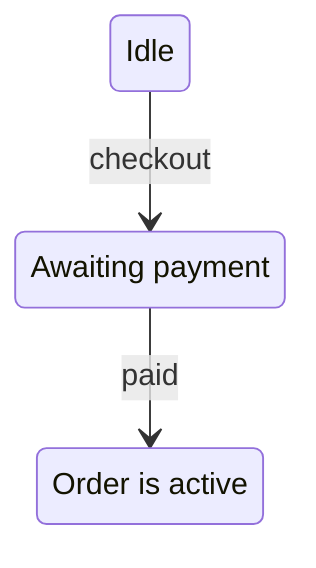
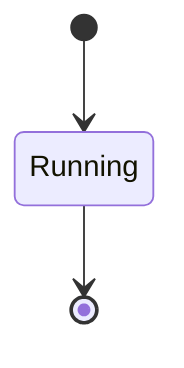
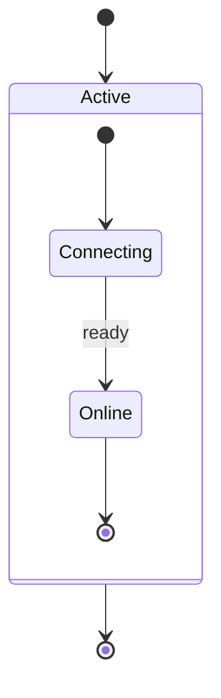
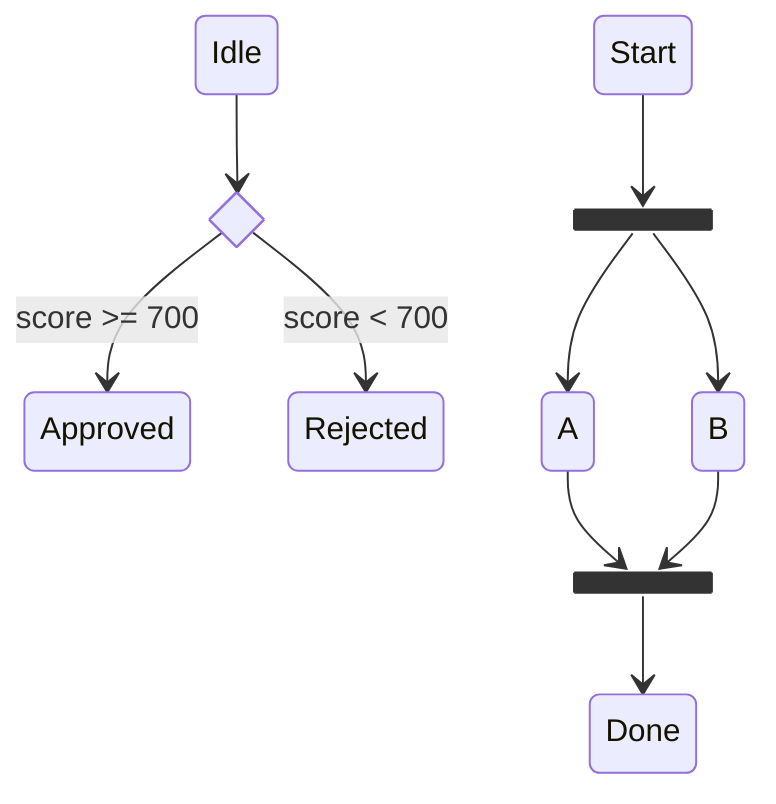
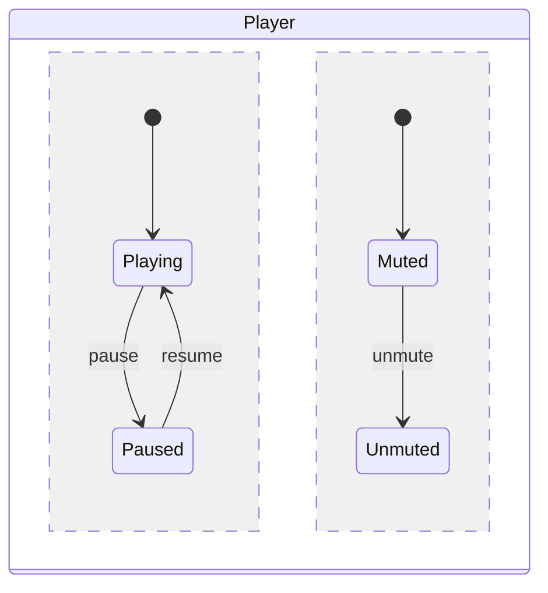
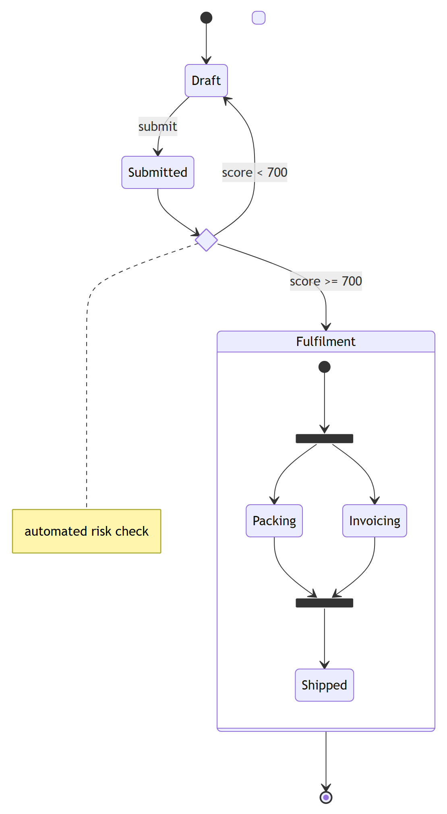
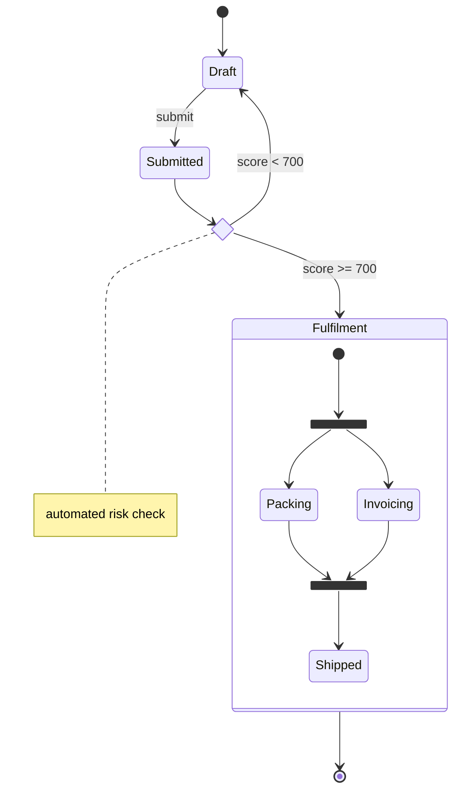

# State Diagram (`stateDiagram-v2`)

**What it's for:** state machines and lifecycles — statuses, transitions, and the events that drive them. Verified against mermaid.js.org, 2026 snapshot (stable).

- [Use `stateDiagram-v2`](#use-statediagram-v2)
- [States & transitions](#states--transitions)
- [Start / end](#start--end)
- [Composite states](#composite-states)
- [Choice, fork/join](#choice-forkjoin)
- [Concurrency](#concurrency)
- [Notes, direction, styling](#notes-direction-styling)
- [Worked example](#worked-example)
- [Pitfalls](#pitfalls)

## Use `stateDiagram-v2`

Two keywords exist: **`stateDiagram-v2`** (modern, better layout — use this) and legacy `stateDiagram`. They share syntax; always prefer `-v2`.

## States & transitions

A state is a bare ID, or an ID with a label, or declared with `state`:

Transitions are `-->`, optionally labeled with `: event`.

## Start / end

`[*]` is the pseudo-state for both start and end; direction of the arrow decides which:

## Composite states

Nest states inside a `state X { … }` block. Each composite can have its own `[*]` start/end.

## Choice, fork/join

Special pseudo-states declared with stereotypes:

## Concurrency

Inside a composite state, `--` (double hyphen on its own line) splits it into concurrent regions:

## Notes, direction, styling

- **Notes:** `note left of S : text` / `note right of S : text` (multi-line notes can span lines and close with `end note`).
- **Direction:** `direction LR` (also `TB`, `BT`, `RL`).
- **Styling:** `classDef hot fill:#fdd` then `class S hot` or `S:::hot`. Note: start/end (`[*]`) and composite-state borders **cannot** be styled directly.

## Worked example

Mermaid source

<!-- render: images/mermaid-state.png -->

## Pitfalls

- Use **`stateDiagram-v2`**, not `stateDiagram` (old renderer) and not `stateDiagramV2`.
- Stereotype pseudo-states are `<<choice>>`, `<<fork>>`, `<<join>>` — double angle brackets, lowercase.
- `--` for concurrency must be on **its own line** inside a composite state; outside one it does nothing useful.
- A description form `Active : text` defines/labels a state — don't confuse the `:` here (state label) with the `:` on a transition (event label).
- Aliases use `state "long label" as Short`, then reference `Short`.
