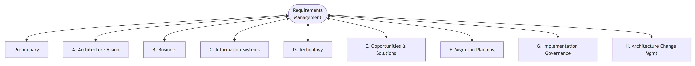
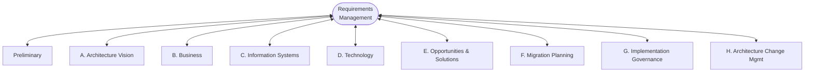

# TOGAF Standard, 10th Edition

TOGAF (The Open Group Architecture Framework) is an enterprise architecture **framework and method**: a structured, repeatable way to develop, govern, and maintain enterprise architectures. Its core is the **Architecture Development Method (ADM)** — a cycle of phases (Preliminary, A–H, plus Requirements Management at the center) — supported by the **Architecture Content Framework** (what you produce), the **Enterprise Continuum and Architecture Repository** (where assets live), and an **Architecture Capability with governance** (who runs it and how). This skill covers the **TOGAF Standard, 10th Edition** (The Open Group, April 2022).

Mermaid source

<!-- render: images/togaf-adm-cycle.png -->

## What changed: 9.2 → 10th Edition (verify before quoting versions)

- The standard is now a **modular document set**, not one monolith. It splits into **TOGAF Fundamental Content** (six free-standing volumes) plus the **TOGAF Series Guides** (stable, topic-specific best-practice guides). The Series Guides sit *within* the broader **TOGAF Library**, which still exists as a separate, lower-stability tier holding emerging and reference material.
- The six **Fundamental Content** volumes: **Introduction & Core Concepts**; **Architecture Development Method (ADM)**; **ADM Techniques**; **Applying the ADM** (the Practitioners' approach); **Architecture Content**; **Enterprise Architecture Capability & Governance**.
- The **ADM cycle diagram dropped its directional arrowheads** — phases are no longer presented as strictly sequential (to avoid implying a waterfall), and the Preliminary↔Phase A link is bidirectional. The underlying phase *content* is largely carried over verbatim from 9.2.
- Always write it as **"TOGAF Standard, 10th Edition"** — not "TOGAF 10".

## When to use this skill / when NOT to

- **Use this skill** for the TOGAF *framework and method*: the ADM and its phases, deliverables/artifacts/building blocks, the content metamodel, the Architecture Repository and Enterprise Continuum, architecture governance, the Architecture Board, contracts, compliance, partitioning, and iteration.
- **For the ArchiMate modeling *language*** (notation, layers, element/relationship semantics, viewpoints) — use the **`archimate`** skill. This skill only covers how ArchiMate *maps onto* ADM phases (see `reference/archimate-mapping.md`).
- **To actually build architecture artifacts in a tool (Sparx Enterprise Architect)** — use the **`ea-modeling`** skill.

## Reference files — open the one you need

| File | Open it when you need… |
|------|------------------------|
| `reference/adm-phases.md` | The ADM cycle in detail: objective, key steps, and outputs/deliverables/artifacts for **Preliminary, Phases A–H, and Requirements Management**. Includes a worked example (Preliminary → A → B). Open for any "what happens in phase X / what does it produce" question. |
| `reference/content-framework.md` | The **Architecture Content Framework**: Deliverables vs Artifacts vs Building Blocks (ABB/SBB); the Content Metamodel; catalogs/matrices/diagrams; and the **Architecture Repository** (Architecture Metamodel, Architecture Landscape, Reference Library incl. TRM & III-RM, Standards Information Base, Governance Log, Architecture Capability). Open for "what artifact / what deliverable / where do assets live" questions. |
| `reference/capability-and-governance.md` | The **Architecture Capability & Governance**: ADM governance, the Architecture Board, Architecture Contracts, Compliance, the **Enterprise Continuum**, **Architecture Partitioning**, **ADM iteration**, and architecture development at **Strategic / Segment / Capability** levels. Open for governance, operating-model, partitioning, and iteration questions. |
| `reference/archimate-mapping.md` | A table mapping **ADM phases/artifacts → ArchiMate layers/elements** (Phase B ↔ Business + Motivation; Phase C Data ↔ Data Objects; Phase C Application ↔ Application Components/Services; Phase D ↔ Technology; Phase A ↔ Motivation + Strategy; Phases E/F ↔ Implementation & Migration). Open when bridging TOGAF deliverables to ArchiMate views. Cross-links to the `archimate` skill. |
