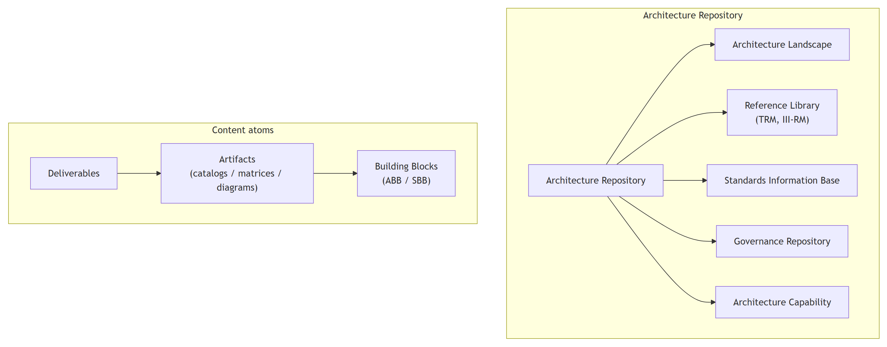
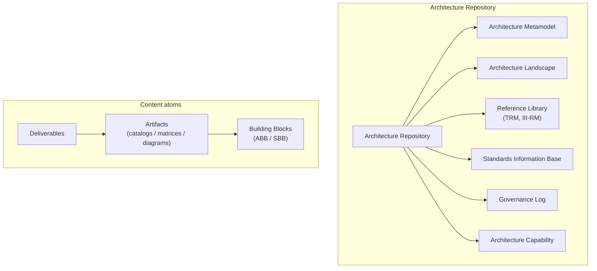

# Architecture Content Framework & Repository

The **Architecture Content Framework** defines *what* the ADM produces and how those outputs relate, so that architecture work is consistent and reusable. The **Architecture Content** volume of the TOGAF Standard, 10th Edition specifies this. (Note the 10th-Edition terminology: the **TOGAF Content Framework** and the **TOGAF Enterprise Metamodel** are now named as two distinct things.)



<details>
<summary>Mermaid source</summary>

<!-- render: images/togaf-content-hierarchy.png -->



</details>

## Contents

- [Deliverables, Artifacts, Building Blocks](#deliverables-artifacts-building-blocks)
- [Building Blocks: ABB vs SBB](#building-blocks-abb-vs-sbb)
- [The Content Metamodel](#the-content-metamodel)
- [Catalogs, Matrices, Diagrams](#catalogs-matrices-diagrams)
- [The Architecture Repository](#the-architecture-repository)
- [Key deliverables checklist](#key-deliverables-checklist)

## Deliverables, Artifacts, Building Blocks

These three are the content "atoms" — keep them straight:

- **Deliverable** — a formal, **contractually specified** work product, reviewed/agreed/signed off by stakeholders. Deliverables are typically *archived* at completion or transitioned into the Architecture Repository. Example: the Architecture Definition Document, the Statement of Architecture Work.
- **Artifact** — a granular, **single-focus** architectural work product that describes the architecture from a specific viewpoint. Artifacts are classified as **catalogs** (lists), **matrices** (relationships), or **diagrams** (pictures). One deliverable usually *contains many* artifacts. Example: a Stakeholder Map matrix, a Business Footprint diagram.
- **Building Block** — a (potentially reusable) component of business, IT, or architectural capability. Building blocks are *what artifacts describe and deliverables assemble*.

```
Deliverable  ──contains──▶  Artifacts  ──describe──▶  Building Blocks
(signed off)                (catalog/matrix/diagram)  (ABB / SBB)
```

## Building Blocks: ABB vs SBB

- **Architecture Building Block (ABB)** — defines *what* functionality/capability is required, in a solution-independent way. Produced during the architecture-definition phases (B, C, D). Describes required capability and shapes the SBBs that realize it.
- **Solution Building Block (SBB)** — defines *how* the capability is delivered — specific products, components, or custom builds. Produced largely in Phase E onward; vendor/implementation-specific.
- ABBs evolve into SBBs as you move down the Enterprise Continuum from the **Architecture Continuum** (abstract) toward the **Solutions Continuum** (concrete). See `capability-and-governance.md` for the Enterprise Continuum.

## The Content Metamodel

The **Content Metamodel** (in the 10th Edition, the basis of the **TOGAF Enterprise Metamodel**) defines the formal structure of architecture content — the **entities** (e.g. Actor, Role, Business Service, Function, Data Entity, Application Component, Technology Component, Requirement, Principle), their **attributes**, and the **relationships** between them — so that artifacts across phases are coherent and tool-able.

It is organized around core areas that line up with the ADM:

- **Architecture Principles, Vision & Requirements** (cross-cutting; from Preliminary/A and Requirements Management).
- **Business Architecture** (organization, function, service, process, product — Phase B).
- **Information Systems Architecture** — **Data** and **Application** (Phase C).
- **Technology Architecture** (platform services, logical/physical technology components — Phase D).

The metamodel can be **extended** (the 10th Edition supports tailoring via extension modules — e.g. governance, services, process modeling, data, infrastructure consolidation, motivation) to suit the enterprise.

## Catalogs, Matrices, Diagrams

Artifacts come in three forms; most ADM phases produce all three:

- **Catalog** — a *list* of building blocks of a given type (e.g. Application Portfolio catalog, Technology Standards catalog). Foundational; feeds matrices and diagrams.
- **Matrix** — a *grid* showing relationships between two types of building block (e.g. Application/Data CRUD matrix, Actor/Role matrix, Application/Technology matrix).
- **Diagram** — a *picture* of building blocks for a stakeholder/viewpoint (e.g. Business Footprint diagram, Application Communication diagram). Diagrams are where **ArchiMate views** most naturally fit — see `archimate-mapping.md`.

A consolidated list of catalogs/matrices/diagrams per phase is in `adm-phases.md`.

## The Architecture Repository

The Architecture Repository is the enterprise's structured store of all architecture output and reference material. The TOGAF Standard, 10th Edition defines six classes of content:

| Repository area | What it holds |
|-----------------|---------------|
| **Architecture Metamodel** | The tailored content metamodel and method — how *this* enterprise describes and develops architecture. |
| **Architecture Landscape** | The architectural representations of assets in use / planned, held at **three levels of granularity**: **Strategic, Segment, Capability** architectures (see partitioning in `capability-and-governance.md`). |
| **Reference Library** | Guidelines, templates, patterns, and **reference models** available for reuse — including the **Technical Reference Model (TRM)** and the **Integrated Information Infrastructure Reference Model (III-RM)**. |
| **Standards Information Base (SIB)** | The standards (legal/regulatory, industry, and internal) with which new architecture must comply. |
| **Governance Log** | Records of governance activity: compliance assessments, dispensations, capability assessments, Architecture Contracts, and audit information. |
| **Architecture Capability** | The parameters, structures, and processes that run the architecture function itself (skills, roles, organization). |

### The two TOGAF reference models in the Reference Library

- **Technical Reference Model (TRM)** — a *foundation architecture*: a taxonomy and conceptual model of generic platform services and the application/communications infrastructure beneath them. It gives common terminology and a structure for the Technology Architecture (Phase D).
- **Integrated Information Infrastructure Reference Model (III-RM)** — a subset/refinement focused on the **application-level** infrastructure needed to enable **Boundaryless Information Flow** — i.e. interoperability and integration of information across the enterprise. Derived from the TRM.

## Key deliverables checklist

The deliverables that recur across the ADM (and where they originate):

- **Request for Architecture Work** (Preliminary / H → A)
- **Statement of Architecture Work** (A)
- **Architecture Vision** (A)
- **Architecture Principles** (Preliminary)
- **Organizational Model for Enterprise Architecture** (Preliminary)
- **Tailored Architecture Framework** (Preliminary)
- **Architecture Definition Document (ADD)** (B, C, D — populated progressively)
- **Architecture Requirements Specification (ARS)** (B, C, D + Requirements Management)
- **Architecture Roadmap** (B–D, consolidated in E)
- **Transition Architectures** (E)
- **Implementation and Migration Plan** (E outline → F detailed)
- **Implementation Governance Model** (F)
- **Architecture Contract** (G)
- **Compliance Assessment** (G)
- **Architecture Building Blocks / Solution Building Blocks** (B–D / E)
- **Capability Assessment** (A, E)
- **Communications Plan** (A)
- **Change Request / Requirements Impact Assessment** (H / Requirements Management)
