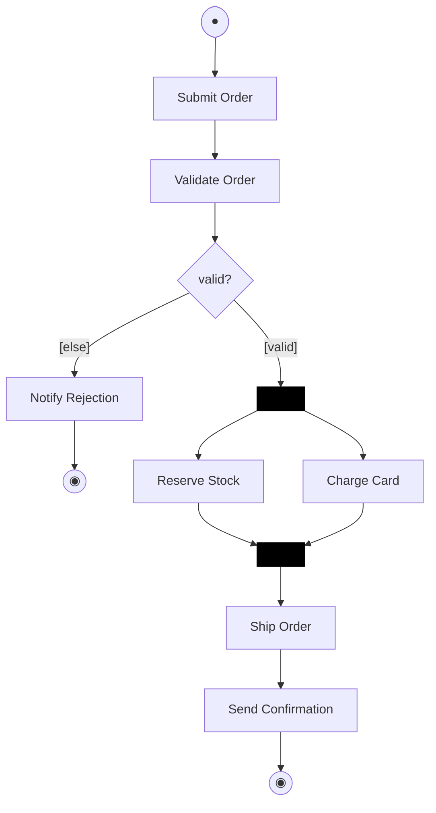

# Activity diagram (UML 2.5.1)

What it is · when to use · notation rules (nodes, edges, control nodes, partitions, objects) · worked example · Mermaid (flowchart) · common mistakes · EA bridge.

## What it is

A **behavior** diagram modeling **workflow** as a graph of **actions** connected by **control flow** and **object flow** edges, with **token** semantics (Petri-net-like). It is UML's tool for algorithms, business processes, and use-case step flows — including concurrency via fork/join.

## When to use it

- Specifying a business process or the internal steps of a use case.
- Showing parallelism (fork/join), decisions/merges, and where objects/data flow between steps.
- Cross-organizational flows using **partitions** (swimlanes).

## Notation rules

**Nodes:**
- **Action**: rounded rectangle with a verb phrase (e.g. *Validate Order*). The atomic unit of work.
- **Initial node**: a filled black circle ● — where the flow starts.
- **Activity final node**: a filled circle inside a ring ◉ — terminates the *whole* activity (all tokens).
- **Flow final node**: a circle with an X ⊗ — terminates *one* flow/token without ending the activity.
- **Decision node**: a diamond ◇ with **one** incoming and multiple outgoing edges, each guarded `[condition]`. `[else]` is the default branch.
- **Merge node**: a diamond ◇ with multiple incoming and **one** outgoing edge — brings alternative paths back together (no synchronization).
- **Fork node**: a solid bar ▬ with one in, many out — splits one token into **concurrent** flows.
- **Join node**: a solid bar ▬ with many in, one out — **synchronizes**; waits for all incoming flows.
- **Object node**: a rectangle naming an object/datum that flows between actions (a pin on an action edge is the compact form). State shown as `objectName [state]`.

**Edges:**
- **Control flow**: solid arrow — sequences actions (a token passes when the source completes).
- **Object flow**: solid arrow through/into object nodes or pins — carries data.

**Partitions (swimlanes):** horizontal or vertical lanes labeled with the responsible actor/class; each action sits in the lane that performs it.

**Well-formedness:** decision = 1-in/many-out (guarded); merge = many-in/1-out; fork/join use bars; every fork should eventually meet a join on its concurrent paths; guards on a decision should be complete and ideally disjoint.

## Worked example — process an order

Lanes: **Customer**, **Sales**, **Warehouse**.

1. ● → *Submit Order* (Customer)
2. → *Validate Order* (Sales) → ◇ `[valid]` / `[else → Notify Rejection → ◉]`
3. `[valid]` → **fork ▬** into: *Reserve Stock* (Warehouse) **and** *Charge Card* (Sales)
4. both → **join ▬** → *Ship Order* (Warehouse)
5. → *Send Confirmation* (Sales) → ◉

## Mermaid (via flowchart)

Mermaid has **no native activity diagram**, but a `flowchart` renders the control flow well; use `subgraph` for swimlanes. Fork/join are approximated by a node fanning out/in (Mermaid has no synchronization-bar semantics — note this).

(The `fork`/`join` bars are visual stand-ins; Mermaid does not enforce the join's "wait for all" semantics.)

## Common mistakes

- Using a **decision** where a **fork** is meant (or vice-versa): decision = *choose one* guarded path; fork = *do all* concurrently. They are not interchangeable.
- Forgetting that a **join** synchronizes (waits for **all** inputs) while a **merge** does not (passes **any** input through).
- Putting guards on **fork** outgoing edges — guards belong on **decision** edges.
- Using **activity final** ◉ when you only want to end one concurrent branch — use **flow final** ⊗ so the rest of the activity continues.
- Omitting an `[else]`/default on a decision, leaving a token stuck when no guard is true.

## EA bridge

- Diagram `type`: **"Activity"** (confirmed).
- Element `type`: **"Action"**, **"Decision"** (the diamond — also serves as merge), **"StateNode"** for the initial/final nodes (verify final-node subtype in live EA), fork/join via an **"Synchronization"**/"Fork-Join" node (verify in live EA). Partitions via an **"ActivityPartition"** element (verify in live EA).
- Connector `type`: **"ControlFlow"** for activity edges (set the guard as the connector's guard property), **"ObjectFlow"** for data edges (verify in live EA). Build sequence: **`ea-modeling`** + `${CLAUDE_PLUGIN_ROOT}/shared/reference/ea-type-cheatsheet.md`.
