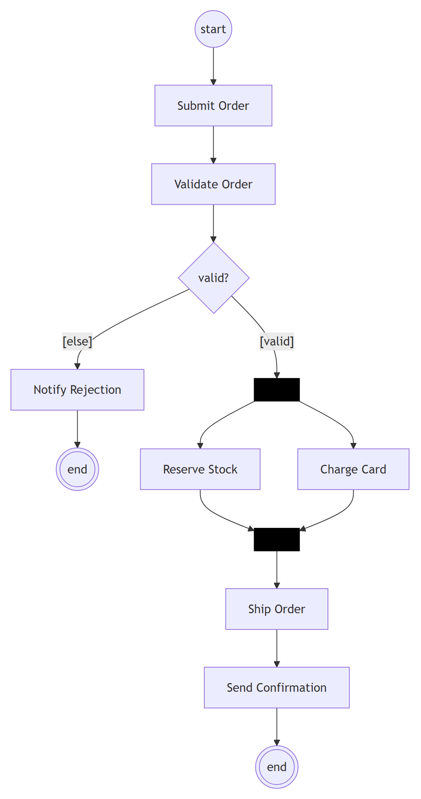
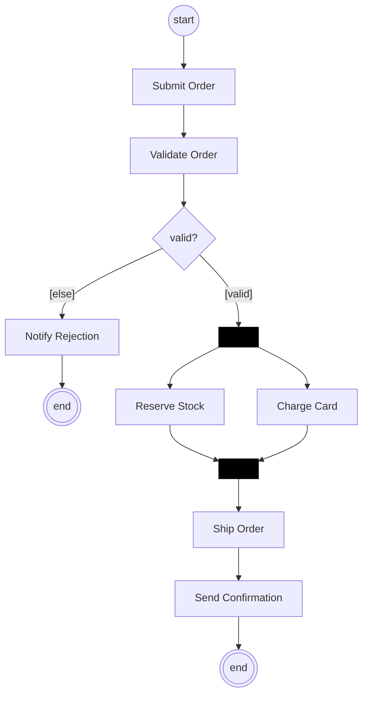

# Activity diagram (UML 2.5.1)

What it is · when to use · notation rules (nodes, edges, control nodes, partitions, objects) · worked example · Mermaid (flowchart) · common mistakes · EA bridge.

## What it is

A **behavior** diagram modeling **workflow** as a graph of **actions** connected by **control flow** and **object flow** edges, with **token** semantics (Petri-net-like). It is UML's tool for algorithms, business processes, and use-case step flows — including concurrency via fork/join.

## When to use it

- Specifying a business process or the internal steps of a use case.
- Showing parallelism (fork/join), decisions/merges, and where objects/data flow between steps.
- Cross-organizational flows using **partitions** (swimlanes).

## Notation rules

**Nodes:**
- **Action**: rounded rectangle with a verb phrase (e.g. *Validate Order*). The atomic unit of work — an action is **never decomposed further** on its own diagram; it either runs to completion or, if its details matter, is modeled as a **call behavior action** (rake symbol ⊞ in the corner) invoking another activity.
- **Send signal action**: a convex pentagon (flag pointing right) — emits a signal/message. **Accept event action**: a concave pentagon (notch on the left) — waits for a matching signal; an **accept time event** uses an hourglass and may start a flow with no incoming edge.
- **Initial node**: a filled black circle ● — where the flow starts.
- **Activity final node**: a filled circle inside a ring ◉ — terminates the *whole* activity (all tokens).
- **Flow final node**: a circle with an X ⊗ — terminates *one* flow/token without ending the activity.
- **Decision node**: a diamond ◇ with **one** incoming and multiple outgoing edges, each guarded `[condition]`. `[else]` is the default branch. A `«decisionInput»` note attached to the diamond names a behavior evaluated **once** to drive all the guards (avoids re-evaluating a costly or side-effecting test per branch).
- **Merge node**: a diamond ◇ with multiple incoming and **one** outgoing edge — brings alternative paths back together (no synchronization).
- **Fork node** (a.k.a. *parallelization node*): a solid bar ▬ with one in, many out — splits one token into **concurrent** flows.
- **Join node** (a.k.a. *synchronization node*): a solid bar ▬ with many in, one out — **synchronizes**; waits for a token on **every** incoming edge, then merges them into a single outgoing token. A bar may combine both roles (many in **and** many out).
- **Object node**: a rectangle naming an object/datum that flows between actions (a pin — small square on an action's boundary — is the compact form). State shown as `objectName [state]`. An incoming object-flow edge tagged `{stream}` (and a filled pin) marks a **streaming** parameter that is read/written continuously while the action runs, rather than once at start/end.
- **Central buffer** `«centralBuffer»`: an object node buffering tokens from multiple sources to multiple receivers; each token is consumed (read once) by exactly one receiver — models transient memory.
- **Data store** `«datastore»`: a persistent object node — tokens are **copied** on read (and may be read repeatedly) and overwritten on write; models a database/permanent memory.

**Edges:**
- **Control flow**: solid arrow — sequences actions (a token passes when the source completes).
- **Object flow**: solid arrow through/into object nodes or pins — carries data.
- **Edge weight** `{weight=N}`: the minimum number of tokens that must be available before they are offered together to the target (default `1`); `{weight=all}` forwards however many are present at once. Use it for batching (e.g. "start once at least 30 are registered").
- **Connector** (edge stub): when an edge would clutter the layout, split it into two small circles labelled with the same letter — one on each fragment — instead of drawing the long line.

**Activity frame & parameters:** the whole activity may sit in a rounded rectangle with its name in a tab; **activity parameter nodes** (small rectangles straddling the frame) carry input/output values — inputs on the left/top, outputs on the right/bottom. `«precondition»` / `«postcondition»` notes on the frame state what must hold before/after.

**Partitions (swimlanes):** horizontal or vertical lanes labeled with the responsible actor/class; each action sits in the lane that performs it. Lanes can be **nested** (subpartitions, e.g. *Institute Employee* split into *Professor* / *Secretary*) or **two-dimensional** (a grid). Partitions are purely organizational — they do **not** change token flow. An action in two partitions can instead be labelled textually `(Partition1, Partition2)` above its name (`::` for a sub-partition).

**Token semantics:** an action **fires only when a token is present on every one of its incoming edges** (and is offered to all outgoing edges when it finishes) — so two edges converging directly on one action behave like an implicit join. An activity may have **several initial nodes**; all of them emit a token when the activity starts, so the subpaths run concurrently. Reaching an **activity final** node withdraws **all** remaining tokens and ends the whole activity (exception: tokens already sitting on activity output parameters survive); a **flow final** ends just its own token.

**Well-formedness:** decision = 1-in/many-out (guarded); merge = many-in/1-out; fork/join use bars; every fork should eventually meet a join on its concurrent paths. Decision guards must be **complete** (some guard is always true — otherwise the token gets stuck) and **non-overlapping** (at most one true at a time — otherwise the choice is non-deterministic); `[else]` covers the remaining case.

**Exception handling:**
- **Exception handler**: when an action may fail, attach a handler to it via a **lightning-bolt (zig-zag) edge**; the handler is itself an action (or group) that runs *instead of* the protected action's normal continuation. The handler is matched by exception **type**, has no ordinary incoming/outgoing edges, and must produce the same outgoing result tokens as the action it safeguards so the flow resumes normally. If no handler matches, the exception propagates outward.
- **Interruptible activity region**: a **dashed rounded rectangle** enclosing one or more actions. An **interrupting edge** (also drawn as a lightning bolt) leaves the region to an action outside it; when an accept-event inside the region fires, **all** tokens in the region are deleted and the target of the interrupting edge is activated — the standard way to model "cancel / abort the whole sub-process" (e.g. *Withdraw* aborts an in-progress enrolment).

## Worked example — process an order

Lanes: **Customer**, **Sales**, **Warehouse**.

1. ● → *Submit Order* (Customer)
2. → *Validate Order* (Sales) → ◇ `[valid]` / `[else → Notify Rejection → ◉]`
3. `[valid]` → **fork ▬** into: *Reserve Stock* (Warehouse) **and** *Charge Card* (Sales)
4. both → **join ▬** → *Ship Order* (Warehouse)
5. → *Send Confirmation* (Sales) → ◉

## Mermaid (via flowchart)

Mermaid has **no native activity diagram**, but a `flowchart` renders the control flow well; use `subgraph` for swimlanes. Fork/join are approximated by a node fanning out/in (Mermaid has no synchronization-bar semantics — note this).

Mermaid source

<!-- render: images/uml-activity-order-fulfilment.png -->

(The `fork`/`join` bars are visual stand-ins; Mermaid does not enforce the join's "wait for all" semantics.)

## Common mistakes

- Using a **decision** where a **fork** is meant (or vice-versa): decision = *choose one* guarded path; fork = *do all* concurrently. They are not interchangeable.
- Forgetting that a **join** synchronizes (waits for **all** inputs) while a **merge** does not (passes **any** input through).
- Putting guards on **fork** outgoing edges — guards belong on **decision** edges.
- Using **activity final** ◉ when you only want to end one concurrent branch — use **flow final** ⊗ so the rest of the activity continues.
- Omitting an `[else]`/default on a decision, leaving a token stuck when no guard is true; or writing **overlapping** guards, making the branch non-deterministic.
- Forgetting that an action with **two incoming control edges** waits for **both** tokens (implicit join) — if you meant "whichever arrives first", insert a **merge** diamond.
- Confusing **central buffer** (token read once, then gone) with **data store** (token copied on read, persists) — they model transient vs. permanent memory.

## EA bridge

- Diagram `type`: **"Activity"** (confirmed).
- Element `type`: **"Action"**, **"Decision"** (the diamond — also serves as merge), **"StateNode"** for the initial/final nodes (verify final-node subtype in live EA), fork/join via a **"Synchronization"** node (try this first; fall back to "Fork-Join" if that name is rejected — verify in live EA). Partitions via an **"ActivityPartition"** element. Object nodes via **"ObjectNode"**; central buffer / data store and exception/interruptible regions are usually a stereotype or property on an ObjectNode / Region rather than a distinct type (verify in live EA).
- Connector `type`: **"ControlFlow"** for activity edges (set the guard as the connector's guard property), **"ObjectFlow"** for data edges (try this name first; fall back to a plain "ControlFlow" through object nodes if it is rejected — verify in live EA). Build sequence: **`ea-modeling`** + `${CLAUDE_PLUGIN_ROOT}/shared/reference/ea-type-cheatsheet.md`.
