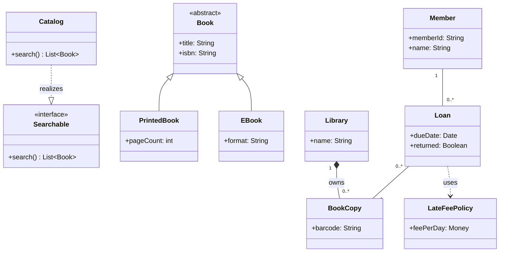

# Class diagram (UML 2.5.1)

Contents: what it is · when to use · notation rules · relationships · worked example · Mermaid · common mistakes · EA bridge.

## What it is

A **structure** diagram showing **classifiers** (classes, interfaces, enumerations, data types) — their attributes and operations — and the static **relationships** among them. It is the most-used UML diagram and the backbone of object-oriented design.

## When to use it

- Capturing a domain model or the design of a class library.
- Documenting types, their features, and how they relate (inherit, reference, depend).
- As the type-level companion to an object diagram (which shows one instance snapshot).

## Notation rules

A class is a rectangle with up to three compartments:

```
┌─────────────────────┐
│      «keyword»       │   ← optional stereotype/keyword, then Name (italic if abstract)
│      ClassName       │
├─────────────────────┤
│ - attr : Type [m] = d│   ← attribute compartment
├─────────────────────┤
│ + op(p:Type) : Ret   │   ← operation compartment
└─────────────────────┘
```

- **Attribute**: `visibility name : type [multiplicity] = default {property}` (see overview). An omitted attribute multiplicity defaults to `[1]` (single-valued); `[*]` is shorthand for `[0..*]`. `_underline_` marks a **static** (classifier-scoped) feature. A leading `/` marks a **derived** attribute (computed from others, e.g. `/age`).
- **Operation**: `visibility name(dir name:type=default, …) : returnType {property}`. Abstract operations are *italic* or `{abstract}`.
- **Interface**: stereotype `«interface»`; realized by classes via a dashed hollow-triangle arrow.
- **Enumeration**: `«enumeration»` with literals in the attribute compartment.
- Visibility, multiplicity, constraints `{ }`, and stereotypes `« »` follow `overview-and-rules.md`.

## Relationships (the load-bearing part)

| Relationship | Line | Arrow/end | Meaning |
| --- | --- | --- | --- |
| **Association** | solid | open arrow (navigable) / role + multiplicity each end | structural "knows-a" link |
| **Aggregation (shared)** | solid | hollow ◇ diamond on whole | weak "part-of"; *intentionally informal* in the standard — a part may belong to **several** wholes at once |
| **Composition** | solid | filled ◆ diamond on whole | strong "part-of" with existence dependency; part in **at most one** composite; parts deleted with the whole |
| **Generalization** | solid | hollow ▷ triangle on parent | "is-a" / inheritance |
| **Realization** | dashed | hollow ▷ triangle on interface | class implements interface |
| **Dependency** | dashed | open arrow on supplier | "uses"; weakest coupling |
| **Association class** | dashed | links a class to an association line | attributes/behavior belonging to the association itself |

Rules of thumb: a **composition** end has multiplicity `1` or `0..1` on the whole and the part belongs to exactly one composite at a time. Both aggregation kinds are **transitive and asymmetric** (if B is part of A and C of B, then C is part of A; and A and B cannot be parts of each other). Navigability arrows are optional; an `x` on an end means explicitly **not navigable**. Use a **qualifier** box to model keyed lookups. Each association end may carry a **role name** (the part the connected class plays), placed near that end.

**N-ary associations.** Three or more partner classes are joined to a central **hollow diamond** (one edge per class). N-ary associations have **no navigation** and **no aggregation diamonds on the ends**. A multiplicity at one end states how many objects of that class may relate to a *fixed combination* of one object from **each** of the other ends — not to a single partner. A binary association with two association classes is **not** the same model as one n-ary association; pick deliberately.

**Generalization sets.** Sibling generalizations sharing a supertype can be grouped and constrained with `{ }` on the set: `{complete}` / `{incomplete}` (do the listed subclasses cover *every* instance of the parent?) and `{disjoint}` / `{overlapping}` (may one object belong to *more than one* subclass at once — i.e. multiple classification?). The standard default is `{incomplete, disjoint}`. Several independent generalization sets (e.g. by role *and* by employment) can partition the same parent on different criteria.

## Worked example — library loans

Domain: a `Library` lends `Book` copies to `Member`s; a `Loan` is the association between a member and a book copy and records the due date. `Book` is abstract; `PrintedBook` and `EBook` specialize it. `Catalog` realizes a `Searchable` interface.

- `Library` **composes** `BookCopy` (copies die with the library record): `1` ◆—— `0..*`.
- `Member` —`Loan`— `BookCopy`: an **association class** `Loan {dueDate, returned}`.
- `PrintedBook`, `EBook` **generalize** to abstract `Book`.
- `Catalog` **realizes** `«interface» Searchable`.
- `Loan` has a **dependency** on a `LateFeePolicy` it merely uses.

## Mermaid

Mermaid has native class diagrams. (It approximates association classes as a normal class plus links; everything else maps cleanly.)

<details open>
<summary>Class diagram — a small library-loans domain (rendered by GitHub from the source below)</summary>



</details>

## Common mistakes

- Using **composition** when the part is shared or outlives the whole — that is aggregation (or plain association). When unsure, prefer plain association.
- Drawing an **arrow** on a generalization that points to the child — the hollow triangle always points to the **parent/supertype**.
- Confusing **dependency** (dashed, transient "uses") with **association** (solid, structural).
- Putting an attribute that is really a relationship (`member : Member`) as a typed attribute *and* drawing the association — pick one representation.
- Forgetting multiplicities on an **association end** — leave it unspecified and the reader has no default to fall back on, so always label both ends. (Note the asymmetry: an omitted *attribute* multiplicity does default to `1`, but an association end does not.)
- Replacing an **association class** with a plain class plus two ordinary associations — this loses a constraint. An association class fixes *one* link object per partner tuple; the three-class workaround permits several. Only split it out if you truly need multiple link objects per tuple.
- Reading an **n-ary** multiplicity as if it constrained a single partner — it constrains the count against a fixed tuple of all the *other* ends.

## EA bridge

Building this diagram in Enterprise Architect — the diagram/element/connector `type` strings and the COM display fixes (navigability arrows, composite diamonds) — is a **tool** concern. See the **`ea-modeling`** skill (`reference/diagram-type-playbooks.md` for the build quirks, `reference/notation-to-ea-mapping.md` for the type mapping) and `${CLAUDE_PLUGIN_ROOT}/shared/reference/ea-type-cheatsheet.md` for the canonical type strings.
