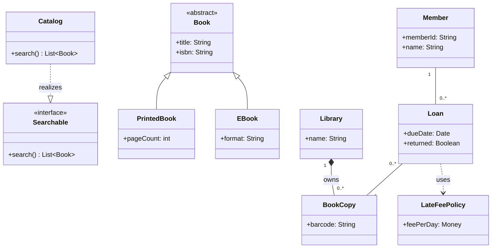

# Class diagram (UML 2.5.1)

Contents: what it is · when to use · notation rules · relationships · worked example · Mermaid · common mistakes · EA bridge.

## What it is

A **structure** diagram showing **classifiers** (classes, interfaces, enumerations, data types) — their attributes and operations — and the static **relationships** among them. It is the most-used UML diagram and the backbone of object-oriented design.

## When to use it

- Capturing a domain model or the design of a class library.
- Documenting types, their features, and how they relate (inherit, reference, depend).
- As the type-level companion to an object diagram (which shows one instance snapshot).

## Notation rules

A class is a rectangle with up to three compartments:

```
┌─────────────────────┐
│      «keyword»       │   ← optional stereotype/keyword, then Name (italic if abstract)
│      ClassName       │
├─────────────────────┤
│ - attr : Type [m] = d│   ← attribute compartment
├─────────────────────┤
│ + op(p:Type) : Ret   │   ← operation compartment
└─────────────────────┘
```

- **Attribute**: `visibility name : type [multiplicity] = default {property}` (see overview). `_underline_` marks a **static** (classifier-scoped) feature.
- **Operation**: `visibility name(dir name:type=default, …) : returnType {property}`. Abstract operations are *italic* or `{abstract}`.
- **Interface**: stereotype `«interface»`; realized by classes via a dashed hollow-triangle arrow.
- **Enumeration**: `«enumeration»` with literals in the attribute compartment.
- Visibility, multiplicity, constraints `{ }`, and stereotypes `« »` follow `overview-and-rules.md`.

## Relationships (the load-bearing part)

| Relationship | Line | Arrow/end | Meaning |
| --- | --- | --- | --- |
| **Association** | solid | open arrow (navigable) / role + multiplicity each end | structural "knows-a" link |
| **Aggregation** | solid | hollow ◇ diamond on whole | shared "has-a"; parts can outlive the whole |
| **Composition** | solid | filled ◆ diamond on whole | strong "owns-a"; parts die with the whole; part in at most one composite |
| **Generalization** | solid | hollow ▷ triangle on parent | "is-a" / inheritance |
| **Realization** | dashed | hollow ▷ triangle on interface | class implements interface |
| **Dependency** | dashed | open arrow on supplier | "uses"; weakest coupling |
| **Association class** | dashed | links a class to an association line | attributes/behavior belonging to the association itself |

Rules of thumb: a **composition** end has multiplicity `1` or `0..1` on the whole and the part belongs to exactly one composite at a time. Navigability arrows are optional; an `x` on an end means explicitly **not navigable**. Use a **qualifier** box to model keyed lookups.

## Worked example — library loans

Domain: a `Library` lends `Book` copies to `Member`s; a `Loan` is the association between a member and a book copy and records the due date. `Book` is abstract; `PrintedBook` and `EBook` specialize it. `Catalog` realizes a `Searchable` interface.

- `Library` **composes** `BookCopy` (copies die with the library record): `1` ◆—— `0..*`.
- `Member` —`Loan`— `BookCopy`: an **association class** `Loan {dueDate, returned}`.
- `PrintedBook`, `EBook` **generalize** to abstract `Book`.
- `Catalog` **realizes** `«interface» Searchable`.
- `Loan` has a **dependency** on a `LateFeePolicy` it merely uses.

## Mermaid

Mermaid has native class diagrams. (It approximates association classes as a normal class plus links; everything else maps cleanly.)

<details open>
<summary>Class diagram — a small library-loans domain (rendered by GitHub from the source below)</summary>

<!-- render: images/uml-class-library-loans.png -->



</details>

## Common mistakes

- Using **composition** when the part is shared or outlives the whole — that is aggregation (or plain association). When unsure, prefer plain association.
- Drawing an **arrow** on a generalization that points to the child — the hollow triangle always points to the **parent/supertype**.
- Confusing **dependency** (dashed, transient "uses") with **association** (solid, structural).
- Putting an attribute that is really a relationship (`member : Member`) as a typed attribute *and* drawing the association — pick one representation.
- Forgetting multiplicities; an unlabeled end is implementation-defined, not "1".

## EA bridge

- Diagram `type`: **"Class"** (confirmed).
- Element `type`: **"Class"**, **"Interface"** (use stereotype/keyword for enumeration: verify in live EA).
- Connector `type`: **"Association"**, **"Aggregation"** (set the composition flag/`«composite»` for filled diamond — verify in live EA), **"Generalization"**, **"Realisation"/"Realization"** (verify spelling in live EA), **"Dependency"**.
- Attributes/operations go through `enterprise-architect:create_or_update_attributes` / `…create_or_update_operations`. For the build sequence see the **`ea-modeling`** skill and `${CLAUDE_PLUGIN_ROOT}/shared/reference/ea-type-cheatsheet.md`.
