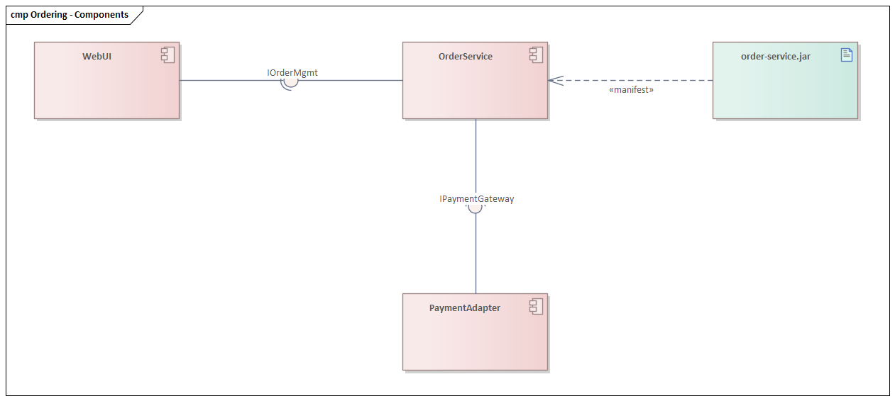

# Component diagram (UML 2.5.1)

What it is · when to use · notation rules · connectors · worked example · Mermaid note · common mistakes · EA bridge.

## What it is

A **structure** diagram showing **components** — modular, replaceable units of software with well-defined **provided** and **required** interfaces — and how they are wired together. It captures the logical decomposition of a system into deployable/replaceable parts and their contracts. A **component** is a self-contained unit that encapsulates state and behavior behind interfaces.

## When to use it

- Describing the build/runtime modularity of a system (services, libraries, subsystems) and their interface contracts.
- Showing how components plug together via interfaces, independent of the classes inside them.
- Pairs with a **deployment** diagram (which puts the resulting **artifacts** onto nodes).

## Notation rules

- A **component** is a rectangle with the keyword `«component»` and/or the component icon (a small rectangle with two protruding tabs) in the top-right corner.
- **Provided interface**: a **lollipop** ──○ on the component boundary — an interface the component implements/offers.
- **Required interface**: a **socket** ──⊂ — an interface the component needs.
- **Assembly connector**: a provided lollipop fitted into a required socket (ball-and-socket), wiring one component's output to another's input.
- **Delegation connector**: a dashed/solid arrow from a component's external port to an internal part that actually realizes the interface (used when showing internal structure).
- A **port** (small square on the boundary) may group provided/required interfaces.
- An **artifact** (`«artifact»`, dog-eared rectangle) is the physical manifestation (jar, dll, exe). A `«manifest»` dependency links an artifact to the component it realizes.
- Interfaces may also be shown the **expanded** way: `«interface»` class boxes linked by realization (dashed hollow triangle) and usage (dashed arrow) instead of lollipop/socket.

## Worked example — order system



*Rendered in Sparx Enterprise Architect.*

```
   ┌──「component」 WebUI ──┐                ┌──「component」 OrderService ──┐
   │                       │○──────────────⊂│                              │○── IOrderMgmt
   │                       │  IOrderMgmt    │                              │
   └───────────────────────┘                └──────────────┬───────────────┘
                                                            │ required
                                                            ⊂ IPaymentGateway
                                                            │
                                            ┌──「component」 PaymentAdapter ──┐
                                            │                                │○── IPaymentGateway
                                            └────────────────────────────────┘
```

- `WebUI` **requires** `IOrderMgmt`; `OrderService` **provides** it → assembly connector.
- `OrderService` **requires** `IPaymentGateway`; `PaymentAdapter` **provides** it → assembly connector.
- An `«artifact» order-service.jar` `«manifest»` → `OrderService`.

## Mermaid

**No native equivalent.** Mermaid has no component diagram (no lollipop/socket, no component glyph). Approximate with a `flowchart` of labeled boxes and arrows annotated with interface names, but state clearly it is not UML component notation.

## Common mistakes

- Swapping **provided** (lollipop ──○, "I implement this") and **required** (socket ──⊂, "I need this") — the most common error.
- Drawing a plain association/dependency between components instead of wiring **through interfaces** — the contract is the whole point of the diagram.
- Confusing a **component** (logical, design-time module) with a **node** (hardware, on a deployment diagram) or an **artifact** (the physical file). A component is *manifested by* an artifact, which is *deployed to* a node.
- Mixing lollipop/socket and expanded interface notation in the same place without need — pick one per interface.

## EA bridge

- Diagram `type`: EA **"Component"** diagram (confirmed).
- Element `type`: **"Component"**, **"Interface"**, **"Artifact"** (confirmed); **"Port"** — verify in live EA.
- Connector `type`: **"Realization"** (component → provided interface, confirmed), **"Dependency"** (component → required interface, or `«use»`, confirmed); **"Assembly"** connector and **"Manifest"** dependency — verify in live EA. Build sequence: **`ea-modeling`** + `${CLAUDE_PLUGIN_ROOT}/shared/reference/ea-type-cheatsheet.md`.
- **Headless connectors (confirmed in live EA).** The MCP creates the **Realization** (component → provided interface, hollow triangle) and **Dependency** (component → required interface, open arrow) connectors with direction unspecified, so both render **headless** — no triangle, no arrowhead. Set each connector's `Direction` via the EA COM bridge to draw the head: `${CLAUDE_PLUGIN_ROOT}/shared/reference/ea-com-bridge.md`. (Generalization triangles render intrinsically and need no fix.)
