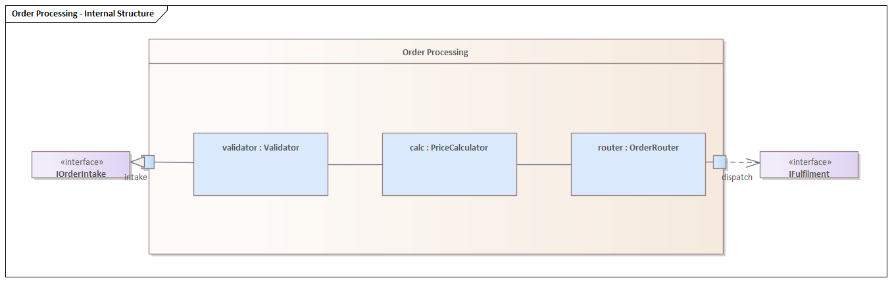

# Composite structure diagram (UML 2.5.1)

What it is · when to use · notation rules (parts, ports, connectors, interfaces, collaborations) · worked example · Mermaid note · common mistakes · EA bridge.

## What it is

A **structure** diagram showing the **internal structure** of a classifier: the **parts** it is composed of at runtime, the **ports** through which it interacts with its environment, and the **connectors** wiring parts and ports together. It answers "what is this thing made of internally and how are the pieces connected?"

## When to use it

- Decomposing a class/component into collaborating runtime parts.
- Specifying the contract surface of a classifier via typed **ports** with provided/required interfaces.
- Capturing a **collaboration** (a reusable pattern of roles) independent of which classes play the roles.

## Notation rules

- The enclosing **classifier** is a large rectangle with its name in the top compartment; its internals are drawn inside.
- A **part** is a rectangle inside, named `rolename : Type [multiplicity]` with a **solid** border (a composite/owned part). A `0..*` part may be drawn as a stacked rectangle. A **referenced** part (not owned, just referenced) has a **dashed** border.
- A **port** is a small square on the boundary of the classifier (or a part), optionally named and typed. Ports relay interactions in/out.
- **Provided interface**: a **lollipop** (ball-on-stick ──○) attached to the port — services the classifier offers.
- **Required interface**: a **socket** (cup-on-stick ──⊂) attached to the port — services it needs from the environment. A provided lollipop fitting a required socket is the **ball-and-socket / assembly** notation.
- A **connector** is a line joining two parts/ports that may communicate at runtime. An **assembly connector** joins a required socket to a compatible provided lollipop; a **delegation connector** forwards a port of the whole to a port of an internal part.
- A **collaboration** is a dashed ellipse containing roles; a **collaboration use** (`:CollaborationName`) binds roles to concrete parts via dashed role-binding lines.

## Worked example — `Order Processing` internal structure



*Rendered in Sparx Enterprise Architect.*

An `Order Processing` classifier decomposed into the runtime **parts** that
collaborate to handle an order, with its contract surface exposed through two
boundary **ports**:

```
        ┌─────────────────────── Order Processing ───────────────────────┐
        │                                                                 │
 ○──▢───┼ validator:Validator ─ calc:PriceCalculator ─ router:OrderRouter ┼───▢──⊂
IOrderIntake│  intake                                              dispatch  │ IFulfilment
 (provided) └─────────────────────────────────────────────────────────────┘ (required)
```

- Three owned **parts** — `validator : Validator`, `calc : PriceCalculator`,
  `router : OrderRouter` — are wired in sequence by **connectors** (an order is
  validated, then priced, then routed).
- `intake` and `dispatch` are boundary **ports**. The `intake` port **provides**
  `IOrderIntake` (the contract for submitting an order); the `dispatch` port
  **requires** `IFulfilment` (the downstream service it depends on).
- **Delegation connectors** forward the `intake` port inward to `validator`, and
  `router` outward to the `dispatch` port — the boundary ports relay interactions
  to and from the internal parts.

> EA draws the provided/required interfaces in the **expanded** form — a
> **Realization** (hollow triangle) to the provided `IOrderIntake` and a
> **Dependency** (dashed arrow) to the required `IFulfilment` — rather than the
> compact lollipop/socket glyphs, which it does not render through automation.
> Both are equivalent UML notations for the same provided/required contract.

## Mermaid

**No native equivalent.** Mermaid cannot render ports, lollipop/socket interfaces, or internal-part containment. If a text sketch is required, fall back to an ASCII box drawing like the one above and state that Mermaid has no composite-structure support.

## Common mistakes

- Confusing a **part** (a runtime role inside this classifier, solid border) with an ordinary associated class on a class diagram.
- Reversing **provided** (lollipop ──○) and **required** (socket ──⊂) interfaces.
- Using an **assembly connector** where a **delegation connector** is needed: assembly joins two parts' ports; delegation joins a boundary port of the whole to an internal part's port.
- Drawing ports as named attributes — ports are boundary squares, not attribute lines.

## EA bridge

Building this diagram in Enterprise Architect — the diagram/element/connector `type` strings (Part/Port with `owningElementID`, delegation `Connector`) and the fact that provided/required interfaces render expanded (no lollipop/socket via automation) — is a **tool** concern. See the **`ea-modeling`** skill (`reference/diagram-type-playbooks.md` for the build quirks, `reference/notation-to-ea-mapping.md` for the type mapping) and `${CLAUDE_PLUGIN_ROOT}/shared/reference/ea-type-cheatsheet.md` for the canonical type strings.
