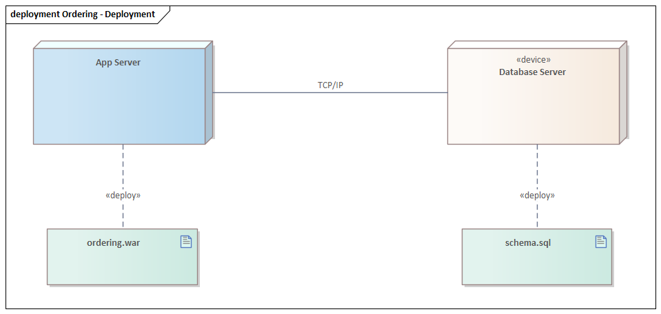

# Deployment diagram (UML 2.5.1)

What it is · when to use · notation rules · worked example · Mermaid note · common mistakes · EA bridge.

## What it is

A **structure** diagram showing the **physical/runtime architecture**: the hardware/execution **nodes**, the **artifacts** (deployable files) placed on them, and the **communication paths** between nodes. It answers "what runs where, and how do the boxes talk?"

## When to use it

- Documenting the target environment: servers, devices, containers, and what is installed on each.
- Showing network topology and the protocols on communication links.
- The physical counterpart to a **component** diagram — artifacts manifest components and get deployed to nodes.

## Notation rules

- A **node** is a 3-D box (cube). Two stereotyped flavors:
  - `«device»` — physical hardware (a server, phone, router).
  - `«executionEnvironment»` — software that hosts artifacts (an app server, JVM, container, OS).
  Nodes can be **nested** (an execution environment inside a device).
- An **artifact** is a dog-eared rectangle with the keyword `«artifact»` and/or the document icon — a concrete file (`.jar`, `.war`, `.exe`, `.dll`, config).
- **Deployment** of an artifact onto a node is shown by (a) drawing the artifact box **inside** the node, or (b) a dashed `«deploy»` (or `«manifest»` for artifact→component) dependency arrow.
- A **communication path** is a plain solid line between two nodes, optionally labeled with the protocol as a stereotype (`«TCP/IP»`, `«HTTPS»`) and multiplicities for the number of node instances.
- A **deployment specification** (`«deployment spec»`) is an artifact giving deployment parameters (e.g. a config file) attached to a deployed artifact.

## Worked example — web app deployment



*Rendered in Sparx Enterprise Architect.*

```
┌─「device」 Client PC ─────┐         ┌─「device」 App Server ──────────────────┐
│  ┌──────────────────┐    │ «HTTPS» │  ┌─「executionEnvironment」 Tomcat ──┐  │
│  │ «artifact»       │    │─────────│  │  ┌──────────────┐                 │  │
│  │ browser          │    │         │  │  │ «artifact»   │                 │  │
│  └──────────────────┘    │         │  │  │ shop.war     │                 │  │
└──────────────────────────┘         │  │  └──────────────┘                 │  │
                                     │  └────────────────────────────────────┘ │
                                     └──────────────┬──────────────────────────┘
                                                    │ «JDBC»
                                     ┌─「device」 DB Server ──────────────────┐
                                     │  ┌──────────────┐                      │
                                     │  │ «artifact»   │                      │
                                     │  │ schema.sql   │                      │
                                     │  └──────────────┘                      │
                                     └────────────────────────────────────────┘
```

- `Client PC` ↔ `App Server` over `«HTTPS»`; `App Server` ↔ `DB Server` over `«JDBC»` (communication paths).
- `shop.war` is **deployed** into the `Tomcat` execution environment, itself nested in the `App Server` device.

## Mermaid

**No native equivalent.** Mermaid has no deployment diagram (no node cubes, no `«deploy»`). Approximate with a `flowchart` using `subgraph` for nodes and boxes for artifacts, labeling links with protocols; state it is not UML deployment notation.

## Common mistakes

- Mixing up **node** (hardware/execution env, a cube) with **component**/**artifact** — components are logical; artifacts are the files that *manifest* them; nodes are where artifacts are *deployed*.
- Putting a **component** directly on a node — deploy the **artifact** that manifests it.
- Forgetting to distinguish `«device»` from `«executionEnvironment»`, or nesting them wrong (an execution environment runs *inside* a device, not vice-versa).
- Labeling communication paths with data instead of **protocol/medium**.

## EA bridge

- Diagram `type`: EA **"Deployment"** diagram (confirmed).
- Element `type`: **"Node"** (confirmed), **"Device"** (confirmed — a dedicated type that renders «device»; for `executionEnvironment` use a `Node` with that stereotype), **"Artifact"** (confirmed).
- Connector `type`: **"Dependency"** with `stereotypes:"deploy"` (artifact → node, confirmed) or `"manifest"` (verify in live EA); communication path is an **"Association"** (confirmed) / **"CommunicationPath"** (verify in live EA) between nodes. Build sequence: **`ea-modeling`** + `${CLAUDE_PLUGIN_ROOT}/shared/reference/ea-type-cheatsheet.md`.
- **Headless connector (confirmed in live EA).** The MCP creates the `«deploy»` **Dependency** (artifact → node) with direction unspecified, so it renders **headless** — no arrow. Set the connector's `Direction` via the EA COM bridge to draw the arrow: `${CLAUDE_PLUGIN_ROOT}/shared/reference/ea-com-bridge.md`.
