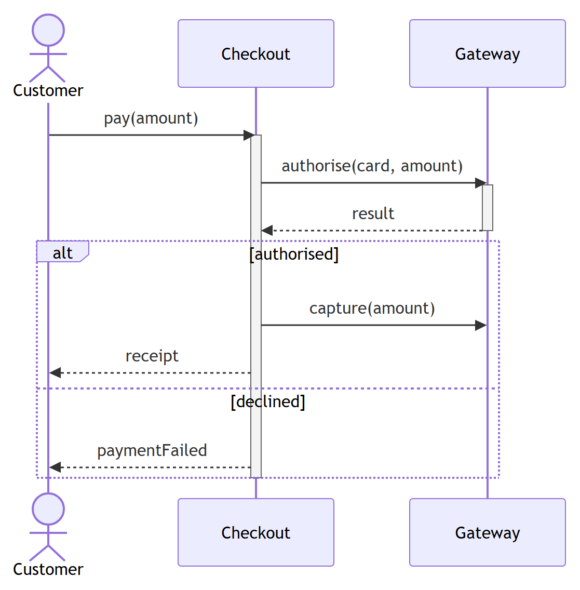
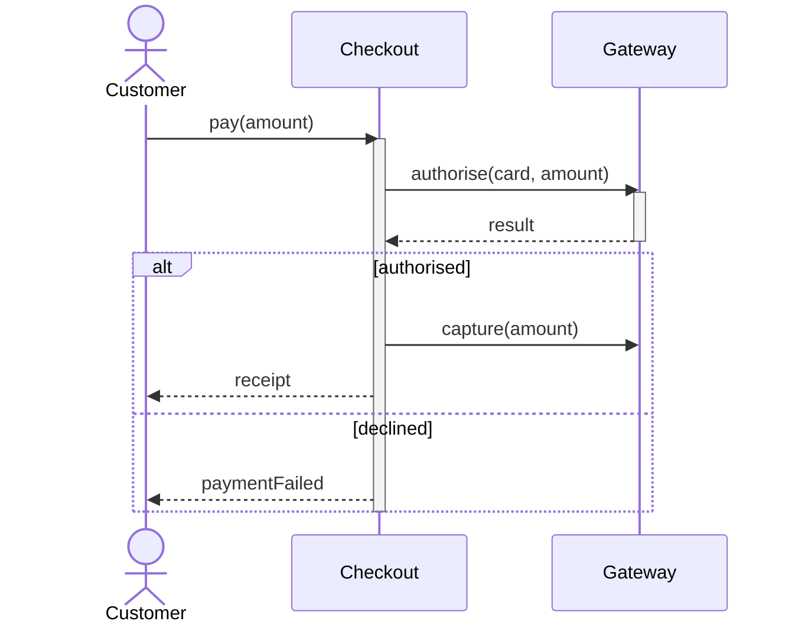

# Interaction diagrams (UML 2.5.1)

The four **Interaction** diagrams — a sub-family of Behavior — all describe how lifelines exchange messages, viewed differently.

Contents:
1. Sequence diagram (lifelines, messages, combined fragments) — **has Mermaid**
2. Communication diagram — no native Mermaid
3. Timing diagram — no native Mermaid
4. Interaction Overview diagram — no native Mermaid

All four share **lifelines** (participants) and **messages**. Sequence emphasizes **time order**, Communication emphasizes **structure/links**, Timing emphasizes **state-vs-real-time**, and Interaction Overview emphasizes **control flow between whole interactions**.

---

## 1. Sequence diagram

### What it is
A **behavior/interaction** diagram showing a time-ordered exchange of **messages** between **lifelines** to realize one scenario. The dominant interaction diagram.

### When to use it
- Walking through one scenario of a use case step by step.
- Designing the call collaboration between objects/services.
- Showing ordering, conditionals (`alt`/`opt`), loops, and concurrency (`par`).

### Notation rules
- A **lifeline** is a named box (`name : Type`) at the top with a **dashed vertical line** descending — the object's existence over time (time flows **downward**).
- An **execution specification** (activation) is a thin rectangle on the lifeline showing it is active/processing.
- **Messages** are horizontal arrows between lifelines:
  - **Synchronous call**: solid line, **filled** arrowhead ►. Caller waits.
  - **Reply/return**: dashed line, open arrowhead ⇠. Optional but recommended for sync calls.
  - **Asynchronous**: solid line, **open** arrowhead →. Caller does not wait.
  - **Create message**: dashed arrow with `«create»` to the *head* of a newly created lifeline (drawn lower).
  - **Destroy**: a message ending in a large **X** on the destroyed lifeline.
  - **Self/recursive message**: arrow looping back to the same lifeline (nested activation).
- A **found** message starts from a filled circle (sender outside scope); a **lost** message ends at a filled circle.
- **Combined fragments**: a rectangular frame with an **operator** label in the top-left corner, optional `[guard]`s, and horizontal dashed lines splitting **operands**. The 12 UML 2.5.1 interaction operators:

| Operator | Meaning |
| --- | --- |
| `seq` | weak sequencing (default composition) |
| `alt` | alternatives; one operand whose `[guard]` is true runs (if/else) |
| `opt` | optional; runs iff its `[guard]` is true |
| `loop` | repeat; `loop(min,max)` or `loop [guard]` |
| `par` | parallel; operands interleave concurrently |
| `strict` | strict sequencing across operands |
| `critical` | atomic region; no interleaving allowed |
| `break` | if guard holds, run the operand and abandon the rest of the enclosing interaction |
| `neg` | the operand shows an **invalid** (forbidden) trace |
| `assert` | the operand is the **only** valid continuation |
| `ignore` | listed messages may occur and are ignored |
| `consider` | only the listed messages are significant here |

- An **interaction use** (`ref` frame) references another sequence diagram by name. A **gate** is a message endpoint on a frame boundary.
- A **state invariant** (`{condition}` on a lifeline) asserts the lifeline's state at that point.
- The whole diagram sits in a frame labeled `sd InteractionName`.

### Worked example — ATM withdrawal
Lifelines: `:Customer`, `:ATM`, `:Bank`.
1. `Customer` →(sync) `ATM` : `insertCard()` / `enterPin(p)`
2. `ATM` →(sync) `Bank` : `verify(pin)` ⇠ `ok`
3. **alt** `[ok]`: `Customer` → `ATM` : `requestCash(amt)`; `ATM` → `Bank` : `debit(amt)`; **opt** `[balance < amt]` → `ATM` shows "insufficient"; else `ATM` → `Customer` : `dispense(amt)`
   `[else]`: `ATM` → `Customer` : `ejectCard()`

### Mermaid
Sequence diagrams are native (`sequenceDiagram`); `alt`/`opt`/`loop`/`par`/`critical`/`break` map to Mermaid blocks. Below, a payment interaction with activations and an `alt` fragment splitting **authorised** from **declined**:



<details>
<summary>Mermaid source</summary>

<!-- render: images/uml-sequence-payment.png -->



</details>

### Common mistakes
- Using **synchronous** (filled ►) where **asynchronous** (open →) is meant, or omitting the **return** on a sync call.
- Misreading the **vertical axis as duration** — it is order, not elapsed time (that's a *timing* diagram).
- Abusing `alt`/`opt` for sequencing — those frames model choice, not steps.
- Forgetting `[guard]`s on `alt`/`opt`/`loop`, making the fragment ambiguous.

### EA bridge
- Diagram `type`: **"Sequence"** (confirmed).
- Element `type`: **"Sequence"** (lifeline), **"Actor"** for actor lifelines.
- Messages via `enterprise-architect:create_or_update_messages`. **Critical gotcha**: the diagram must be **open first** (`enterprise-architect:open_diagrams`) or messages silently duplicate; messages are ordered by vertical position. Combined fragments are added as fragment elements (verify in live EA). Build sequence: **`ea-modeling`** + `${CLAUDE_PLUGIN_ROOT}/shared/reference/ea-type-cheatsheet.md`.

---

## 2. Communication diagram

### What it is
The **same** interaction as a sequence diagram but laid out by **structure**: lifelines positioned freely, connected by **links**, with **numbered** messages along those links. Emphasizes *who is connected to whom*, not the time axis. (Formerly "collaboration diagram" in UML 1.x.)

### When to use it
- When the network of connections matters more than strict timing.
- Showing a small interaction compactly without a tall sequence diagram.

### Notation rules
- **Lifelines** are boxes (`name : Type`, underlined optional) placed anywhere.
- A **link** is a solid line between two lifelines (an association/connector instance).
- **Messages** are small arrows *alongside* a link, each with a **sequence number** giving order. Nested/decimal numbering (`1`, `1.1`, `1.2`, `2`) shows call nesting; `*` prefix means iteration (`1 *[i=1..n]: …`); a letter prefix denotes concurrency (`1a`, `1b`).
- Message syntax: `seq# [guard] return := name(args)`.

### Worked example — same ATM withdrawal
```
        1: verify(pin)          2: debit(amt)
[Customer] ──── [ATM] ──────────────── [Bank]
   ▲              │  1.1: ok (return)
   │ 3: dispense(amt)
```
Numbering `1`, `1.1`, `2`, `3` encodes the same order as the sequence diagram above.

### Mermaid
**No native equivalent.** Mermaid has no communication diagram. Either present the sequence-diagram form instead, or approximate with a `flowchart` whose edge labels carry `1:`, `1.1:` numbers — and state it is not UML communication notation.

### Common mistakes
- **Inconsistent numbering** that no longer matches the intended order (the numbers *are* the ordering — there is no time axis to fall back on).
- Trying to show many alternative branches — communication diagrams handle complex control flow poorly; use a sequence diagram with combined fragments.

### EA bridge
- Diagram `type`: EA **"Communication"** diagram (mark **verify in live EA**).
- Element: reuse class/object lifelines; **"Association"** links carry the messages. Message sequence numbers are set on the message properties — **verify in live EA**. See **`ea-modeling`**.

---

## 3. Timing diagram

### What it is
An **interaction** diagram plotting the **state or value** of one or more lifelines **against a real-time axis** (time on the horizontal axis). Used where exact timing/duration matters — embedded, hardware, protocols.

### When to use it
- Hardware/embedded signals, protocol timing, or any scenario where **durations and time constraints** are the point.
- Showing how several lifelines' states change relative to each other over time.

### Notation rules
- **Time** runs **left→right** on the horizontal axis (labeled with units).
- Two lifeline styles:
  - **State (state/condition) lifeline**: the y-axis lists discrete **states**; a stepped line shows which state the lifeline is in at each time — the line jumps up/down at each state change.
  - **Value lifeline**: a band drawn with two parallel horizontal lines that **cross over (✕)** at each value change, the value name written between the crossings (compact form for many values).
- A **message/event** between lifelines is an arrow at the time it occurs.
- **Duration constraint**: `{d..d'}` between two time points; **time constraint**: `{t=…}` at an event; **timing ruler** ticks mark units.

### Worked example — traffic light + pedestrian
Two state lifelines stacked, shared time axis:
- `TrafficLight`: states `Red → Green → Yellow → Red`, transitions at `t=0, 30, 60, 65`s.
- `WalkSignal`: states `Walk → DontWalk`, `Walk` only while `TrafficLight = Red`, with a duration constraint `{15..20s}` on the `Walk` interval.

```
TrafficLight  Green ┤        ┌────────┐
              Yellow┤        │        └─┐
              Red   ┤────────┘          └────  …
                    └┬────────┬────────┬─┬──── t (s)
                     0       30       60 65
WalkSignal    Walk  ┤──────┐ {15..20s}
              Don't ┤      └───────────────────
```

### Mermaid
**No native equivalent.** Mermaid has no UML timing diagram. (Mermaid's `gantt`/`timeline` are unrelated.) State explicitly that timing diagrams cannot be rendered in Mermaid; describe in text or ASCII.

### Common mistakes
- Confusing a timing diagram's **horizontal time axis** with a sequence diagram's *order-only* vertical axis.
- Mixing **state** and **value** lifeline styles within one lifeline without reason — pick the style that fits (few states → state lifeline; many values → value lifeline).
- Omitting **duration/time constraints**, which are the whole reason to use this diagram.

### EA bridge
- Diagram `type`: EA **"Timing"** diagram (mark **verify in live EA**).
- Element `type`: state/value **lifeline** with a **state timeline**; transitions/time points set on the lifeline — **verify in live EA**. See **`ea-modeling`**.

---

## 4. Interaction Overview diagram

### What it is
A **high-level** interaction diagram that is an **activity diagram whose nodes are interactions**. It strings together multiple interactions (sequence diagrams) with activity-style control flow — a "map of scenarios."

### When to use it
- Giving an overview of how several detailed sequence diagrams connect (which runs after which, under what condition).
- Modeling control flow *between* interactions rather than messages *within* one.

### Notation rules
- Uses **activity-diagram control nodes**: initial ●, final ◉, decision/merge ◇, fork/join bars ▬, control-flow edges.
- The "activity" nodes are replaced by **interactions**, in two forms:
  - **Interaction use** — a frame labeled `ref` in the top-left with the referenced interaction's name in the center (points to an existing sequence diagram).
  - **Inline interaction element** — a frame labeled `sd` showing a (usually small) interaction inline.
- The whole diagram sits in a frame labeled `sd OverviewName` (it *is* an Interaction).
- Lifelines may be declared on the frame; guards `[ ]` sit on decision branches as in activity diagrams.

### Worked example — checkout overview
```
 ●
 │
 ┌─ ref ───────────┐
 │  Authenticate   │
 └────────┬────────┘
          ▼
        ◇ [cart empty?]
   [yes]│        │[no]
        ▼        ▼
      ◉      ┌─ ref ──────────┐
             │  ProcessOrder  │
             └───────┬────────┘
                     ▼
             ┌─ ref ──────────┐
             │  SendReceipt   │
             └───────┬────────┘
                     ▼
                     ◉
```
Each `ref` frame links to a full sequence diagram; the diamond and edges are pure activity-diagram control flow.

### Mermaid
**No native equivalent.** Mermaid cannot nest interactions inside activity-style frames. Approximate the control flow with a `flowchart` whose nodes are labeled "ref: ProcessOrder", but note Mermaid cannot embed the referenced sequence diagrams or use UML interaction-frame notation.

### Common mistakes
- Drawing **messages** on an interaction overview — messages live *inside* the referenced interactions; the overview only shows control flow between frames.
- Forgetting the `ref`/`sd` frame labels, making nodes look like ordinary actions.
- Putting guards on fork edges instead of decision edges (same rule as activity diagrams).

### EA bridge
- Diagram `type`: EA **"Interaction Overview"** diagram (mark **verify in live EA**).
- Element `type`: **"InteractionOccurrence"/"InteractionFragment"** (the `ref` frames), plus activity control nodes (**"Decision"**, **"StateNode"** for initial/final, fork/join) — **verify in live EA**.
- Connector `type`: **"ControlFlow"** for the edges between interaction frames. See **`ea-modeling`** + `${CLAUDE_PLUGIN_ROOT}/shared/reference/ea-type-cheatsheet.md`.
