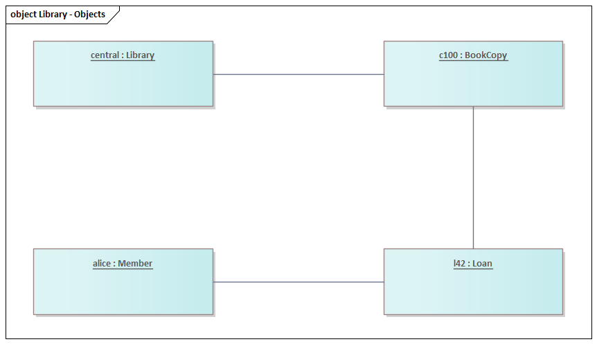

# Object diagram (UML 2.5.1)

What it is · when to use · notation rules · worked example · Mermaid note · common mistakes · EA bridge.

## What it is

A **structure** diagram that shows a **snapshot** of a system at one moment: concrete **instance specifications** (objects) with their **slot** values, and the **links** (instances of associations) between them. It is the instance-level counterpart of a class diagram. UML 2.5.1 has no separate "object diagram" metaclass — it is just a class/structure diagram populated with `InstanceSpecification`s.

## When to use it

- Illustrating a concrete example or test case for a class diagram ("here is one valid configuration").
- Validating a class model: if a legal instance snapshot can't be drawn, the class model is wrong.
- Explaining a tricky multiplicity or self-association by example.

## Notation rules

- An object is a rectangle with an **underlined** name string: `instanceName : ClassName` (either part may be omitted → `: ClassName` is an anonymous instance, `alice :` is an instance of unspecified type). The underline is what distinguishes an object from a class.
- The second compartment lists **slots**: `attributeName = value` (no visibility/types needed; they come from the class).
- A **link** is a solid line between two objects — an instance of an association. Links have **no** multiplicities (each end is a single object) and **no** navigability arrows by convention, though role names may appear.
- Objects may be tagged with `«instanceOf»` or carry a constraint, but generally stay minimal.
- Each object has its own **identity**: two objects of the same class with *identical* slot values are still two distinct objects (and must be drawn as two boxes, e.g. `maxMiller1` and `maxMiller2`). Identity, not attribute values, is what individuates an object.

## Worked example — one library loan snapshot



*Rendered in Sparx Enterprise Architect.*

A snapshot of the library model from `class-diagram.md` at a moment in time:

```
┌───────────────────────────┐
│ cityLib : Library         │   (underlined)
│  name = "City Library"    │
└───────────────────────────┘
        │ owns
┌───────────────────────────┐        ┌──────────────────────────┐
│ copy42 : BookCopy         │────────│ loan99 : Loan            │
│  barcode = "BC-0042"      │        │  dueDate = 2026-07-01    │
└───────────────────────────┘        │  returned = false        │
                                     └──────────────────────────┘
                                              │
                                     ┌──────────────────────────┐
                                     │ alice : Member           │
                                     │  memberId = "M-1007"     │
                                     │  name = "Alice"          │
                                     └──────────────────────────┘
```

This snapshot must satisfy every class-diagram multiplicity (e.g. `loan99` links exactly one `Member` and one `BookCopy`).

## Mermaid

**No native equivalent.** Mermaid has no object/instance diagram. If a text rendering is needed, either (a) draw it as a `classDiagram` and fake instances by naming classes `alice_Member` with slot lines, clearly noting it is a workaround, or (b) use a `flowchart` with labeled boxes. State explicitly that neither is a true UML object diagram.

## Common mistakes

- **Forgetting the underline** — without it the boxes read as classes, not instances.
- Putting **multiplicities or arrows** on links — links are single-to-single instance connections.
- Showing types in slots (`balance : Money = 0`) — slots are just `name = value`; the type lives on the class.
- Drawing an instance configuration that **violates the class model** (e.g. two `Loan`s for a `BookCopy` whose class says `0..1`).

## EA bridge

- Diagram `type`: EA models these on an **"Object"** diagram (confirmed — the canonical Class diagram with instance elements also works).
- Element `type`: **"Object"** (confirmed; an instance element — name it `instance : Classifier` and set its **classifier** to the typing class so slots inherit). Verify slot/run-state entry in live EA.
- Connector `type`: **"Association"** used as a link between objects (no multiplicities). For the build sequence and run-state values see the **`ea-modeling`** skill and `${CLAUDE_PLUGIN_ROOT}/shared/reference/ea-type-cheatsheet.md`.
