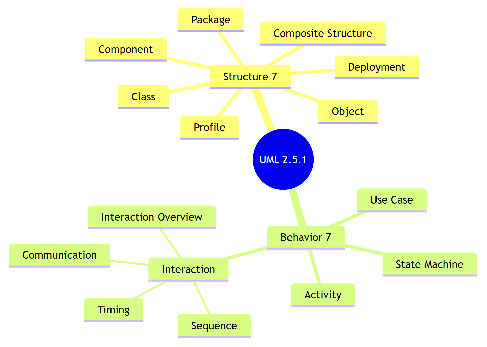
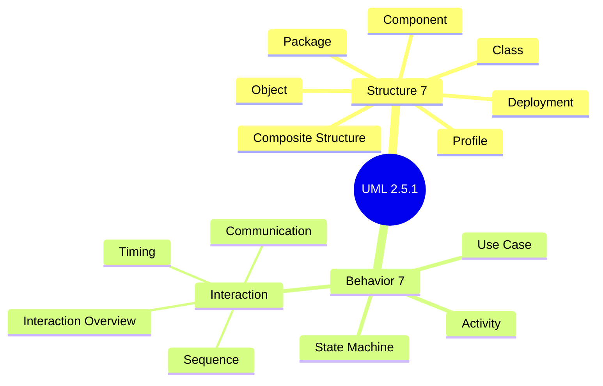
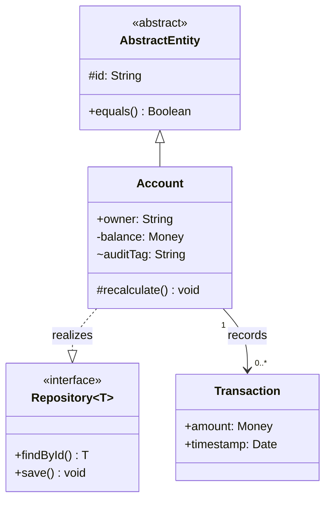

# UML 2.5.1 — Overview and cross-cutting rules

Contents:
1. Version note
2. The taxonomy: structure vs behavior
3. The 14 diagram types (table)
4. Picking a diagram type
5. Cross-cutting notation
   - The diagram frame and name tag
   - Visibility
   - Multiplicity
   - Name strings, roles, qualifiers
   - Stereotypes & profiles
   - Notes, comments, and `{constraints}`
   - Packages & namespaces
   - Keywords vs stereotypes

---

## 1. Version note

This skill targets **UML 2.5.1**, OMG document **formal/17-12-05** (December 2017). 2.5.1 is an editorial revision of 2.5 (formal/15-03-01) that reorganized the spec into one document and dropped the old "Infrastructure/Superstructure" split. The diagram set and notation are stable across 2.5 / 2.5.1. UML defines **no required diagram types** — diagrams are views onto a single underlying model; the 14 named types are the canonical, non-normative taxonomy from Annex A.

## 2. The taxonomy: structure vs behavior

The 14 diagrams split into two families:

- **Structure diagrams (7)** show the static things in a system and their relationships: **Class, Object, Package, Composite Structure, Component, Deployment, Profile.**
- **Behavior diagrams (7)** show dynamics over time: **Use Case, Activity, State Machine**, plus the four **Interaction** diagrams (a sub-family of Behavior): **Sequence, Communication, Timing, Interaction Overview.**

Mermaid source

<!-- render: images/uml-diagram-taxonomy.png -->

## 3. The 14 diagram types — reference & completeness table

Every type maps to one reference file (the four **Interaction** diagrams share `interaction-diagrams.md`).
EA diagram `type` strings are confirmed live except where noted; full status in the
[EA type cheatsheet](../../../shared/reference/ea-type-cheatsheet.md). Mermaid column: native support,
flowchart **approximation**, or none (build in EA).

| # | Diagram | Family | EA diagram `type` | Mermaid | Reference file |
| --- | --- | --- | --- | --- | --- |
| 1 | Class | Structure | `Class` | `classDiagram` | `class-diagram.md` |
| 2 | Object | Structure | `Object` | — | `object-diagram.md` |
| 3 | Package | Structure | `Package` | approx. (`flowchart`) | `package-diagram.md` |
| 4 | Composite Structure | Structure | `Composite Structure` | — | `composite-structure-diagram.md` |
| 5 | Component | Structure | `Component` | — | `component-diagram.md` |
| 6 | Deployment | Structure | `Deployment` | — | `deployment-diagram.md` |
| 7 | Profile | Structure | `Profile` | — | `profile-diagram.md` |
| 8 | Use Case | Behavior | `Use Case` | — | `use-case-diagram.md` |
| 9 | Activity | Behavior | `Activity` | approx. (`flowchart`) | `activity-diagram.md` |
| 10 | State Machine | Behavior | `StateMachine` | `stateDiagram-v2` | `state-machine-diagram.md` |
| 11 | Sequence | Behavior · Interaction | `Sequence` | `sequenceDiagram` | `interaction-diagrams.md` |
| 12 | Communication | Behavior · Interaction | `Communication` | — | `interaction-diagrams.md` |
| 13 | Timing | Behavior · Interaction | `Timing` | — | `interaction-diagrams.md` |
| 14 | Interaction Overview | Behavior · Interaction | `Interaction Overview` | — | `interaction-diagrams.md` |

For side-by-side **worked examples** of the four Mermaid-capable types built in both EA and Mermaid
(with the exact recipe for each tool), see
[`shared/reference/worked-examples.md`](../../../shared/reference/worked-examples.md).

## 4. Picking a diagram type

- *What things exist and how they relate?* → **Class** (types) or **Object** (a concrete instance snapshot, instance specifications, slots, links).
- *Who uses the system and for what?* → **Use Case** (actors, goals).
- *What is the step-by-step process / algorithm / business flow / workflow?* → **Activity**.
- *How does one object react to events over its lifetime (states, lifecycle, status flow)?* → **State Machine**.
- *In what order do objects talk to do one scenario?* → **Sequence** (time emphasis, lifelines, messages) or **Communication** (same interaction, structure/link emphasis).
- *How does a signal/value change against real time (time axis)?* → **Timing**.
- *How do several scenarios / interactions string together at a high level?* → **Interaction Overview**.
- *How is the code organized into modules with interfaces?* → **Component**; *how is the build laid into folders/namespaces, grouped into packages?* → **Package**.
- *What runs on what hardware (nodes, devices, artifacts)?* → **Deployment**.
- *What is the internal wiring (parts, ports, connectors) of a classifier?* → **Composite Structure**.
- *Inventing your own modeling vocabulary / stereotypes / tagged values on top of UML?* → **Profile**.

## 5. Cross-cutting notation

These conventions apply across many diagrams; the per-diagram files assume them.

### The diagram frame and name tag

Any diagram may be enclosed in a **frame** — a rectangle with a **name tag** (a small pentagon, dog-eared on its lower-right) in the top-left corner. The name tag holds an optional **kind prefix** plus the diagram name, and may carry **parameters** after the name. Common kind prefixes:

| Prefix | Diagram | Prefix | Diagram |
| --- | --- | --- | --- |
| `cd` | Class | `sd` | Sequence / Interaction Overview |
| `pkg` | Package | `comm` | Communication |
| `uc` | Use Case | `td` | Timing |
| `act` | Activity | `cmp` | Component |
| `stm` | State Machine | `dep` | Deployment |

e.g. `cd University` or `sd Registration(course, date)`. The frame is mandatory when the diagram must be referenced from elsewhere (an interaction `ref`, a frame gate, a contained diagram) and otherwise optional; the per-diagram files note where it is load-bearing.

### Visibility

Prefixed on attributes, operations, roles, and other features:

| Symbol | Visibility | Meaning |
| --- | --- | --- |
| `+` | public | visible to any element that can access the namespace |
| `-` | private | visible only inside the owning classifier |
| `#` | protected | visible to the classifier and its specializations |
| `~` | package | visible to elements in the same package |

A small class diagram tying these conventions together — the four visibility markers, an `«interface»`, an `«abstract»` class, and an association carrying multiplicities:

UML notation basics — visibility, an «interface», an «abstract» class, and a multiplicity-bearing association (rendered by GitHub from the source below)

### Multiplicity

Written as `lower..upper` on an association end, attribute, or part. `*` means unbounded (so `0..*` = "zero or more"; `*` alone is shorthand for `0..*`). Examples: `1` (exactly one), `0..1` (optional), `1..*` (one or more), `2..4`. Multiplicity may carry `{ordered}`, `{unordered}`, `{unique}`, `{nonunique}` property strings. The four combinations name a collection kind: `{unordered, unique}` is a **Set** (the UML default for a multivalued end), `{ordered, unique}` an **OrderedSet**, `{unordered, nonunique}` a **Bag**, and `{ordered, nonunique}` a **Sequence** — e.g. `[0..*] {ordered}` for an ordered, possibly-repeating collection.

### Name strings, roles, qualifiers

- Attribute syntax: `visibility name : type [multiplicity] = default {property-string}` — e.g. `- balance : Money [1] = 0 {readOnly}`.
- Operation syntax: `visibility name(param-list) : return-type {property-string}` where each param is `direction name : type = default` and `direction ∈ {in, out, inout, return}`.
- Association ends carry a **role name** and **multiplicity**; a filled arrowhead/open arrow indicates navigability; an `x` on an end means **not navigable**.
- A **qualifier** is a small box on the source end naming a key that partitions the target set (e.g. `Bank [accountNo] —— Account`).

### Stereotypes & profiles

A **stereotype** extends a metaclass with extra semantics, shown in guillemets: `«interface»`, `«enumeration»`, `«include»`, `«deploy»`. Multiple stereotypes: `«stereo1, stereo2»`. Stereotypes are defined in a **Profile** (see `profile-diagram.md`) and may add **tagged values** (name=value properties). Do not invent stereotypes that contradict standard ones.

### Notes, comments, and `{constraints}`

- A **comment/note** is a dog-eared rectangle attached by a dashed line; it carries no semantics.
- A **constraint** is a boolean condition in curly braces `{ }`, e.g. `{age >= 18}`, `{self.end > self.start}`, or OCL. On an association, `{xor}` between two associations means exactly one holds. `{subsets r}`, `{redefines r}`, `{union}` refine association ends.

### Packages & namespaces

A **package** is a named container (a tabbed folder) that owns a namespace; fully-qualified names use `::` (e.g. `Banking::Account`). Dependencies between packages use dashed arrows, optionally `«import»` / `«access»` / `«merge»`. See `package-diagram.md`.

### Keywords vs stereotypes

UML **keywords** (e.g. `{abstract}`, `«interface»` as a predefined keyword, `«primitive»`) are built into UML; **stereotypes** come from an applied profile. Both render in guillemets, but keywords are not user-defined. Abstract classifiers/operations are shown with the name in *italics* or the keyword `{abstract}`.
