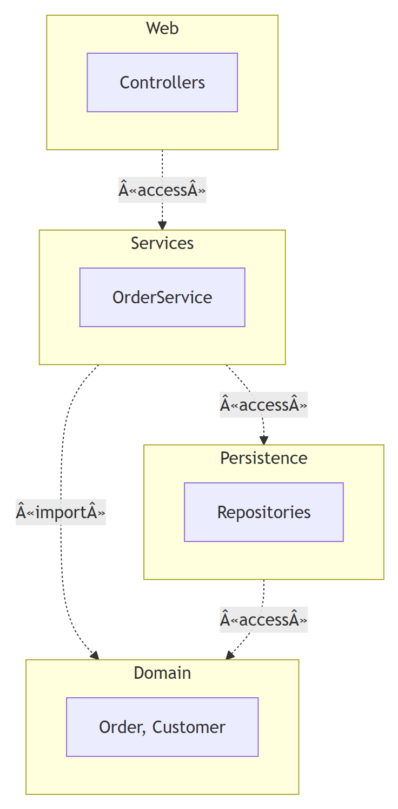
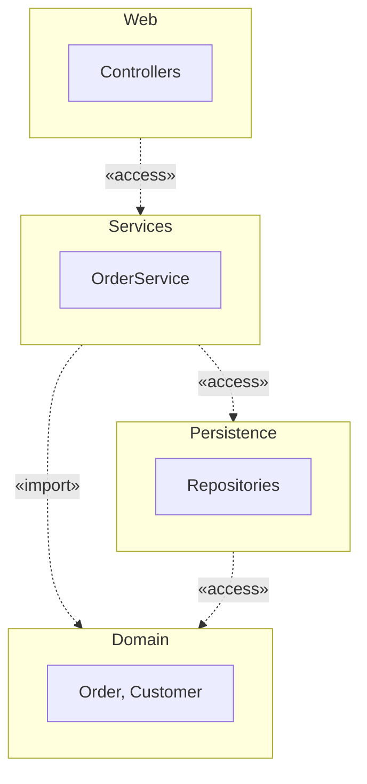

# Package diagram (UML 2.5.1)

What it is · when to use · notation rules · dependencies · worked example · Mermaid note · common mistakes · EA bridge.

## What it is

A **structure** diagram that groups model elements into **packages** (namespaces) and shows the **dependencies** between those groups. It is the standard tool for organizing a large model and for reasoning about coupling between subsystems/layers.

## When to use it

- Showing the high-level architecture as layers/modules and which modules depend on which.
- Organizing a large class model so the package-level dependency graph stays acyclic.
- Documenting `«import»`/`«access»`/`«merge»` relationships between namespaces.

## Notation rules

- A **package** is a tabbed folder: a small tab on top of a larger rectangle. The name goes in the tab if contents are shown inside the body, otherwise in the body.
- **Nesting** is shown either by drawing one package inside another, or by a line from the container to contained packages with a circle-plus ⊕ ("containment") symbol on the container end.
- Fully-qualified names use `::` — e.g. `Web::Controllers::LoginController`.
- A **package dependency** is a dashed arrow from the dependent (client) package to the one it depends on (supplier).

### Dependency stereotypes

| Stereotype | Meaning |
| --- | --- |
| `«import»` | public import: names from the target become usable **and re-exported** as if owned. |
| `«access»` | private import: names usable inside the importing package but **not** re-exported. |
| `«merge»` | package merge: target's contents are conceptually combined into the source (used in metamodels/profiles). |
| `«use»` | generic dependency (default when unlabeled). |

## Worked example — layered web app

```
        ┌──────────────┐
        │ ▭ Web        │
        └──────┬───────┘
               ┊ «access»
               ▼
        ┌──────────────┐        ┌──────────────┐
        │ ▭ Services   │┄┄┄┄┄┄┄▶│ ▭ Domain     │
        └──────┬───────┘ «import»└──────────────┘
               ┊ «access»               ▲
               ▼                        ┊ «access»
        ┌──────────────┐                ┊
        │ ▭ Persistence│┄┄┄┄┄┄┄┄┄┄┄┄┄┄┄┄┘
        └──────────────┘
```

`Web` depends on `Services`; `Services` imports `Domain` (re-exporting its types); both `Services` and `Persistence` access `Domain`. The graph is acyclic — a healthy layering. (Dashed arrows ┄▶ are dependencies; ┊ are vertical dashed arrows.)

## Mermaid

**No native equivalent.** Mermaid has no package diagram. Approximate with a `flowchart` using `subgraph` blocks as packages and dashed arrows (`-.->`) for dependencies, but note it is not true UML package notation (no tabbed-folder glyph, no `«import»`/`«access»` semantics).

The same layered web app as above, rendered as a Mermaid flowchart with `subgraph` packages and labelled dashed dependencies:



<details>
<summary>Mermaid source</summary>

<!-- render: images/uml-package-dependencies.png -->



</details>

## Common mistakes

- Pointing the dependency arrow **the wrong way** — it goes from client to supplier (the package that needs the other).
- Treating `«import»` and `«access»` as interchangeable — `«import»` re-exports the names; `«access»` does not.
- Letting the package dependency graph contain **cycles** — usually a design smell; break it with an interface package.
- Confusing **nesting** (ownership/namespace containment) with **dependency** (a usage relationship).

## EA bridge

- Diagram `type`: EA uses a **"Package"** diagram (mark **verify in live EA**).
- Element: packages are created with `enterprise-architect:create_or_update_package` (not `…_elements`); a package can also appear **on** a diagram as a Package element. Verify the on-diagram package element in live EA.
- Connector `type`: **"Dependency"**, with `stereotypes:"import"` / `"access"` / `"merge"` for the labeled variants; **"Package"** / "PackageImport" connector — **verify in live EA**. Build sequence: see **`ea-modeling`** and `${CLAUDE_PLUGIN_ROOT}/shared/reference/ea-type-cheatsheet.md`.
