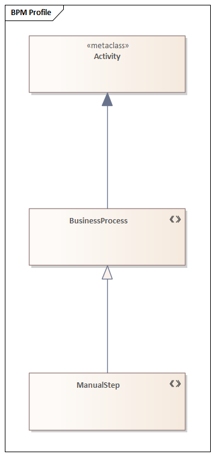

# Profile diagram (UML 2.5.1)

What it is · when to use · notation rules · worked example · Mermaid note · common mistakes · EA bridge.

## What it is

A **structure** diagram for the **profile** mechanism — UML's lightweight extension facility. A **profile** defines **stereotypes** that extend UML **metaclasses** (e.g. `Class`, `Component`, `Association`), optionally adding **tagged values** and **constraints**. Applying a profile to a model lets you tailor UML to a domain (e.g. SysML, a corporate modeling standard) without changing the UML metamodel.

## When to use it

- Defining a domain-specific modeling vocabulary on top of UML (the proper way to "invent" a stereotype).
- Documenting the stereotypes, their tagged values, and which metaclasses they may decorate.
- Specifying which profiles a package applies.

## Notation rules

- A **profile** is a package with the keyword `«profile»`.
- A **stereotype** is shown as a class box with the keyword `«stereotype»`. Its attributes become **tagged values** (properties available on every element the stereotype is applied to).
- A **metaclass** is shown as a class box with the keyword `«metaclass»` (e.g. `«metaclass» Component`).
- An **extension** links a stereotype to the metaclass it extends: a solid line with a **filled triangle (▰ black arrowhead)** on the metaclass end. The arrowhead being **filled** is what distinguishes an extension from a generalization. A `{required}` extension means every instance of the metaclass *must* carry the stereotype.
- **Applying a profile**: a package shows a `«apply»` (profile application) dashed arrow to the profile it uses.
- When a stereotype is *applied* to a normal element elsewhere, it shows in guillemets `«stereotypeName»` with its tagged values in a note or `{tag = value}` form.

## Worked example — an EJB profile



*Rendered in Sparx Enterprise Architect.*

```
┌─「profile」 EJB ───────────────────────────────────────┐
│                                                        │
│  ┌─「stereotype」 Bean ─┐ ▰━━━━━━ ┌─「metaclass」 Component ─┐
│  │  version : String   │         └──────────────────────────┘
│  │  transactional:Bool │                                     │
│  └─────────────────────┘                                     │
│                                                              │
│  ┌─「stereotype」 RemoteInterface ─┐ ▰━━━ ┌「metaclass」Interface┐
│  └────────────────────────────────┘      └─────────────────────┘
└───────────────────────────────────────────────────────────────┘
```

Applied in a model:

```
┌──「component」«Bean» OrderService ──┐
│  {version = "2.1", transactional = true}
└────────────────────────────────────┘
```

- `«stereotype» Bean` **extends** `«metaclass» Component` (filled-triangle extension).
- `Bean` adds tagged values `version` and `transactional`.
- A user package does `«apply» EJB` and then stereotypes `OrderService` as `«Bean»` with concrete tag values.

## Mermaid

**No native equivalent.** Mermaid has no profile diagram and no extension (filled-triangle) relationship. If a sketch is needed, draw stereotype and metaclass as `classDiagram` boxes with `<<stereotype>>` / `<<metaclass>>` labels and note that the **extension** relationship and `{required}`/tagged-value semantics cannot be expressed.

## Common mistakes

- Using a **generalization** (hollow triangle) instead of an **extension** (filled triangle) between stereotype and metaclass.
- Inventing stereotypes ad-hoc on a class diagram instead of defining them in a profile — fine for sketching, wrong for a rigorous model.
- Confusing a **tagged value** (a property contributed by a stereotype) with an ordinary class attribute.
- Forgetting to show the **profile application** (`«apply»`) — a stereotype is only usable in a model that applies its profile.

## EA bridge

- Diagram `type`: EA models profiles via an **"Profile"** diagram / MDG technology tooling (mark **verify in live EA** — EA's UML Profile authoring uses dedicated stereotype elements).
- Element `type`: **"Stereotype"**, **"Class"** with `«metaclass»` keyword — **verify in live EA**.
- Connector `type`: **"Extension"** (stereotype → metaclass), or "Generalization" is NOT correct here — **verify in live EA**. Tagged values map to EA `taggedValues` (remember: an **array** of `{name,value}`). Build sequence: **`ea-modeling`** + `${CLAUDE_PLUGIN_ROOT}/shared/reference/ea-type-cheatsheet.md`.
