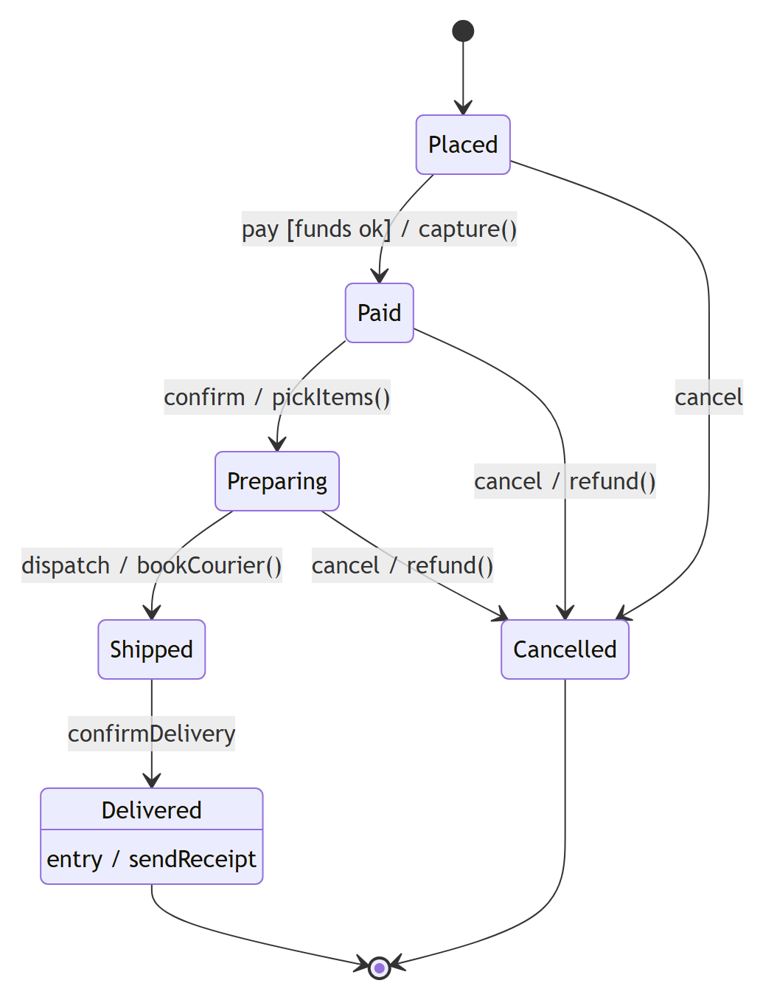
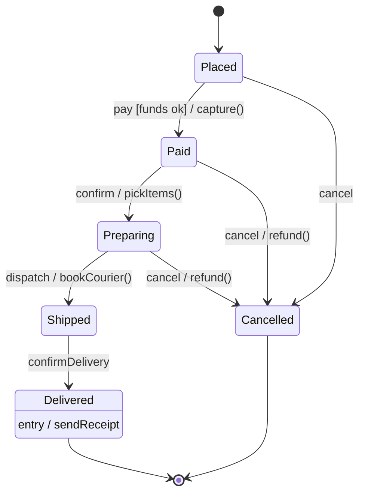

# State machine diagram (UML 2.5.1)

What it is · when to use · notation rules (states, transitions, pseudostates, composite/region) · worked example · Mermaid · common mistakes · EA bridge.

## What it is

A **behavior** diagram describing the lifecycle of **one** object/classifier as a set of **states** and event-driven **transitions** between them. UML 2.5.1 has two kinds: **behavioral** state machines (the common case, below) and **protocol** state machines (`{protocol}`, constraining the legal order of operation calls). It answers "what states can this thing be in and what events move it between them?"

## When to use it

- A reactive object with a meaningful lifecycle (an order, a connection, a UI control, a document).
- Specifying event/guard/effect rules precisely, including nested and concurrent states.
- Protocol of an interface/port (which calls are legal in which state).

## Notation rules

- A **state** is a rounded rectangle. Optional internal compartment lists internal activities:
  - `entry / action` — run on entering the state.
  - `exit / action` — run on leaving.
  - `do / activity` — ongoing while in the state.
  - `event / action` — internal transition (handled without leaving the state).
- A **transition** is a solid arrow between states labeled `trigger [guard] / effect` — any part optional. The **trigger** is an event (call, signal, change `when(cond)`, or time `after(2s)` / `at(...)`); the **guard** `[ ]` must be true; the **effect** runs during the transition.
- A **final state** is a circle-in-ring ◉ → the enclosing state machine (or region) completes. Despite the notation it is **not** a pseudostate — UML 2.5.1 makes `FinalState` a subclass of `State`.
- **Pseudostates** (transient):
  - **Initial**: filled circle ● → the default starting state.
  - **Choice**: diamond ◇ — dynamic branch evaluated *after* prior effects (guards on outgoing edges).
  - **Junction**: small filled circle — static merge/branch of transitions.
  - **History**: shallow `(H)` restores the last active substate of a composite; deep `(H*)` restores the full nested configuration.
  - **Fork/Join** bars, **entry/exit points**, **terminate** (X).
- A **composite state** nests a sub-state-machine; a state with **two or more regions** separated by a dashed line is **orthogonal** (concurrent) — the object is in one substate of *each* region simultaneously.
- A **submachine state** (`stateName : SubMachine`) references a reusable state machine.
- A **completion transition** (no trigger) fires when the source state finishes its `do`/substate activity.

## Worked example — order lifecycle

States: `Placed`, `Paid`, `Preparing`, `Shipped`, `Delivered`, `Cancelled`.

- ● → `Placed`
- `Placed` —`pay [funds ok] / capture()`→ `Paid`
- `Placed` —`cancel`→ `Cancelled`
- `Paid` —`confirm / pickItems()`→ `Preparing`
- `Paid` —`cancel / refund()`→ `Cancelled` → ◉
- `Preparing` —`dispatch / bookCourier()`→ `Shipped`
- `Preparing` —`cancel / refund()`→ `Cancelled`
- `Shipped` —`confirmDelivery`→ `Delivered` → ◉
- `Delivered` has `entry / sendReceipt`.

## Mermaid

Mermaid renders state machines natively with `stateDiagram-v2` (supports composite states via nested `state X { }`, choice via `<<choice>>`, fork/join via `<<fork>>`/`<<join>>`).

Mermaid source

<!-- render: images/uml-state-machine-order.png -->

## Common mistakes

- Putting an **action/verb** in a state name (states are *conditions of being*: `Paid`, not "Process Payment") — verbs belong in an **activity** diagram.
- Forgetting **guards** so two transitions on the same event are non-deterministic; guards on a choice should be complete (add `[else]`).
- Confusing a **choice** pseudostate (evaluated *after* the incoming effect, so it can branch on freshly-computed values) with a **junction** (guards evaluated statically before the transition runs).
- Using a **fork/join** (concurrency) when you meant **orthogonal regions**, or modeling concurrency that the object can't actually exhibit.
- Mixing **internal transition** (`event / action`, no state change, entry/exit *not* re-run) with a **self-transition** (arrow back to the same state, which *does* re-run exit then entry).

## EA bridge

- Diagram `type`: **"StateMachine"** (confirmed).
- Element `type`: **"State"**, **"StateNode"** for initial/final/history/choice pseudostates (verify the specific pseudostate subtype in live EA).
- Connector `type`: **"StateFlow"** for transitions (set trigger/guard/effect on the transition's properties). Build sequence: **`ea-modeling`** + `${CLAUDE_PLUGIN_ROOT}/shared/reference/ea-type-cheatsheet.md`.
