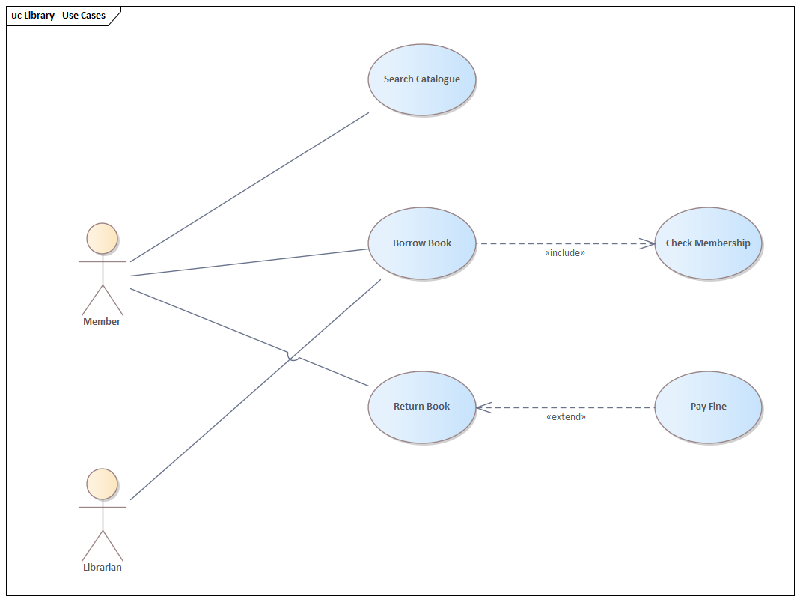

# Use case diagram (UML 2.5.1)

What it is · when to use · notation rules · relationships · worked example · Mermaid note · common mistakes · EA bridge.

## What it is

A **behavior** diagram that captures the **functional scope** of a system: the **actors** (roles outside the system), the **use cases** (units of useful functionality the system provides), and the **system boundary**. It is a requirements/scoping tool, not a process flow — the *steps* of a use case live in its textual specification or an activity diagram.

## When to use it

- Early scoping: what the system does and who needs it.
- Communicating with non-technical stakeholders about goals.
- Indexing detailed requirements (each use case → a specification).

## Notation rules

- An **actor** is a stick figure (or a `«actor»` rectangle) outside the boundary — a **role**, not a person (one person can play many actors; one actor can be many people). Non-human actors (other systems, a clock) are valid.
- A **use case** is an ellipse with a verb-phrase name (e.g. *Place Order*), drawn **inside** the system boundary.
- The **system boundary** is a rectangle enclosing the use cases, labeled with the system name. Actors sit outside it.
- An **association** (plain solid line, no arrowhead) connects an actor to each use case it participates in. This is the *only* actor↔use-case relationship. Associations are always **binary** (one actor, one use case) — a single line cannot join two actors to one use case (see *Common mistakes*).
- An association end may carry a **multiplicity**. The default on the actor end is **1** and is normally left implicit; a value greater than 1 (e.g. `1..3`) means more than one instance of that actor takes part in a single execution of the use case. The use-case end's multiplicity is mostly unrestricted and is rarely shown.
- Actors can be characterized as **primary** (takes the actual benefit of the use case) vs **secondary** (no direct benefit but required for execution), and **active** (initiates the use case) vs **passive** (provides functionality). The diagram does not notate these distinctions; they inform *which* actors to include.

### Relationships between use cases

| Relationship | Notation | Meaning |
| --- | --- | --- |
| `«include»` | dashed arrow from **base** → included use case | base **always** runs the included use case (mandatory, factored-out common behavior). |
| `«extend»` | dashed arrow from **extending** → **base** | extending use case **conditionally** adds behavior at an extension point in the base. |
| **Generalization** | solid hollow-triangle arrow → parent | a specialized use case (or actor) inherits the parent's properties, behavior, **and all its relationships** (associations, include/extend), and may extend or override the inherited behavior. |

Direction is the classic trap: **`«include»`** points *from base to the part it includes*; **`«extend»`** points *from the optional extension back to the base*. The base names an **extension point** (a labeled location) that the `«extend»` may reference with a condition `{condition}`.

**Extension points and condition.** An extension point is a named location declared inside the base use case, drawn in a dedicated `extension points` compartment of the ellipse. The `«extend»` relationship may carry a **condition** in curly braces (e.g. `{lecture hall free}`), shown next to the relationship or in an attached note; the extending behavior is inserted only if the condition holds when the extension point is reached.

**Abstract use cases and actors.** A use case or actor marked `{abstract}` (an actor name may instead be shown in *italics*) cannot be instantiated/executed directly — only its specializations can. An abstract parent exists purely to factor out and group common behavior or common associations of its children.

## Worked example — library system



*Rendered in Sparx Enterprise Architect.*

- **Actors**: `Member`, `Librarian`.
- **Use cases** for the `Library` system: *Search Catalogue*, *Borrow Book*, *Check Membership*, *Return Book*, *Pay Fine*.
- *Borrow Book* `«include»` *Check Membership* (borrowing always verifies membership).
- *Pay Fine* `«extend»` *Return Book* (an overdue return *conditionally* adds the fine; the extending use case points back at the base).
- `Member` ── *Search Catalogue*, *Borrow Book*, *Return Book*; `Librarian` ── *Borrow Book*, *Return Book*.

```
            ┌──────────────────── Library ────────────────────┐
            │   (Search Catalogue)                            │
 Member ────┼── (Borrow Book) ┄┄«include»┄┄▶ (Check Membership)┼
   │        │                                                 │
 Librarian ─┼── (Return Book) ◀┄┄«extend»┄┄  (Pay Fine)        │
            └─────────────────────────────────────────────────┘
```

## Mermaid

**No native equivalent.** Mermaid has no use-case diagram (no actor/ellipse/boundary notation, no `«include»`/`«extend»`). If a sketch is required, approximate with a `flowchart` (stadium shapes `([Use Case])` for cases, plain nodes for actors, dashed links labeled `include`/`extend`) and state explicitly it is not UML use-case notation.

## Common mistakes

- **Reversing `«include»`/`«extend»` arrows** — include goes base→included; extend goes extension→base. This is the #1 error.
- Modeling **process steps** as use cases ("Enter Username", "Click Submit") — those are steps inside one use case, not separate use cases. A use case is a goal that delivers observable value.
- Drawing arrowheads on the **actor association** — actor-to-use-case links are plain solid lines.
- Treating an actor as a specific person rather than a **role**; or omitting external systems that are legitimate actors.
- **Misplacing the system boundary.** Actors are *always outside* the boundary; anything part of the system must *not* be an actor. An external entity that a use case relies on but that is not part of the system (e.g. an e-mail server, a payment gateway) belongs *outside* as an actor — never inside.
- **Reading a shared use case as joint participation.** If one use case is associated with two actors, that does **not** mean both actors take part in a given execution — each association is individual (different actors, or different instances of one actor, may run it). To express that two actors really share involvement, introduce a common (often `{abstract}`) parent actor via generalization rather than drawing both associations to suggest it.
- **Mixing abstraction levels** — putting a business-level "top-level" use case (*Manage student data*) next to a technical detail (*Select printer*) in the same diagram. Start from business objectives, then refine to technical requirements in a separate, lower-level diagram.
- **Functional decomposition** — splitting a use case into included/extending sub-use-cases that are not independently meaningful goals (*Enter data*, *Log out*). Every use case, including ones reached via `«include»`/`«extend»`, must be executable independently within the system's scope; a mere precondition (e.g. *Log in*) is not a use case.
- Over-using `«include»`/`«extend»`/generalization to "factor" everything — keep the diagram about scope, not decomposition.

## EA bridge

- Diagram `type`: **"Use Case"** (confirmed).
- Element `type`: **"UseCase"**, **"Actor"**, and a **"Boundary"** element for the system boundary (verify boundary in live EA).
- Connector `type`: **"Association"** (actor↔use case — correctly a plain line, no arrowhead, as the notation requires), **"Generalization"**, **"Dependency"** with `stereotypes:"include"` or `stereotypes:"extend"` for the two factored relationships. Build sequence: **`ea-modeling`** + `${CLAUDE_PLUGIN_ROOT}/shared/reference/ea-type-cheatsheet.md`.
- **Headless connectors (confirmed in live EA).** The MCP creates the `«include»` / `«extend»` **Dependency** connectors with direction unspecified, so they render **headless** — no open arrow. Set each connector's `Direction` via the EA COM bridge to draw the arrow: `${CLAUDE_PLUGIN_ROOT}/shared/reference/ea-com-bridge.md`. (Generalization triangles render intrinsically and need no fix.)
