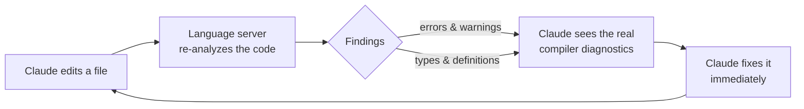
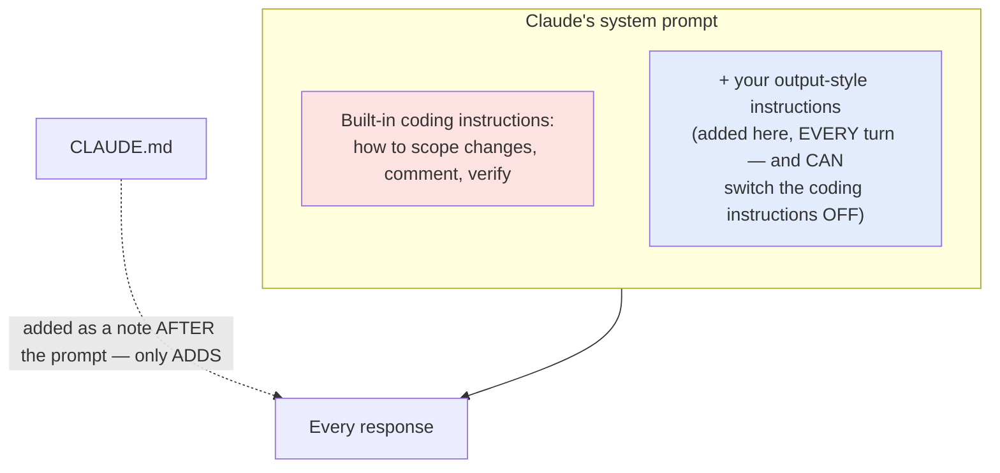
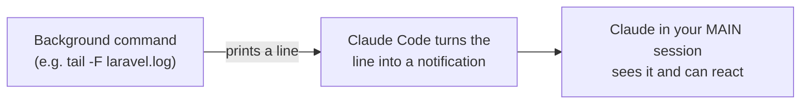
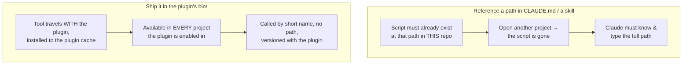

# starter-spell 🪄

The **copy-me template**. It ships one example of every Claude Code plugin
component, so you can see each format and keep only the ones you need.

## What's inside

```
starter-spell/
├─ .claude-plugin/
│  └─ plugin.json                 # manifest (name, version, author) — REQUIRED
├─ skills/
│  └─ hello-grimoire/SKILL.md     # ① spell      (skill)        — LIVE
├─ commands/
│  └─ cast.md                     # ② incantation (command)     — LIVE
├─ agents/
│  └─ familiar.md                 # ③ familiar   (agent)        — LIVE
├─ hooks/
│  └─ hooks.json.example          # ④ ward       (hook)         — dormant
├─ scripts/
│  └─ ward.sh                     # the hook's shell script
├─ .mcp.json.example              # ⑤ conduit    (MCP server)   — dormant
├─ .lsp.json.example              # ⑥ (LSP server)              — dormant
├─ output-styles/
│  └─ terse.md.example            # ⑦ output style              — dormant
├─ themes/
│  └─ grimoire-dark.json          # ⑧ theme                     — LIVE
├─ monitors/
│  └─ monitors.json.example       # ⑨ monitor                   — dormant
└─ bin/
   └─ starter-spell-tool          # ⑩ executable (on PATH)      — LIVE
```

**Live** = loads and works the moment the plugin is enabled (safe; only acts
when invoked). **Dormant** = ships as a `.example` file that Claude Code ignores
until you activate it. The five dormant ones are off by default because they'd
otherwise change your setup on enable — hooks/MCP/monitor have side effects (run
shell, spawn processes), LSP errors without its binary, and an output style would
clutter your style picker.

Activate a dormant component by **renaming** it (drop `.example`). Remove any
component by **deleting** its file/folder. Details per component below.

## Component, or just a CLAUDE.md line?

Before building anything, ask whether plain text would do. A `CLAUDE.md` rule is
always-on context the model *should* follow — cheap, but only a request.

- **Instruction components** (skill, command, agent, output style) are, at heart,
  text the model reads — so CLAUDE.md *can* sometimes replace them. Reach for the
  component only when the guidance is long, relevant only sometimes (load it on
  demand instead of bloating every prompt), reusable across projects, or must be
  explicitly triggered.
- **Capability components** (hook, MCP, LSP, monitor, theme, bin) can **never** be
  replaced by CLAUDE.md. They *do* things text can't: run code deterministically,
  connect to external systems, render UI. If you need a guarantee or an external
  action, CLAUDE.md is never enough.

Each section below ends with a **vs CLAUDE.md** note marking where the line falls.

---

## ① Spell — `skills/hello-grimoire/SKILL.md`

**What it is:** a skill. Claude invokes it automatically when its `description`
matches the task, or you run it as `/starter-spell:hello-grimoire`.

- **Use it for:** Productivity — a `weekly-status` skill that turns rough notes
  into your team's status-report format. Coding — a `review-checklist` skill
  Claude auto-applies when reviewing a PR (N+1 queries, error handling, secrets).
- **Setup:** none. Auto-discovered from `skills/`.
- **Make it yours:** edit `SKILL.md`. The `description` frontmatter is what the
  model matches on — make it specific (include trigger phrases). Add supporting
  files (`reference.md`, `scripts/`) in the same folder if needed.
- **To remove:** delete `skills/hello-grimoire/` (or the whole `skills/` folder).
- **vs CLAUDE.md:** A skill wins when the guidance is long, only sometimes
  relevant (loaded on demand, so it doesn't bloat every prompt), reusable across
  projects, or ships scripts/reference files. CLAUDE.md is enough for a short,
  always-true project rule (e.g. "use strict types").

## ② Incantation — `commands/cast.md`

**What it is:** a slash command. Runs only when the user types
`/starter-spell:cast`.

- **Use it for:** Productivity — `/standup`: paste yesterday's notes, get a
  formatted update. Coding — `/scaffold-endpoint Orders`: generate a Laravel
  controller + service + test in your house conventions.
- **Setup:** none. Auto-discovered from `commands/`.
- **Make it yours:** rename the file (the filename becomes the command name) and
  rewrite the body. Use `$ARGUMENTS` for input; declare `argument-hint` /
  `allowed-tools` in frontmatter.
- **To remove:** delete the `.md` file (or the whole `commands/` folder).
- **vs CLAUDE.md:** A command is *triggered on demand* by typing `/x` — CLAUDE.md
  can't be invoked, it's passive context. Use a command for an explicit,
  parameterized, repeatable action; use CLAUDE.md when you just want default
  behavior to always apply.

## ③ Familiar — `agents/familiar.md`

**What it is:** a subagent. Dispatched into its own context window for a focused
task. Safe to ship live — it only runs when invoked.

- **Use it for:** Productivity — a `meeting-notes` familiar that digests a
  transcript into decisions + action items in its own context. Coding — a
  `test-writer` familiar dispatched to write tests while your main thread keeps
  building.
- **Setup:** none. Auto-discovered from `agents/`.
- **Make it yours:** edit the frontmatter (`name`, `description`, `model`, and
  optionally `effort`, `maxTurns`, `tools`, `disallowedTools`, `skills`,
  `isolation: worktree`). Write a sharp system prompt in the body. Note: plugin
  agents may **not** declare `hooks`, `mcpServers`, or `permissionMode`.
- **To remove:** delete the `.md` file (or the whole `agents/` folder).
- **vs CLAUDE.md:** An agent gives you an isolated context, its own model/tools,
  and parallel dispatch. CLAUDE.md can describe a role, but it all runs in one
  context window. Reach for an agent when you need separation or parallelism —
  not just instructions.

## ④ Ward — `hooks/hooks.json.example` + `scripts/ward.sh`

**What it is:** a hook. Runs automatically on a lifecycle event (this example
fires on `SessionStart` and runs `scripts/ward.sh`). **Fires without asking** —
that's the power and the risk.

- **Use it for:** Productivity — a `Stop` hook that appends a one-line session
  summary to your daily journal. Coding — a `PostToolUse` hook on `Write|Edit`
  that auto-runs `ruff`/`php-cs-fixer`, or a `PreToolUse` guard that blocks edits
  to `.env`.
- **Activate:** `mv hooks/hooks.json.example hooks/hooks.json`
- **Setup:** make the script executable — `chmod +x scripts/ward.sh` — or the
  hook silently does nothing. Reference bundled scripts via
  `"${CLAUDE_PLUGIN_ROOT}"` (plugins run from a cache dir, not in place).
- **Make it yours:** change the event (`PreToolUse`, `PostToolUse`,
  `UserPromptSubmit`, `Stop`, …) and `matcher` (e.g. `"Write|Edit"`); rewrite the
  script. Hook types: `command`, `http`, `mcp_tool`, `prompt`, `agent`.
- **To remove:** delete `hooks/` and `scripts/ward.sh`.
- **vs CLAUDE.md:** **Never** CLAUDE.md. A CLAUDE.md rule is a request the model
  may forget or skip; a hook is deterministic harness enforcement that fires
  every time, regardless of the model. If it *must* always happen (format, block,
  log), it's a hook.

## ⑤ Conduit — `.mcp.json.example`

**What it is:** a bundled MCP server — connects Claude to an external tool or
service. The example points at the official `@modelcontextprotocol/server-everything`
demo server (a real, runnable MCP server fetched via `npx`).

- **Use it for:** Productivity — connect Jira/Notion/your CRM so Claude reads
  tickets and logs activity directly. Coding — connect a staging DB so Claude
  can inspect the live schema while writing queries.
- **Activate:** `mv .mcp.json.example .mcp.json`
- **Setup:** the example needs only Node/`npx` (server is fetched on first run).
  A real conduit needs whatever its server needs — bundle a binary under the
  plugin and reference it with `${CLAUDE_PLUGIN_ROOT}`, or point at an installed
  command. Secrets go in `env` / `userConfig`, never hardcoded.
- **Caution:** an active MCP server **spawns a process every session** it's
  enabled. Leave it dormant until you need it.
- **To remove:** delete `.mcp.json.example` (and `.mcp.json` if you renamed it).
- **vs CLAUDE.md:** **Never** CLAUDE.md — text can't connect to anything. An MCP
  server is capability, not instruction. If Claude needs to read or write an
  external system, only an MCP server (or equivalent tool) can do it.

## ⑥ LSP — `.lsp.json.example`

**What it actually is:** a **Language Server** is a separate program that deeply
understands one programming language — the same engine that powers the red error
squiggles, autocomplete, and "Go to definition" in editors like VS Code. This file
doesn't contain that engine; it just tells Claude Code **how to start the language
server and talk to it**. (You install the engine separately — see Setup.)

**How it works:** every time Claude edits a file, the language server re-analyzes
it and reports back. Claude reads that report and corrects course — before the code
is ever run.



Without LSP, Claude only *guesses* from the text in front of it. With LSP it gets
**compiler-grade facts**: it stops inventing methods that don't exist, catches a
wrong argument type the instant it's written, and can find **every** caller of a
function before renaming it.

- **Use it for (coding only):** any typed codebase where you want Claude to make
  fewer broken edits. Install the engine for your language:

  | Language | Install this binary | What it gives Claude |
  | --- | --- | --- |
  | **PHP** | `intelephense` (or `phpactor`) | unknown-method / wrong-arg-type errors in Laravel/Symfony |
  | **Java** | `jdtls` (Eclipse JDT Language Server) | full Spring Boot type awareness, find-references |
  | **Kotlin** | `kotlin-language-server` | null-safety + type info for Kotlin/Spring |
  | **C / C++** | `clangd` | compiler-grade diagnostics, `#include` resolution, go-to-definition |
  | **TypeScript** (bundled example) | `typescript-language-server` + `typescript` | type errors across `.ts` / `.tsx` |

- **Activate:** `mv .lsp.json.example .lsp.json`
- **Setup (required):** install the language-server **binary yourself** — it is
  **not** bundled. Example: `npm install -g typescript-language-server typescript`;
  for PHP: `npm install -g intelephense`. If the binary isn't on your PATH you'll
  see `Executable not found in $PATH` in the `/plugin` Errors tab.
- **Make it yours:** set `command` (the binary), its `args`, and
  `extensionToLanguage` (which file types it handles). One `.lsp.json` can list
  several languages at once.
- **To remove:** delete `.lsp.json.example` (and `.lsp.json` if you renamed it).
- **vs CLAUDE.md:** **Never** CLAUDE.md — text can't run a type-checker or resolve
  symbols. You *could* write "this project is PHP 8.3" in CLAUDE.md, but only an LSP
  gives Claude live, line-by-line type feedback. Pure capability.

---

## ⑦ Output style — `output-styles/terse.md.example`

**What it actually is:** an output style **rewrites Claude's system prompt** — the
core instructions that define how Claude behaves and "who it is" — and it applies
to **every single response** for the whole session. It changes *role, tone, and
format*, not knowledge.

**The sharp difference from CLAUDE.md** (the thing people get wrong):



- **CLAUDE.md** is a note attached *after* the system prompt. It can only **ADD**
  facts ("also know: this project uses Laravel"). It can never switch off Claude's
  built-in behavior.
- **An output style edits the system prompt itself.** A custom style even **drops
  Claude Code's built-in software-engineering instructions** (how it scopes work,
  writes comments, verifies changes) — unless you set `keep-coding-instructions:
  true`. **CLAUDE.md literally cannot do that.**
- One-line rule: **CLAUDE.md adds knowledge; an output style changes who Claude is.**

**Built-in styles** (switch anytime, for reference): **Default** (normal coding),
**Proactive** (acts without pausing to ask), **Explanatory** (adds teaching
"Insights" — this very session uses it), **Learning** (asks you to write some code
yourself).

- **Use it for:** Productivity — a writing-assistant style that **drops** coding
  instructions so Claude acts like an editor, not an engineer. Coding — a
  "diagrams-first" style that **keeps** coding instructions but makes Claude open
  every explanation with a diagram.
- **Activate:** `mv output-styles/terse.md.example output-styles/terse.md`, then
  select it in **`/config` → Output style**.
- **Make it yours:** edit the frontmatter (`name`, `description`,
  `keep-coding-instructions`) and the body (your added instructions). To make a
  *plugin* style apply automatically for everyone who enables the plugin, add
  `force-for-plugin: true` — otherwise it merely *appears as an option*.
- **Why dormant:** without `force-for-plugin` a plugin style isn't forced on you,
  but it still clutters your `/config` picker the moment it exists. Shipped as
  `.example` so it stays out of your list until you write a real one.
- **To remove:** delete the file (or the whole `output-styles/` folder).
- **vs CLAUDE.md:** Biggest overlap of all — but not the same thing. Use an output
  style to change Claude's *whole manner* and toggle it across projects via
  `/config`. Use CLAUDE.md for a fixed, project-specific "also write briefly" rule.

## ⑧ Theme — `themes/grimoire-dark.json`

**What it actually is:** a theme changes **the colors of the Claude Code interface
itself** — the program you're typing into. That's *all* it does: the color of
Claude's text, the red of errors, the green of successes, the colors inside a diff.

**"Pure UI" means exactly this — the colors of Claude Code's own screen, nothing
else.** What a theme paints, and what it does *not* touch:

```
┌─ Claude Code window ─────────────────────────────────┐
│  assistant text, code, diffs   ← THEME colors these   │
│  errors (red) / success (green) ← THEME colors these  │
│                                                       │
│  > your prompt input                                  │
│  ──────────────────────────────────────────────────  │
│  [Opus] 📁 my-repo  ⎇ main  42% context  $0.12        │ ← NOT the theme.
└───────────────────────────────────────────────────────┘   This bottom bar is
                                                             the STATUS LINE.
```

To answer the obvious questions directly — a theme **cannot**:
- ❌ change the prompt text or inject context info,
- ❌ show the current directory or git branch,
- ❌ change prompt / command **autocompletion**.

Those are *different* features:
- Showing **directory, git branch, model, context %, cost** = the **status line**
  (set it up with `/statusline`; it runs a small shell script along the bottom bar).
- Autocompletion behavior isn't something a plugin configures.

- **Use it for:** color-code your environments — e.g. switch to a red theme inside
  client/production repos so you can never confuse them with a sandbox at a glance.
- **Setup:** none. Auto-discovered from `themes/`. Run `/theme` and pick
  "Grimoire Dark".
- **Make it yours:** set `base` (`dark` / `light`) and a sparse `overrides` map of
  color tokens (`claude`, `success`, `error`, …). Themes are an experimental
  component — the schema may shift between releases.
- **To remove:** delete the `.json` (or the whole `themes/` folder).
- **vs CLAUDE.md:** **Never** CLAUDE.md — a theme is pure visual styling of the
  app, not an instruction to Claude at all.

## ⑨ Monitor — `monitors/monitors.json.example`

**What it actually is:** a background watcher. The plugin runs a shell command that
keeps running for the whole session, and **every line that command prints becomes a
notification to Claude**. So Claude finds out about events *as they happen* —
without you stopping to ask it to check.

**How it works:**



**Where it runs — important:** a monitor feeds your **main interactive session**
(the conversation you're in), *not* subagents. It works **only in the interactive
CLI** (not in headless `-p` runs) and runs **unsandboxed**, at the same trust level
as hooks. Use it when *you* are working alongside Claude and want it to react to
live events instead of you polling.

- **Use it for (real day-to-day examples):**
  - `tail -F storage/logs/laravel.log` → Claude sees a Laravel exception the moment
    it's logged and can offer a fix.
  - your `npm run dev` / Vite output → Claude reacts to a compile/build error live.
  - `php artisan queue:work` output → Claude notices a failed job as it fails.
  - a script polling your CI or deploy status → Claude tells you the moment the
    deploy finishes (or breaks).
- **Activate:** `mv monitors/monitors.json.example monitors/monitors.json`
- **Caution:** it **auto-starts the process when the plugin is enabled** and emits
  notifications, so it's shipped dormant. Requires Claude Code v2.1.105+.
- **Make it yours:** set `name`, `command` (supports `${CLAUDE_PLUGIN_ROOT}` /
  `${CLAUDE_PROJECT_DIR}` / `${user_config.*}`), and `description`. Optional `when`:
  `"always"` (start at session start — the default) or `"on-skill-invoke:<skill>"`
  (only start watching once a particular skill of yours runs — e.g. start the log
  watcher only when your `debug` skill fires).
- **To remove:** delete the file (or the whole `monitors/` folder).
- **vs CLAUDE.md:** **Never** CLAUDE.md — text can't watch a process or poll an
  endpoint across a session. Capability, not instruction.

## ⑩ Executable — `bin/starter-spell-tool`

**What it actually is:** any program or script you drop in `bin/`. While the plugin
is enabled, Claude Code adds this `bin/` folder to the **PATH of its Bash tool** —
so Claude can run your program as a **bare command** (`starter-spell-tool`) inside
any Bash call, in **any project**, without knowing where the file lives.

**How it differs from just referencing a script in CLAUDE.md or a skill** (your
question): it comes down to *where the tool lives* and *whether it travels with
you*.



- One-line rule: **CLAUDE.md points at a tool that must already be there; `bin/`
  brings the tool with it, everywhere.**
- **Use it for:** Coding — bundle a project CLI (a code generator, a `db-seed`
  helper) so Claude can call it anywhere. Productivity — a `report-export` /
  `invoice-gen` script Claude runs as one step inside a larger workflow.
- **Setup:** make it executable — `chmod +x bin/starter-spell-tool`.
- **Make it yours:** replace with a real helper and give it a **distinctive name**
  so it can't shadow a system command (don't name it `git` or `ls`).
- **To remove:** delete the file (or the whole `bin/` folder).
- **vs CLAUDE.md:** Close call by design. If the script already lives in the repo,
  CLAUDE.md telling Claude to run it is fine. Reach for `bin/` when you want to
  **bundle, distribute, and version** the tool with the plugin and call it by a
  clean bare name everywhere.

## Conjure a new plugin from this template

1. `cp -r plugins/starter-spell plugins/<your-plugin>`
2. Edit `<your-plugin>/.claude-plugin/plugin.json` → set `name`, `description`,
   bump `version` (or omit `version` to track every commit).
3. Keep the components you want, delete the rest (table above).
4. Add an entry to `.claude-plugin/marketplace.json` with
   `"source": "./plugins/<your-plugin>"`.
5. Validate, then test locally:
   ```bash
   claude plugin validate .
   claude plugin validate ./plugins/<your-plugin>
   claude plugin marketplace add ./
   claude plugin install <your-plugin>@grimoire
   ```

**Forks** you don't want to vendor: list them in `marketplace.json` with a
GitHub source — `"source": { "source": "github", "repo": "owner/repo", "ref": "main" }`.
